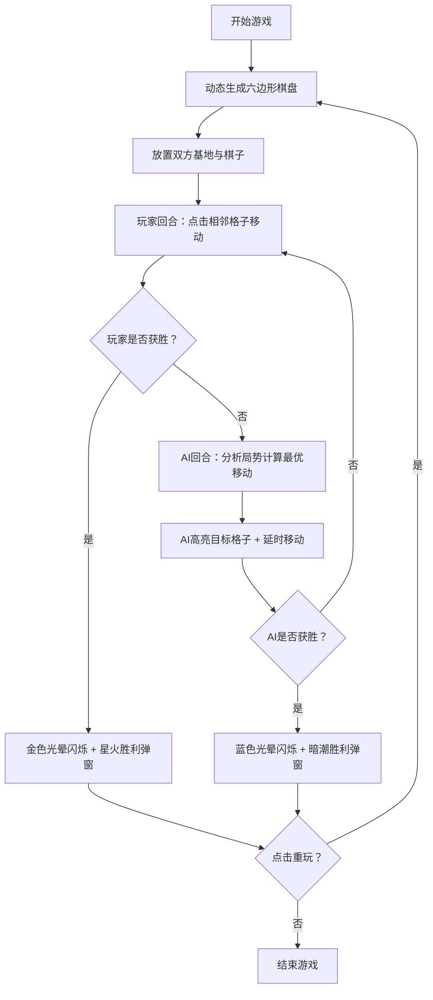

## 1. 产品概述

『星火棋局』是一款2D策略益智对战游戏，玩家与AI各控制一枚发光棋子，在动态生成的六边形网格棋盘上展开博弈。通过移动棋子铺设己方路径，目标是率先连接己方基地与对方基地，同时阻挡对手的前进路线。游戏融合了路径规划、战略阻挡和前瞻思维，以精美的"星火对撞"视觉风格呈现，面向所有喜欢策略益智类游戏的玩家。

## 2. 核心特性

### 2.1 用户角色
| 角色 | 注册方式 | 核心权限 |
|------|----------|----------|
| 玩家 | 直接进入游戏 | 控制暖金色棋子，与AI对战，重置游戏，暂停游戏 |

### 2.2 功能模块
1. **游戏主场景**：六边形棋盘渲染、棋子移动交互、胜负判定
2. **AI对手系统**：路径分析算法、阻挡策略、延时决策模拟
3. **UI控制系统**：计分显示、回合指示、暂停/重置按钮、胜利面板
4. **视觉特效系统**：发光脉动、星尘光痕、过渡动画、光晕闪烁

### 2.3 页面详情
| 页面名称 | 模块名称 | 功能描述 |
|----------|----------|----------|
| 游戏主界面 | 六边形棋盘 | 动态生成自适应六边形网格，格子带发光边框与中心脉动节点 |
| 游戏主界面 | 棋子系统 | 暖金/冷蓝发光小球，移动时拖出星尘光痕，0.3秒平滑过渡 |
| 游戏主界面 | AI决策 | 分析棋盘局势，计算最优路径，识别并阻挡玩家关键路线 |
| 游戏主界面 | 胜负判定 | 检测己方基地到对方基地的连续路径，触发胜利效果 |
| 游戏主界面 | 顶部UI | 回合指示器、双方得分、暂停按钮、重置按钮 |
| 游戏主界面 | 胜利弹窗 | 毛玻璃效果面板，显示胜方名称与重玩按钮 |

## 3. 核心流程

## 4. 用户界面设计

### 4.1 设计风格
- **主色调**：深黑到暗紫渐变背景（#0a0014 → #1a0030）
- **玩家色（暖金）**：#FFD700 → #FFA500 发光渐变
- **AI色（冷蓝）**：#00BFFF → #1E90FF 发光渐变
- **棋盘格子**：半透明暗色面板（rgba(30, 20, 60, 0.6)），发光边框 2px
- **按钮风格**：圆角胶囊形，发光边框，悬停时亮度增强
- **字体**：使用 Orbitron 或类科幻字体，标题大号加粗，正文中等字重
- **布局**：全屏游戏画布 + 顶部固定UI栏，垂直居中棋盘

### 4.2 页面设计概览
| 页面名称 | 模块名称 | UI元素 |
|----------|----------|----------|
| 游戏主界面 | 背景 | 深黑→暗紫径向渐变，细微波纹流动动效 |
| 游戏主界面 | 六边形格子 | 半透明暗色多边形，发光边框描边，中心节点脉动动画 |
| 游戏主界面 | 棋子 | 圆润发光球体，内发光+外发光双重阴影，悬浮感 |
| 游戏主界面 | 路径标记 | 已占格子填充对应方半透明色，边缘柔和发光 |
| 游戏主界面 | 顶部UI栏 | 左：玩家分数+暖金圆点；中：回合指示器；右：暂停/重置按钮 |
| 游戏主界面 | 胜利弹窗 | 毛玻璃backdrop，居中卡片，胜方大标题，重玩按钮，入场动画 |

### 4.3 响应式设计
- **桌面优先**：棋盘大小根据窗口短边自适应，保持六边形等比缩放
- **触控优化**：格子点击区域适当放大，支持触屏设备
- **最小尺寸**：窗口不小于480×480时棋盘完整显示
- **宽屏适配**：超宽屏时棋盘居中，两侧留白增强沉浸感

### 4.4 动效规范
- **格子脉动**：未占格子中心节点使用sin函数0.8秒周期缩放1.0~1.3倍
- **棋子移动**：0.3秒线性插值(tween)从旧位置到新位置
- **星尘光痕**：移动轨迹上生成10-15个微小粒子，逐渐淡出消散
- **AI高亮**：目标格子边框从默认色过渡到AI色，闪烁2次后执行移动
- **胜利光晕**：全屏叠加对应方色半透明层，呼吸式透明度变化3秒
- **所有过渡**：统一使用Phaser的Easing.Sine.easeInOut缓动函数
