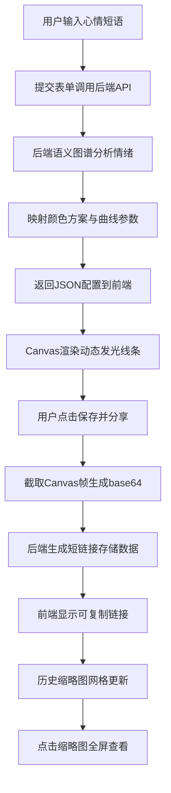

## 1. 产品概述

语纹织机是一款情绪可视化Web应用，用户输入心情短语后，系统通过语义图谱分析情绪，将文字转化为动态发光线条构成的抽象艺术画作，并支持保存与分享。

- 核心价值：将抽象的情绪语言转化为具象的视觉艺术，为用户提供情感表达与创作的数字画布
- 目标用户：对艺术创作、情绪表达、数字美学感兴趣的年轻用户群体

## 2. 核心特性

### 2.1 用户角色

| 角色 | 注册方式 | 核心权限 |
|------|----------|----------|
| 普通用户 | 无需注册 | 输入心情短语、生成画作、保存分享、查看历史作品 |

### 2.2 功能模块

1. **首页**：情绪输入区、画作展示区、保存分享区、历史作品缩略图网格
2. **画作详情页**：全屏画作展示、动画重播、返回首页

### 2.3 页面详情

| 页面名称 | 模块名称 | 功能描述 |
|-----------|-------------|---------------------|
| 首页 | 情绪输入区 | 中文文本输入框，响应式布局，提交按钮带毛玻璃效果 |
| 首页 | 画作展示区 | Canvas动态渲染30-120条发光曲线，正弦摆动旋转，60fps帧率 |
| 首页 | 保存分享区 | 保存按钮点击后生成短链接，支持一键复制到剪贴板 |
| 首页 | 历史作品区 | 底部缩略图网格（最多10个），淡入动画，点击全屏查看 |
| 画作详情页 | 全屏展示 | Canvas重制动画，支持返回首页 |

## 3. 核心流程

用户在首页输入心情短语并提交 → 系统调用后端API进行语义分析 → 后端返回情绪分类、颜色映射参数、曲线配置 → 前端Canvas渲染动态发光线条画 → 用户点击保存分享 → 后端生成短链接并存储画作快照 → 前端显示可复制链接 → 历史作品缩略图网格更新

## 4. 用户界面设计

### 4.1 设计风格

- **主色调**：根据用户情绪动态生成（暖色/冷色/中性色）
- **背景**：深灰到黑色径向渐变，营造沉浸式氛围
- **输入框与按钮**：毛玻璃半透明效果（backdrop-filter: blur），半透明白色边框
- **按钮悬停**：柔和光晕效果，点击时有scale(0.97)微小缩放反馈
- **字体**：标题使用具有艺术感的衬线字体（如Playfair Display），正文使用简洁无衬线字体
- **布局**：居中卡片式布局，留白充足，极简主义

### 4.2 页面设计概览

| 页面名称 | 模块名称 | UI元素 |
|-----------|-------------|-------------|
| 首页 | Hero标题区 | 渐变色艺术字体标题，副标题说明，居中对齐 |
| 首页 | 情绪输入区 | 圆角毛玻璃输入框（60%宽移动端100%），发光提交按钮 |
| 首页 | 画作展示区 | 800x600 Canvas（移动端自适应），深色容器卡片，圆角20px |
| 首页 | 保存分享区 | 分享按钮、链接展示框（带复制图标）、提示文字 |
| 首页 | 历史作品区 | 4列网格（移动端2列），缩略图卡片180x135，淡入动画 |
| 画作详情页 | 全屏展示 | 全屏Canvas，返回按钮，标题显示原心情短语 |

### 4.3 响应式设计

- 设计方式：桌面优先，移动端适配
- 断点：768px为移动端临界点
- 优化：移动端输入框全宽、Canvas按比例缩放、缩略图网格2列显示、触摸优化点击区域

### 4.4 视觉动效

- 页面加载：标题与输入框淡入上移（stagger动画）
- 画作生成：Canvas渐显效果
- 按钮交互：hover光晕扩散、active缩放回弹
- 缩略图：逐张淡入（animation-delay递增）
- 链接复制：成功提示气泡上浮消失
