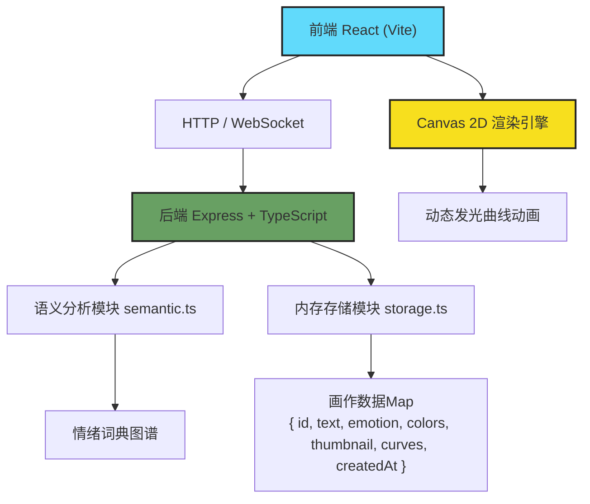
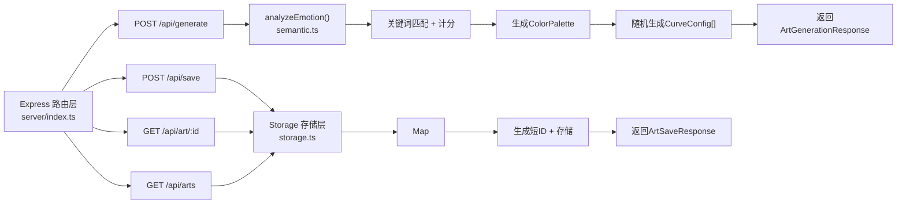
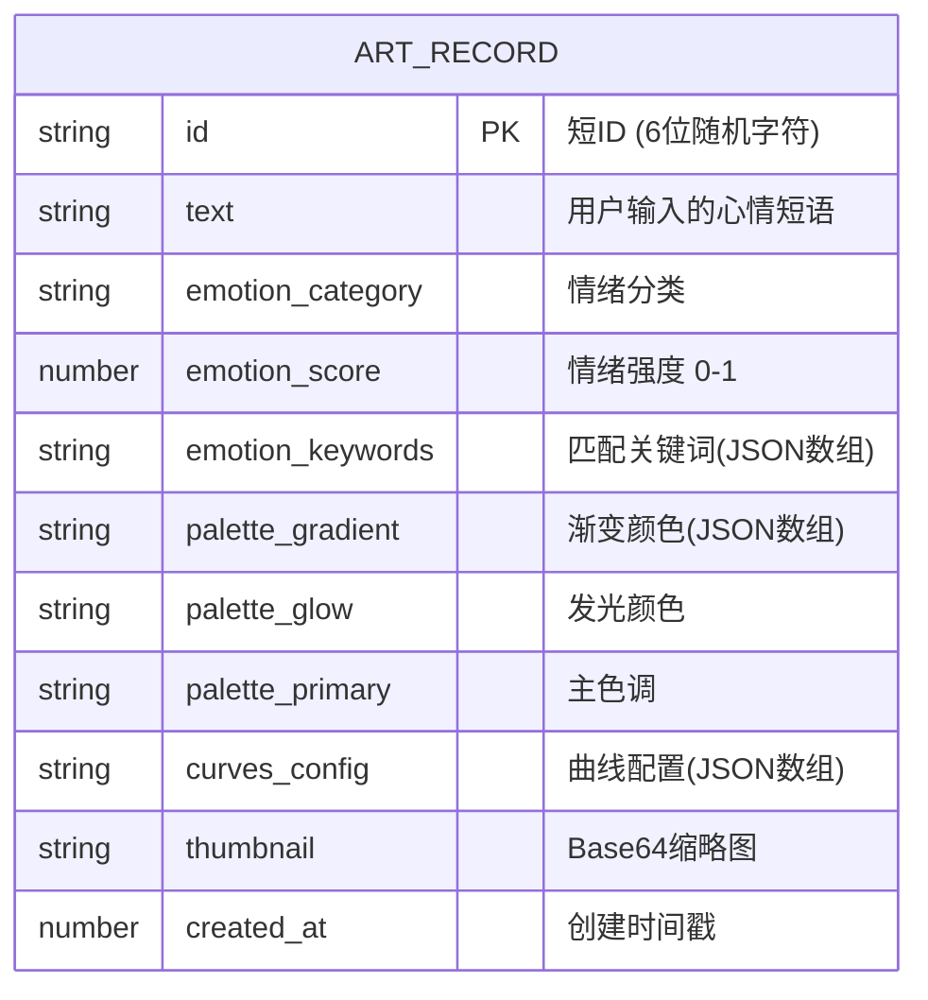

## 1. 架构设计



## 2. 技术选型说明

- **前端框架**：React@18 + TypeScript@5
- **构建工具**：Vite@5（提供HMR热更新、快速构建）
- **样式方案**：原生CSS + CSS Modules（使用CSS变量管理主题色）
- **路由**：React Router DOM@6（单页应用路由管理）
- **后端框架**：Express@4 + TypeScript@5
- **后端运行**：tsx（直接运行TypeScript，无需编译）
- **进程管理**：concurrently（同时启动前后端开发服务器）
- **端口代理**：Vite proxy将 /api 请求转发至 Express
- **存储方案**：内存 Map 存储（进程内持久化，重启清空）

## 3. 路由定义

| 路由路径 | 用途 | 页面组件 |
|-------|---------|----------|
| / | 首页（输入、生成、历史列表） | App → HomeView |
| /art/:id | 画作详情页（全屏展示、重播动画） | App → ArtDetailView |
| /api/generate | POST 生成画作配置 | 后端API |
| /api/save | POST 保存画作并生成短链 | 后端API |
| /api/art/:id | GET 获取画作详情数据 | 后端API |
| /api/arts | GET 获取最近画作列表（最多10） | 后端API |

## 4. API 接口定义

```typescript
// 共享类型定义

export type EmotionCategory = 'positive' | 'negative' | 'neutral';

export interface EmotionAnalysis {
  category: EmotionCategory;
  score: number;
  keywords: string[];
}

export interface ColorStop {
  color: string;
  position: number;
}

export interface ColorPalette {
  gradient: ColorStop[];
  glowColor: string;
  primaryColor: string;
}

export interface CurveConfig {
  startX: number;
  startY: number;
  amplitude: number;
  frequency: number;
  phase: number;
  speed: number;
  rotationSpeed: number;
  length: number;
  lineWidth: number;
  colorOffset: number;
}

export interface ArtGenerationResponse {
  id: string;
  emotion: EmotionAnalysis;
  palette: ColorPalette;
  curves: CurveConfig[];
  curveCount: number;
}

export interface ArtSaveRequest {
  text: string;
  emotion: EmotionAnalysis;
  palette: ColorPalette;
  curves: CurveConfig[];
  thumbnail: string;
}

export interface ArtSaveResponse {
  id: string;
  shortUrl: string;
}

export interface ArtRecord {
  id: string;
  text: string;
  emotion: EmotionAnalysis;
  palette: ColorPalette;
  curves: CurveConfig[];
  thumbnail: string;
  createdAt: number;
}

// POST /api/generate
// Request Body: { text: string }
// Response: ArtGenerationResponse

// POST /api/save
// Request Body: ArtSaveRequest
// Response: ArtSaveResponse

// GET /api/art/:id
// Response: ArtRecord

// GET /api/arts
// Response: ArtRecord[] (最多10条，按创建时间倒序)
```

## 5. 后端服务架构图



## 6. 数据模型

### 6.1 数据结构定义



### 6.2 存储说明

由于使用内存存储，无DDL语句。数据结构对应TypeScript接口 `ArtRecord`，存储在 `storage.ts` 的 `Map<string, ArtRecord>` 中，键为6位随机字符ID。初始化时：

- 使用 `crypto.randomBytes` 或简单随机算法生成6位短ID
- 列表查询时按 `createdAt` 倒序取前10条
