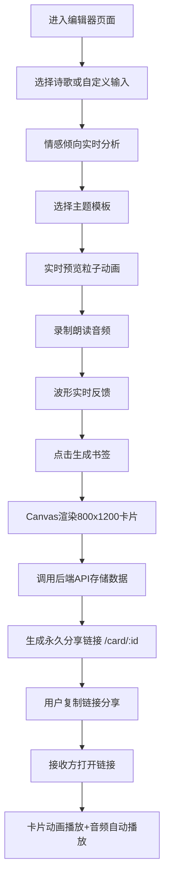

## 1. 产品概述

「读诗·流光书签」是一个交互式诗歌卡片创作与分享平台，旨在解决传统诗歌阅读缺乏视觉沉浸感和社交互动性的问题。用户可从预设诗歌库选择或自定义创作诗歌，通过主题模板生成流光粒子动画卡片，并绑定个人朗读音频，一键分享给他人体验。

- **核心价值**：将静态文字转化为动态视觉艺术，赋予诗歌沉浸式的表现形式；通过语音朗读增加情感表达维度，让诗歌分享更具个人温度。
- **目标用户**：诗歌爱好者、文艺创作者、社交媒体用户，以及希望在特殊节日用创意形式表达情感的大众用户。

## 2. 核心功能

### 2.1 功能模块

1. **编辑器页面（/editor）**：诗歌选择/自定义输入、主题模板选择、粒子动画实时预览、语音录制、生成书签
2. **卡片详情页（/card/:id）**：完整卡片动画展示、音频自动播放、永久分享链接
3. **管理仪表盘（/dashboard）**：历史卡片缩略图网格、卡片预览、重新生成链接、删除卡片

### 2.2 页面详情

| 页面名称 | 模块名称 | 功能描述 |
|-----------|-------------|---------------------|
| 编辑器页面 | 诗歌选择模块 | 下拉菜单选择10首预设诗歌，支持作者简介和背景介绍展示；自定义文本框输入（20行限制，每行40字），实时行数统计和情感倾向检测（积极/平静/悲伤色标反馈） |
| 编辑器页面 | 主题模板模块 | 5个圆形图标按钮（星空/森林/海浪/极光/暖阳），点击脉冲动画，预览区即时切换主题 |
| 编辑器页面 | 实时预览区 | Canvas实时渲染粒子动画卡片，背景渐变同心圆旋转，诗句逐行流光粒子入场 |
| 编辑器页面 | 语音录制模块 | 圆形红色录制按钮，30秒限时，16条蓝色频谱波形实时显示，自动停止覆盖机制 |
| 编辑器页面 | 生成分享模块 | Canvas绘制800x1200完整卡片，调用后端API生成唯一分享链接，一键复制 |
| 卡片详情页 | 卡片展示模块 | 完整粒子入场动画，背景旋转，音频加载时显示环形加载动画，加载完成自动播放 |
| 管理仪表盘 | 卡片网格模块 | 最近20张卡片200x300缩略图，4列网格，主题图标角标，悬停放大阴影效果，点击跳转详情 |
| 管理仪表盘 | 卡片操作模块 | 重新生成链接、删除卡片操作 |

## 3. 核心流程

用户从进入编辑器开始，依次选择诗歌、挑选主题、录制朗读、生成卡片，最终获取分享链接。其他用户打开链接后体验完整的视听盛宴。

## 4. 用户界面设计

### 4.1 设计风格

- **整体基调**：暗色沉浸主题，营造诗歌的静谧与深邃感
- **主色调**：背景 `#0D0D0D`，文字主色 `#E0E0E0`，辅助色 `#BB86FC`（紫罗兰渐变）
- **情感色标**：积极 `#28B463`（翠绿）、平静 `#5B6ABF`（靛蓝）、悲伤 `#E74C3C`（赤红）
- **字体选择**：标题使用衬线字体「Noto Serif SC」体现文艺质感，正文使用「Noto Sans SC」保证可读性
- **视觉特效**：所有交互元素带 `transition: all 0.2s ease` 平滑过渡；主题按钮点击脉冲缩放动画；粒子流光效果配合背景同心圆旋转
- **布局风格**：桌面端左右分栏（操作面板320px + 预览区自适应），移动端上下堆叠

### 4.2 页面设计概览

| 页面名称 | 模块名称 | UI元素 |
|-----------|-------------|-------------|
| 编辑器页面 | 操作面板 | 320px宽，`#1A1A1A`背景，12px圆角，24px内边距；诗歌下拉（`#2A2A2A`背景/`#3A3A3A`边框/辅助色高亮）；5个48px圆形主题按钮；64px红色圆形录制按钮 |
| 编辑器页面 | 预览区 | 黑色渐变背景，居中卡片展示，Canvas实时渲染粒子动画和旋转同心圆背景 |
| 卡片详情页 | 全屏展示 | 居中卡片800x1200，粒子入场动画错落0.3秒间隔每行，透明度淡入0.8秒，同心圆2秒/圈旋转 |
| 管理仪表盘 | 网格布局 | `#1E1E1E`背景，4列网格间距20px，200x300缩略图悬停1.05倍放大+`0 8px 24px rgba(0,0,0,0.3)`阴影 |

### 4.3 响应式设计

- **桌面端（≥768px）**：左右分栏布局，操作面板固定宽度320px居左，预览区占据剩余空间居中展示卡片
- **移动端（<768px）**：上下堆叠布局，操作面板折叠置顶，预览区占据完整剩余高度；卡片按视口宽度等比缩放
- **触摸优化**：主题按钮和录制按钮触控目标增大至56px，长按录制按钮提供触觉反馈提示

## 5. 性能指标

| 指标 | 目标值 | 验证方式 |
|------|--------|----------|
| 动画帧率 | ≥45fps | Chrome DevTools FPS Meter |
| 卡片渲染时间 | ≤300ms | 从点击生成到Canvas绘制完成计时 |
| 链接生成响应 | ≤200ms | 后端API响应时间监控 |
| 首屏加载时间 | ≤2s | Lighthouse Performance 审计 |
