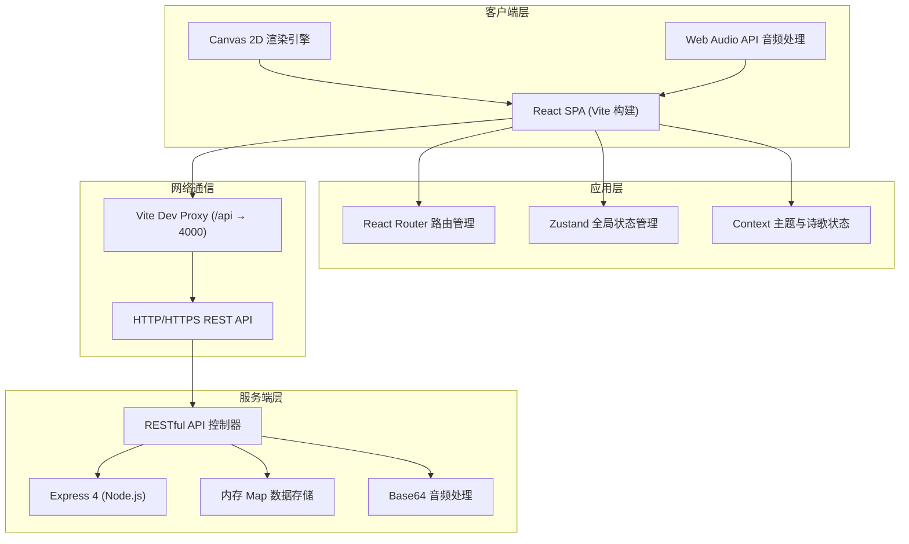
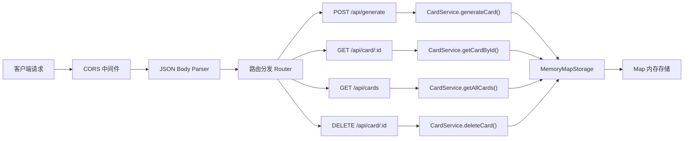
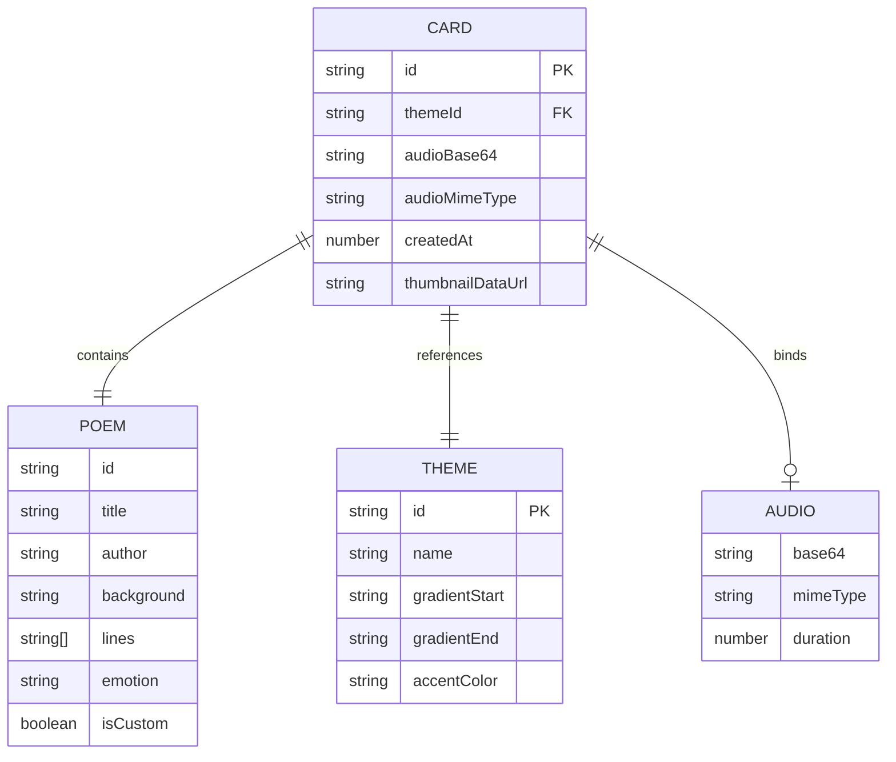

## 1. 架构设计



## 2. 技术选型说明

- **前端框架**：React 18 + TypeScript —— 组件化开发，类型安全保障
- **构建工具**：Vite 5 —— 极速HMR，开发体验优秀，端口3000
- **状态管理**：Zustand —— 轻量无模板代码，适合中等规模状态
- **路由方案**：React Router DOM 6 —— 声明式路由，支持动态参数
- **后端框架**：Express 4 + TypeScript (ts-node) —— 轻量灵活，端口4000
- **数据存储**：Node.js 内存 Map —— 无需数据库，快速原型实现
- **视觉渲染**：Canvas 2D API —— 粒子动画高性能绘制
- **音频处理**：Web Audio API (AnalyserNode, MediaRecorder) —— 原生浏览器支持
- **样式方案**：原生 CSS + CSS Variables —— 无额外CSS框架依赖，性能最优
- **图标库**：lucide-react —— 现代化SVG图标

## 3. 路由定义

| 路由路径 | 页面组件 | 用途说明 |
|----------|----------|----------|
| `/` 或 `/editor` | `EditorPage` | 编辑器首页，诗歌创作与预览 |
| `/card/:id` | `CardDetailPage` | 卡片详情页，动画展示+音频播放 |
| `/dashboard` | `DashboardPage` | 卡片管理仪表盘，历史卡片列表 |
| `*` | `Redirect to /editor` | 404重定向至编辑器 |

## 4. API 接口定义

```typescript
// ============ 请求/响应类型定义 ============

// 诗歌数据结构
interface PoemData {
  id?: string;
  title: string;
  author: string;
  background?: string;
  lines: string[];
  emotion: 'positive' | 'calm' | 'sad';
  isCustom: boolean;
}

// 主题数据结构
interface ThemeData {
  id: string;
  name: string;
  icon: string;
  gradientStart: string;
  gradientEnd: string;
  accentColor: string;
}

// 卡片数据结构
interface CardData {
  id: string;
  poem: PoemData;
  themeId: string;
  audioBase64: string | null;
  audioMimeType: string;
  createdAt: number;
  thumbnailDataUrl?: string;
}

// 生成卡片请求
interface GenerateCardRequest {
  poem: PoemData;
  themeId: string;
  audioBase64: string | null;
  audioMimeType: string;
  thumbnailDataUrl?: string;
}

// 生成卡片响应
interface GenerateCardResponse {
  success: boolean;
  cardId: string;
  shareUrl: string;
}

// 获取卡片响应
interface GetCardResponse {
  success: boolean;
  card: CardData | null;
}

// 卡片列表响应
interface GetCardsResponse {
  success: boolean;
  cards: CardData[];
  total: number;
}

// 删除卡片响应
interface DeleteCardResponse {
  success: boolean;
  message: string;
}
```

### 4.1 RESTful API 端点

| 方法 | 路径 | 请求体 | 响应 | 功能说明 |
|------|------|--------|------|----------|
| `POST` | `/api/generate` | `GenerateCardRequest` | `GenerateCardResponse` | 创建新卡片，生成唯一ID和分享链接 |
| `GET` | `/api/card/:id` | - | `GetCardResponse` | 根据ID获取卡片完整数据（含音频base64） |
| `GET` | `/api/cards` | - | `GetCardsResponse` | 获取当前所有卡片列表（最近20条） |
| `DELETE` | `/api/card/:id` | - | `DeleteCardResponse` | 删除指定ID的卡片 |

## 5. 服务端架构



### 5.1 核心服务层

- **CardService**：卡片业务逻辑封装
  - `generateCard(req: GenerateCardRequest): Promise<CardData>` —— 生成唯一ID（nanoid算法），创建卡片数据
  - `getCardById(id: string): CardData | undefined` —— 从内存Map读取
  - `getAllCards(limit = 20): CardData[]` —— 按时间倒序返回最近N条
  - `deleteCard(id: string): boolean` —— 删除并返回操作结果

- **IdGenerator**：唯一ID生成
  - 使用时间戳+随机数组合，确保短URL友好（约12位字符）

## 6. 数据模型设计

### 6.1 核心数据实体关系



### 6.2 预设诗歌种子数据

```typescript
const PRESET_POEMS: PoemData[] = [
  // 中国古典诗歌 5首
  { id: 'p1', title: '春夜喜雨', author: '杜甫', background: '唐代诗人杜甫在成都草堂时期所作，描绘春夜雨景，表达喜悦之情。', lines: ['好雨知时节', '当春乃发生', '随风潜入夜', '润物细无声', '野径云俱黑', '江船火独明', '晓看红湿处', '花重锦官城'], emotion: 'positive', isCustom: false },
  { id: 'p2', title: '静夜思', author: '李白', background: '李白客居他乡时的思乡名篇，语言清新朴素，韵味含蓄无穷。', lines: ['床前明月光', '疑是地上霜', '举头望明月', '低头思故乡'], emotion: 'calm', isCustom: false },
  { id: 'p3', title: '登鹳雀楼', author: '王之涣', background: '盛唐五言绝句的巅峰之作，寓理于景，意境壮阔。', lines: ['白日依山尽', '黄河入海流', '欲穷千里目', '更上一层楼'], emotion: 'positive', isCustom: false },
  { id: 'p4', title: '枫桥夜泊', author: '张继', background: '诗人羁旅途中，夜泊枫桥，满怀愁绪写下此诗。', lines: ['月落乌啼霜满天', '江枫渔火对愁眠', '姑苏城外寒山寺', '夜半钟声到客船'], emotion: 'sad', isCustom: false },
  { id: 'p5', title: '相思', author: '王维', background: '借咏物寄托相思之情，语言浅近而情意深长。', lines: ['红豆生南国', '春来发几枝', '愿君多采撷', '此物最相思'], emotion: 'calm', isCustom: false },
  // 中国现代诗歌 3首
  { id: 'p6', title: '面朝大海，春暖花开', author: '海子', background: '诗人海子的代表作，表达对美好生活的向往与追求。', lines: ['从明天起，做一个幸福的人', '喂马，劈柴，周游世界', '从明天起，关心粮食和蔬菜', '我有一所房子，面朝大海，春暖花开'], emotion: 'positive', isCustom: false },
  { id: 'p7', title: '再别康桥', author: '徐志摩', background: '徐志摩离别剑桥大学时所作，表达对康桥的眷恋与不舍。', lines: ['轻轻的我走了', '正如我轻轻的来', '我轻轻的招手', '作别西天的云彩'], emotion: 'sad', isCustom: false },
  { id: 'p8', title: '雨巷', author: '戴望舒', background: '戴望舒的成名作，描绘江南雨巷中彷徨的惆怅意境。', lines: ['撑着油纸伞，独自', '彷徨在悠长、悠长', '又寂寥的雨巷', '我希望逢着', '一个丁香一样的', '结着愁怨的姑娘'], emotion: 'calm', isCustom: false },
  // 外国诗歌 2首
  { id: 'p9', title: '飞鸟集·选段', author: '泰戈尔', background: '印度诗人泰戈尔《飞鸟集》中的经典诗句，短小精悍而意蕴深远。', lines: ['生如夏花之绚烂', '死如秋叶之静美', '你看不见你自己', '你所看见的只是你的影子'], emotion: 'calm', isCustom: false },
  { id: 'p10', title: '假如生活欺骗了你', author: '普希金', background: '俄国诗人普希金的励志名作，传递乐观豁达的人生态度。', lines: ['假如生活欺骗了你', '不要悲伤，不要心急', '忧郁的日子里须要镇静', '相信吧，快乐的日子将会来临'], emotion: 'positive', isCustom: false },
];
```

### 6.3 主题配置数据

```typescript
const THEMES: ThemeData[] = [
  { id: 'starry', name: '星空', icon: 'Stars', gradientStart: '#0B0C10', gradientEnd: '#1F2833', accentColor: '#66FCF1' },
  { id: 'forest', name: '森林', icon: 'TreePine', gradientStart: '#2D6A4F', gradientEnd: '#95D5B2', accentColor: '#D8F3DC' },
  { id: 'ocean', name: '海浪', icon: 'Waves', gradientStart: '#0077B6', gradientEnd: '#90E0EF', accentColor: '#CAF0F8' },
  { id: 'aurora', name: '极光', icon: 'Sparkles', gradientStart: '#0B132B', gradientEnd: '#5A189A', accentColor: '#C77DFF' },
  { id: 'sunshine', name: '暖阳', icon: 'Sun', gradientStart: '#E85D04', gradientEnd: '#FAA307', accentColor: '#FFE169' },
];
```

## 7. 项目文件结构

```
auto21/
├── package.json
├── vite.config.js
├── tsconfig.json
├── index.html
├── .trae/
│   └── documents/
│       ├── PRD-读诗流光书签.md
│       └── TECH-读诗流光书签.md
├── src/
│   ├── main.tsx                    # React入口
│   ├── App.tsx                     # 主组件+路由
│   ├── index.css                   # 全局样式
│   ├── types/
│   │   └── index.ts                # TypeScript类型定义
│   ├── data/
│   │   ├── poems.ts                # 预设诗歌数据
│   │   └── themes.ts               # 主题模板配置
│   ├── store/
│   │   └── useAppStore.ts          # Zustand全局状态
│   ├── context/
│   │   └── AppContext.tsx          # React Context（备选方案）
│   ├── hooks/
│   │   ├── useParticleEngine.ts    # 粒子动画引擎Hook
│   │   ├── useAudioRecorder.ts     # 语音录制Hook
│   │   └── useCardRenderer.ts      # 卡片Canvas渲染Hook
│   ├── utils/
│   │   ├── emotionDetector.ts      # 情感关键词匹配
│   │   ├── colorUtils.ts           # 颜色处理工具
│   │   ├── idGenerator.ts          # 唯一ID生成
│   │   └── api.ts                  # API请求封装
│   ├── components/
│   │   ├── PoemSelector.tsx        # 诗歌选择组件
│   │   ├── ThemePicker.tsx         # 主题选择组件
│   │   ├── AudioRecorder.tsx       # 语音录制组件
│   │   ├── WaveformVisualizer.tsx  # 波形可视化组件
│   │   ├── CardCanvas.tsx          # 卡片Canvas预览组件
│   │   ├── LoadingSpinner.tsx      # 加载动画组件
│   │   └── NavBar.tsx              # 导航栏组件
│   └── pages/
│       ├── EditorPage.tsx          # 编辑器页面
│       ├── CardDetailPage.tsx      # 卡片详情页
│       └── DashboardPage.tsx       # 仪表盘页面
└── src/server/
    ├── index.ts                    # Express服务端入口
    ├── types.ts                    # 服务端类型
    ├── storage.ts                  # 内存存储层
    ├── services/
    │   └── CardService.ts          # 卡片业务服务
    ├── routes/
    │   └── cardRoutes.ts           # 卡片路由
    └── middleware/
        └── cors.ts                 # CORS配置
```

## 8. 性能优化策略

### 8.1 前端性能
- **Canvas渲染优化**：粒子池复用，requestAnimationFrame帧同步，离屏Canvas预渲染静态元素
- **动画性能**：CSS transform/opacity 触发 GPU 合成，避免 layout thrashing
- **内存管理**：组件卸载时取消 requestAnimationFrame，释放 Web Audio 资源，清除定时器
- **加载优化**：代码按路由懒加载，字体子集化，图标按需导入

### 8.2 后端性能
- **内存存储**：O(1) 哈希表读写，避免磁盘IO瓶颈
- **响应优化**：Node.js 流处理，避免 JSON 大对象阻塞事件循环
- **音频处理**：Base64 编码内存操作，最大30秒限制保证体积可控

## 9. 浏览器兼容性

| 浏览器 | 最低版本 | 关键特性支持 |
|--------|----------|--------------|
| Chrome | 80+ | Canvas 2D, Web Audio, MediaRecorder |
| Firefox | 75+ | 完整功能支持 |
| Safari | 14+ | 需要用户手势触发音频播放 |
| Edge | 80+ | Chromium内核，同Chrome |
