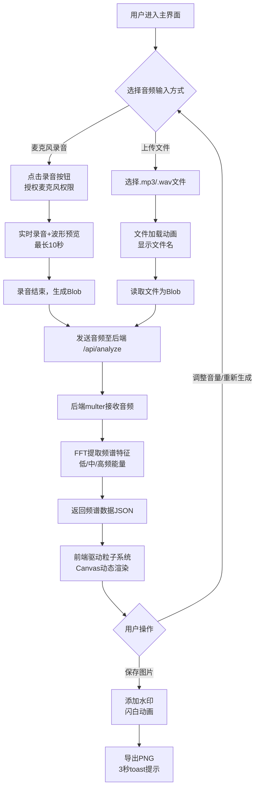

## 1. 产品概述

「幻彩声绘」是一款基于音频频谱特征的动态粒子可视化Web应用，将声音转化为绚丽的彩色粒子抽象画。用户通过录制语音或上传音频文件，即可生成由声音驱动的动态视觉作品，并可保存为带水印的图片。

- **核心价值**：将抽象的听觉体验转化为可感知的视觉艺术，为音乐爱好者、创意工作者提供独特的音频可视化体验
- **目标用户**：音乐爱好者、设计师、内容创作者、普通大众

## 2. 核心功能

### 2.1 用户角色

| 角色 | 注册方式 | 核心权限 |
|------|----------|----------|
| 游客用户 | 无需注册 | 录制音频、上传文件、生成粒子画、保存图片 |

### 2.2 功能模块

1. **主界面**：应用标题、粒子画布、控制面板
2. **音频采集模块**：麦克风录音（最长10秒）、本地文件上传（.mp3/.wav）
3. **音频分析模块**：后端FFT频谱分析，返回低/中/高频能量数据
4. **粒子渲染模块**：Canvas 2D动态粒子系统，按频段分层渲染
5. **图片导出模块**：保存为带水印的PNG图片

### 2.3 页面详情

| 页面名称 | 模块名称 | 功能描述 |
|----------|----------|----------|
| 主界面 | 应用标题 | 霓虹光效文字，赛博朋克风格 |
| 主界面 | 粒子画布 | 16:9宽高比Canvas，响应式适配，最小宽度600px |
| 主界面 | 控制面板 | 毛玻璃材质，包含录音/上传/保存三个按钮 |
| 录音组件 | 录音控制 | 圆形麦克风按钮，录音时脉冲缩放动画，最长10秒 |
| 录音组件 | 波形预览 | 实时显示录音波形，进度条显示剩余时间 |
| 上传组件 | 文件选择 | 支持拖拽或点击选择.mp3/.wav文件 |
| 上传组件 | 加载反馈 | 文件加载动画、文件名确认 |
| 粒子画布 | 粒子系统 | 低频-底部暖色（红橙）、中频-中部绿色、高频-顶部蓝紫 |
| 粒子画布 | 视觉效果 | 粒子大小/速度随音量变化、发光叠加、深灰黑渐变背景 |
| 保存模块 | 导出图片 | 保存为带水印PNG，闪白动画+3秒toast提示 |

## 3. 核心流程

用户进入应用后，可选择两种音频输入方式：使用浏览器麦克风录制最长10秒的音频，或上传本地.mp3/.wav文件。音频采集完成后，前端将音频数据发送至后端，后端通过FFT算法提取频谱特征，返回低频、中频、高频三段的能量均值数组。前端接收数据后，驱动Canvas上的粒子系统进行动态渲染——粒子按频段分布在画布的不同垂直区域，颜色从底部暖色渐变至顶部冷色，粒子的大小和运动速度随对应频段的音量实时变化。渲染过程中，用户可随时点击保存按钮，将当前画布状态导出为带有「幻彩声绘」水印的PNG图片，并获得保存成功的反馈提示。

## 4. 用户界面设计

### 4.1 设计风格

- **主色调**：深蓝 `#0a0e27`（背景）、品红 `#ff2d78`（强调色1）、青色 `#00e5ff`（强调色2）
- **辅助色**：低频区红橙渐变、中频区绿色、高频区蓝紫渐变
- **按钮风格**：半透明毛玻璃材质（`backdrop-filter: blur(12px)`），细发光边框，圆角设计
- **字体**：标题使用霓虹光效装饰字体，正文使用现代无衬线字体
- **布局风格**：固定标题（左上）+ 中央画布（自适应）+ 悬浮控制面板（右下）
- **图标风格**：线性图标，带发光效果，与赛博朋克主题一致

### 4.2 页面设计概述

| 页面名称 | 模块名称 | UI元素 |
|----------|----------|--------|
| 主界面 | 应用标题 | 霓虹文字「幻彩声绘」，文字发光动画，品红/青色双色光晕 |
| 主界面 | 背景层 | 深灰→黑色径向渐变，叠加细腻噪点纹理，营造深邃感 |
| 主界面 | 粒子画布 | 16:9宽高比，居中显示，最小宽度600px，外层发光边框 |
| 主界面 | 控制面板 | 毛玻璃卡片（`rgba(10,14,39,0.6)`），1px发光边框，圆角16px |
| 录音按钮 | 圆形按钮 | 麦克风图标，录音时1.1x→1.3x脉冲缩放，品红光晕 |
| 上传按钮 | 胶囊按钮 | 向上箭头图标，悬停时青色渐变动画 |
| 保存按钮 | 胶囊按钮 | 下载图标，右下角位置，悬停时品红→青色渐变 |
| 录音面板 | 进度条 | 10秒倒计时，青色进度条，当前时间/总时间文字 |
| 录音面板 | 波形预览 | Canvas实时波形，青色线条，居中显示 |
| Toast提示 | 成功提示 | 毛玻璃卡片，图标+「保存成功」文字，3秒后淡出 |

### 4.3 响应式设计

- **设计策略**：Desktop-first，移动端自适应
- **断点设置**：屏幕宽度 < 900px 触发移动端布局
- **桌面端（≥900px）**：
  - 标题：左上区域，字号36px
  - 画布：居中显示，16:9比例，最大宽度占屏幕70%
  - 控制面板：右下悬浮，三按钮水平排列
- **移动端（<900px）**：
  - 标题：缩小至24px，居中显示
  - 画布：宽度占满90%，高度自适应，保持16:9比例
  - 控制面板：移至画布下方，按钮两行排列（录音+上传一行，保存居中）
  - 触控优化：按钮最小触控区域44px，增加点击反馈

### 4.4 动画与交互细节

- **按钮悬停**：背景色从深蓝半透明→品红/青色半透明渐变，边框亮度提升
- **录音状态**：按钮1.1x↔1.3x脉冲缩放，每0.8秒循环，外圈品红光晕呼吸
- **粒子入场**：首次加载时粒子从中心向外扩散，0.8秒内完成入场
- **保存反馈**：全屏闪白（opacity 0→0.8→0，0.2秒），toast从底部滑入
- **过渡动画**：所有面板切换使用0.3秒ease-out过渡
- **性能目标**：粒子渲染帧率稳定60fps，录音→显示延迟≤2秒（不含网络）
