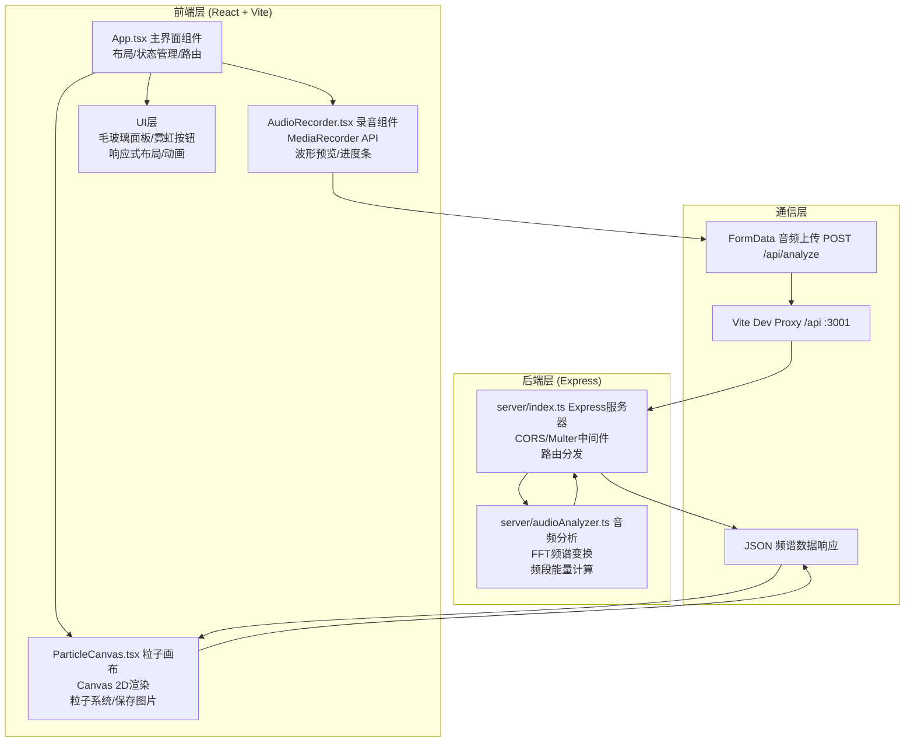
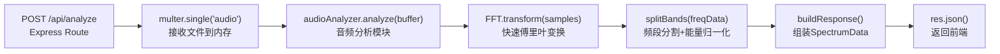

## 1. 架构设计



## 2. 技术描述

- **前端框架**：React 18 + TypeScript
- **构建工具**：Vite 5 + @vitejs/plugin-react
- **开发代理**：Vite HMR + /api 代理至后端 :3001
- **后端框架**：Express 4 + TypeScript（编译后运行）
- **音频处理**：
  - 前端：MediaRecorder API、Web Audio API（波形预览）
  - 后端：multer（文件上传）、自定义FFT算法（频谱分析）
- **样式方案**：原生CSS + CSS Modules，backdrop-filter毛玻璃效果
- **辅助库**：uuid（临时文件命名）、cors（跨域支持）

## 3. 项目目录结构

```
auto215/
├── package.json
├── vite.config.js
├── tsconfig.json
├── index.html
├── server/
│   ├── index.ts              # Express服务器入口
│   └── audioAnalyzer.ts      # 音频FFT分析模块
└── client/
    └── src/
        ├── main.tsx          # React入口
        ├── App.tsx           # 主界面组件
        ├── App.css           # 全局样式
        └── components/
            ├── AudioRecorder.tsx     # 录音组件
            ├── AudioRecorder.css     # 录音组件样式
            ├── ParticleCanvas.tsx    # 粒子画布组件
            └── ParticleCanvas.css    # 粒子画布样式
```

## 4. 路由定义

| 路由 | 方法 | 用途 |
|------|------|------|
| / | GET | Vite SPA入口，渲染React应用 |
| /api/analyze | POST | 上传音频文件，返回频谱分析数据 |
| /api/health | GET | 后端健康检查 |

## 5. API 定义

### 5.1 音频分析接口 POST /api/analyze

**请求 (multipart/form-data)**：
```typescript
interface AnalyzeRequest {
  audio: File;        // .mp3 / .wav / webm 音频文件，multer field name: 'audio'
}
```

**响应 (application/json)**：
```typescript
interface SpectrumData {
  success: boolean;
  lowFreq: number[];     // 低频能量数组 (20-250Hz)，长度=64，值范围[0,1]
  midFreq: number[];     // 中频能量数组 (250-2000Hz)，长度=64，值范围[0,1]
  highFreq: number[];    // 高频能量数组 (2000-20000Hz)，长度=64，值范围[0,1]
  duration: number;      // 音频时长(秒)
  sampleRate: number;    // 采样率
  lowAvg: number;        // 低频整体能量均值 [0,1]
  midAvg: number;        // 中频整体能量均值 [0,1]
  highAvg: number;       // 高频整体能量均值 [0,1]
}

interface ErrorResponse {
  success: boolean;
  error: string;
}
```

**频段划分**：
- 低频 Low：20Hz ~ 250Hz → 底部暖色粒子（红#ff2d78 → 橙#ff8c42）
- 中频 Mid：250Hz ~ 2000Hz → 中部绿色粒子（#00ff88 → #00e5ff）
- 高频 High：2000Hz ~ 20000Hz → 顶部蓝紫粒子（#0066ff → #9933ff）

## 6. 核心数据模型

### 6.1 粒子对象模型

```typescript
interface Particle {
  x: number;              // 当前X坐标
  y: number;              // 当前Y坐标 (按频段分布在画布不同区域)
  vx: number;             // X方向速度，随音量变化
  vy: number;             // Y方向速度，随音量变化
  size: number;           // 当前粒子大小
  baseSize: number;       // 基础大小
  color: { r: number; g: number; b: number };  // 粒子颜色（按频段渐变）
  band: 'low' | 'mid' | 'high';  // 所属频段
  alpha: number;          // 当前透明度
  energyIndex: number;    // 对应的频谱数组索引 (0-63)
  phase: number;          // 运动相位，用于轨迹扰动
}
```

### 6.2 画布状态模型

```typescript
interface CanvasState {
  width: number;          // 画布实际像素宽度（×devicePixelRatio）
  height: number;         // 画布实际像素高度
  displayWidth: number;   // CSS显示宽度
  displayHeight: number;  // CSS显示高度
  particles: Particle[];  // 粒子池，约200-300个
  spectrum: SpectrumData | null;  // 当前频谱数据
  animationId: number;    // requestAnimationFrame ID
  frame: number;          // 当前帧计数
  isFlashing: boolean;    // 是否正在闪白动画
}
```

### 6.3 录音状态模型

```typescript
interface RecordingState {
  isRecording: boolean;       // 是否正在录音
  duration: number;           // 已录音时长（秒）
  maxDuration: number;        // 最大时长 = 10秒
  audioBlob: Blob | null;     // 录音结果Blob
  mediaRecorder: MediaRecorder | null;
  audioContext: AudioContext | null;
  analyser: AnalyserNode | null;
  waveformData: Uint8Array;   // 实时波形数据（用于波形预览）
}
```

## 7. 服务器内部架构



**后端技术要点**：
- 使用 `memoryStorage` 将上传文件暂存内存（不上磁盘）
- 限制单文件最大 20MB
- 通过 `Buffer` 解码音频采样数据
- 采用窗口化FFT（汉宁窗）减少频谱泄漏
- 采样后将频谱分为64个子带，按三段聚合返回
- 全链路错误处理，异常时返回规范ErrorResponse

## 8. 性能与优化约束

| 指标 | 目标值 | 实现策略 |
|------|--------|----------|
| 渲染帧率 | 稳定60fps | 使用requestAnimationFrame，粒子数上限300，脏矩形优化 |
| 录音→渲染延迟 | ≤2秒（不含网络） | 流式处理、worker可选项、后端FFT算法优化 |
| 内存占用 | ≤200MB | 粒子池复用、Blob及时释放、Canvas离屏渲染控制 |
| 上传大小限制 | ≤20MB | multer limits配置 |
| 响应式重排 | ≤16ms | CSS transform优先，避免频繁resize触发重绘 |
