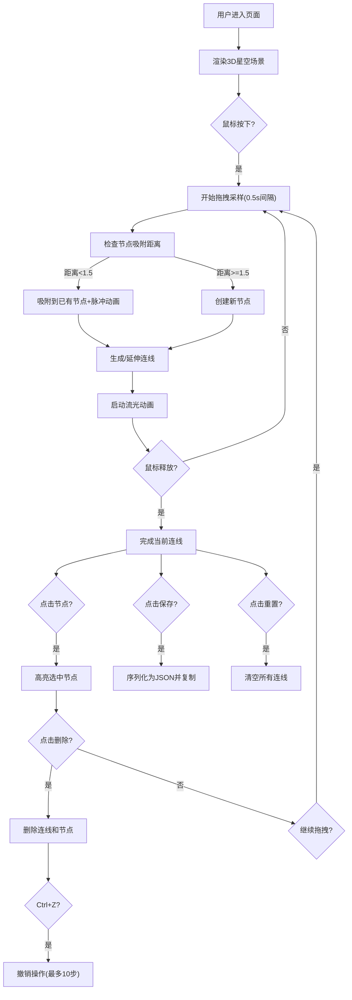

## 1. 产品概述
「星轨织网」是一款面向天文爱好者和创意人士的3D交互式可视化工具，让用户通过鼠标拖拽在虚拟星空背景中编织动态星座连线，形成可分享的星网艺术作品。
- 解决的核心问题：提供沉浸式、低门槛的3D星座艺术创作体验
- 目标用户：天文爱好者、数字艺术家、教育工作者、普通创意用户
- 产品价值：将科学美感与艺术创作结合，提供独特的交互式星空编织体验

## 2. 核心功能

### 2.1 用户角色
| 角色 | 注册方式 | 核心权限 |
|------|----------|----------|
| 普通用户 | 无需注册，直接使用 | 创建/编辑/删除星轨、保存作品JSON、重置场景 |

### 2.2 功能模块
1. **3D星空场景**：深空渐变背景、2000颗随机分布星星、闪烁生命效果
2. **星轨编织系统**：鼠标拖拽采样、节点生成、连线绘制、流光脉动
3. **智能节点系统**：节点吸附对齐、脉冲光晕动画、节点选择删除
4. **控制面板**：颜色选择、线宽调节、重置、保存、删除、撤销
5. **作品管理**：撤销操作（10步历史）、JSON序列化导出

### 2.3 页面详情
| 页面名称 | 模块名称 | 功能描述 |
|----------|----------|----------|
| 主页面 | 3D星空画布 | 2000颗随机静态星星（0.1-0.5大小、0.3-0.8透明度、50半径球体分布），鼠标拖拽交互，相机默认(0,5,15) |
| 主页面 | 星轨连线系统 | 0.5秒路径采样、半透明发光线条、0.3单位节点光晕球体、每次点击开新线 |
| 主页面 | 流光动画系统 | 起点到终点周期性流动亮光、色相±30°、2秒往返周期、透明度0.3-1.0循环 |
| 主页面 | 节点吸附系统 | 距离<1.5自动吸附、0.3秒脉冲光晕（半径0.3→1.0） |
| 主页面 | 删除撤销系统 | 节点点击高亮（红色边框1秒）、删除按钮移除、Ctrl+Z撤销10步 |
| 主页面 | 控制面板 | 颜色选择器、线宽滑块、重置按钮、保存按钮、删除按钮、响应式布局 |

## 3. 核心流程
用户进入页面→看到星空背景→按住鼠标拖拽→系统每0.5秒采样路径点→生成节点和连线→流光动画开始播放→继续拖拽或吸附已有节点→点击节点选中→可删除或继续操作→Ctrl+Z撤销→点击保存导出JSON→点击重置清空所有

## 4. 用户界面设计

### 4.1 设计风格
- **主色调**：深空蓝紫渐变 #0a0a2e → #1a1a4e
- **强调色**：柔和蓝紫 #6a5acd，流光色相±30°
- **背景**：径向渐变深空，略带星云质感
- **按钮风格**：圆角12px、毛玻璃半透明、悬停光晕、点击下压(scale 0.95, 100ms)
- **字体**：现代无衬线字体，标题使用略带未来感的字重
- **图标风格**：线条型简约图标，与蓝紫色调统一

### 4.2 页面设计概览
| 页面名称 | 模块名称 | UI元素 |
|----------|----------|--------|
| 主页面 | 3D星空场景 | 全屏Canvas、2000颗发光粒子、深空渐变背景、轻微星云纹理 |
| 主页面 | 星轨连线 | 发光半透明线条、直径0.3球形节点、流光扫描效果、随机闪烁(0.7-0.9透明度, 1-3秒周期) |
| 主页面 | 控制面板 - 大屏 (>1200px) | 右下角固定、宽280px、毛玻璃(rgba(255,255,255,0.1))、白色半透明边框、圆角12px、0.5秒淡入 |
| 主页面 | 控制面板 - 中屏 (768-1200px) | 宽200px、控件字号减小、布局紧凑 |
| 主页面 | 控制面板 - 小屏 (<768px) | 底部横向抽屉(高80px)、展开按钮、0.3秒滑出动画 |
| 主页面 | 控制面板控件 | 颜色选择器(带光晕悬停)、线宽滑块(#6a5acd轨道)、重置/保存/删除按钮(下压动画) |

### 4.3 响应式设计
- **桌面优先** (Desktop-first)：大屏为基准布局
- **断点设计**：
  - >1200px：完整控制面板 280px
  - 768-1200px：紧凑面板 200px，字体缩放0.85
  - <768px：底部抽屉式，展开/收起动画
- **触控优化**：移动端触摸事件映射、更大的节点点击热区

### 4.4 3D场景指导
- **环境氛围**：深空宇宙，背景使用#0a0a2e到#1a1a4e的径向渐变，略带紫色星云感
- **光照设置**：AmbientLight(0xffffff, 0.3) 基础环境光 + PointLight(0x6a5acd, 1, 100) 蓝紫补光
- **相机设置**：PerspectiveCamera(fov=60), 初始位置(0, 5, 15)，看向原点，允许OrbitControls拖拽旋转
- **构图焦点**：中心区域为主要创作区，星星密度中心略高、边缘略低形成层次感
- **交互动画**：
  - 连线流光：顶点着色器实现，u_time驱动亮光扫过
  - 节点脉冲：scale属性0.3→1.0→消失，duration=0.3s
  - 选中高亮：红色边框 emissive 闪烁 1秒
  - 星星闪烁：片元着色器随机相位alpha 0.7-0.9
- **后处理效果**：Bloom发光效果（阈值0.8，强度0.5）增强连线和节点的发光质感
- **性能预算**：
  - 星星顶点 ≤ 2000（使用Points几何体合并）
  - 连线总数 ≤ 100条，每条 ≤ 50点 → 总顶点 ≤ 15000
  - 目标帧率 ≥ 50FPS（Chrome 110+，16GB内存）
