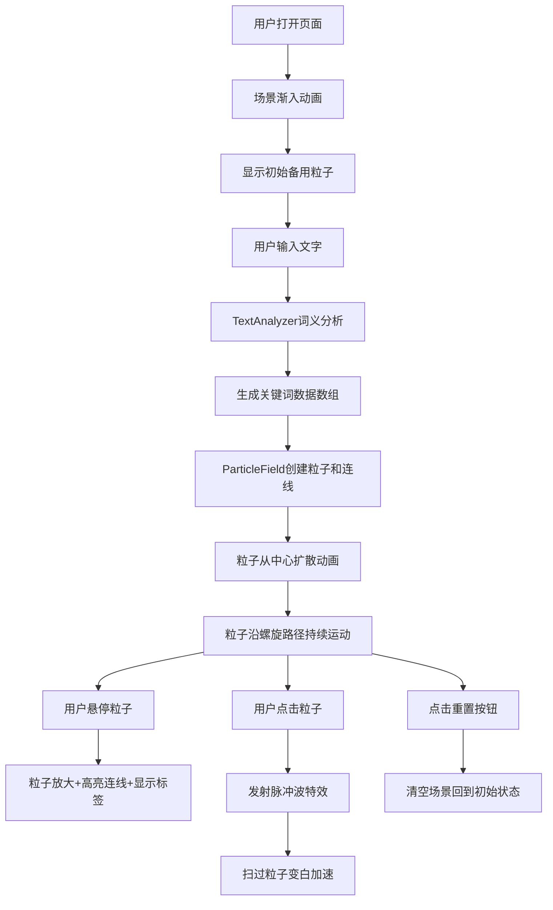

## 1. 产品概述

「思絮星流」是一款基于WebGL的3D思想流可视化交互装置，将用户输入的文字转化为动态发光粒子网络，模拟大脑神经元信号的闪烁与传递。

- 核心目标：为科幻爱好者、创意工作者提供沉浸式的文字语义可视化体验，将抽象思维具象化为可交互的三维艺术装置
- 市场价值：探索文字与视觉艺术的跨界融合，可应用于创意展示、教育科普、艺术装置等场景

## 2. 核心功能

### 2.1 用户角色
| 角色 | 注册方式 | 核心权限 |
|------|----------|----------|
| 普通用户 | 无需注册 | 输入文字、浏览粒子场景、交互探索粒子网络 |

### 2.2 功能模块
1. **主场景页面**：3D粒子可视化场景、语义关联流线网络、交互式探索
2. **输入控制模块**：文字输入框（100字符限制）、重置按钮、实时触发粒子重排
3. **交互反馈模块**：鼠标悬停高亮、点击脉冲波、视角拖拽旋转

### 2.3 页面详情
| 页面名称 | 模块名称 | 功能描述 |
|----------|----------|----------|
| 主场景页面 | 3D粒子系统 | 根据输入文本生成发光粒子，颜色映射情感色彩，大小映射词频 |
| 主场景页面 | 语义流线网络 | 粒子间根据关联度连接发光线段，透明度正比于关联度 |
| 主场景页面 | 动态运动 | 粒子沿三维螺旋路径缓慢移动，连接线形成流动视觉效果 |
| 主场景页面 | 悬停交互 | 悬停粒子放大1.5倍，高亮连接线，显示词语标签 |
| 主场景页面 | 点击交互 | 点击粒子触发脉冲波，半径30单位，持续1秒，扫过粒子变白加速 |
| 输入控制模块 | 文字输入框 | 半透明毛玻璃效果，支持中英文混合，最多100字符 |
| 输入控制模块 | 重置按钮 | 清空场景，回到初始随机漂浮备用粒子状态 |
| 输入控制模块 | 过渡动画 | 输入后0.8秒粒子重排过渡，场景进入2秒渐入，粒子生成缩放动画 |

## 3. 核心流程

用户打开页面后，首先看到深空背景中随机漂浮的备用粒子。在顶部输入框输入文字后，系统将文本拆分为关键词，计算情感色彩和关联度，生成对应粒子和连接线网络。用户可通过鼠标拖拽旋转视角，悬停查看词语详情，点击触发脉冲波效果。点击重置按钮清空所有语义粒子，回到初始状态。

## 4. 用户界面设计

### 4.1 设计风格
- **主色调**：深空黑 `#0a0a0a` → 深蓝 `#0d1b2a` 径向渐变背景
- **情感色彩映射**：
  - 正面词：蓝紫 `#8A2BE2` → 青色 `#00FFFF` 渐变
  - 负面词：橙红 `#FF4500` → 紫红 `#C71585` 渐变
- **辅助色**：淡蓝边框 `#40E0D066`，标签文字白色 `#FFFFFF`
- **字体**：无衬线体（system-ui），标签字号14px
- **材质效果**：半毛玻璃（背景 `rgba(255,255,255,0.05)`），粒子周围光晕（Bloom后期）
- **动画缓动**：所有交互0.2秒缓动过渡，粒子重排0.8秒过渡，场景渐入2秒

### 4.2 页面设计概述
| 页面名称 | 模块名称 | UI元素 |
|----------|----------|--------|
| 主场景页面 | 3D画布 | 全屏Canvas（100vw×100vh），深空径向渐变背景，Bloom光晕后期 |
| 主场景页面 | 粒子渲染 | BufferGeometry点精灵，发光材质，颜色映射情感，大小映射词频（3-8px） |
| 主场景页面 | 连线渲染 | LineSegments，透明度0.3-0.9正比于关联度 |
| 主场景页面 | 脉冲特效 | ShaderMaterial动画圆环，半径0→30单位，1秒周期 |
| 主场景页面 | 标签层 | CSS2DRenderer悬浮标签，白色14px，毛玻璃背景 |
| 输入控制模块 | 输入框容器 | 顶部居中，最大宽度320px，绝对定位，z-index上层 |
| 输入控制模块 | 文字输入框 | 圆角，毛玻璃背景，淡蓝边框，白色文字，placeholder提示 |
| 输入控制模块 | 重置按钮 | 输入框下方，毛玻璃风格，点击反馈动画 |

### 4.3 响应式适配
- **桌面优先**：Canvas始终占满视口（100vw×100vh）
- **移动端适配**：输入框宽度自适应，最小触控目标48px
- **触控优化**：支持单指拖拽旋转，双指缩放，点击触发脉冲

### 4.4 3D场景指引
- **环境氛围**：纯深空背景，径向渐变营造宇宙纵深感，无HDRI贴图
- **光照设置**：AmbientLight基础环境光 + PointLight粒子自发光模拟，关闭阴影计算
- **相机设置**：PerspectiveCamera，初始距离80，fov 60°，OrbitControls禁用平移，启用阻尼
- **构图焦点**：粒子群居中，运动保持在可视范围内，连接线形成视觉流线网络
- **交互动画**：粒子螺旋运动（2-5单位/秒），悬停缩放1.5倍（0.2s缓动），脉冲波纹扩散
- **后期处理**：UnrealBloomPass光晕效果（阈值0.1，强度0.8，半径0.5）
- **性能预算**：粒子数500-800，连接线≤粒子数×2，BufferGeometry优化，目标60FPS
