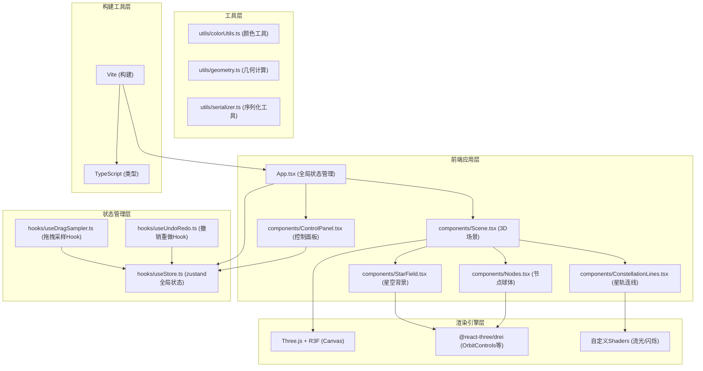

## 1. 架构设计



## 2. 技术说明
- **前端框架**：React@18 + TypeScript@5
- **构建工具**：Vite@5 + @vitejs/plugin-react@4
- **3D渲染**：Three.js@0.160 + @react-three/fiber@8 + @react-three/drei@9
- **类型定义**：@types/three@0.160
- **状态管理**：zustand@4（轻量全局状态）
- **样式方案**：原生CSS + CSS Modules（无Tailwind，保持简洁高效）
- **无后端**：纯前端应用，数据通过Clipboard API导出

## 3. 目录与文件说明

```
auto22/
├── package.json              # 项目依赖和脚本
├── vite.config.js            # Vite配置（React+TS+路径别名）
├── tsconfig.json             # TS严格模式+路径映射
├── index.html                # 入口HTML（深空背景）
└── src/
    ├── main.tsx              # React入口挂载点
    ├── App.tsx               # 主组件（相机/全局状态/初始化）
    ├── index.css             # 全局样式（渐变背景、响应式）
    ├── types/
    │   └── index.ts          # 类型定义（星轨/节点/配置）
    ├── components/
    │   ├── Scene.tsx         # 3D场景组件（R3F Canvas+交互逻辑）
    │   ├── ControlPanel.tsx  # 控制面板（颜色/线宽/按钮）
    │   ├── StarField.tsx     # 星空背景（2000颗Points粒子）
    │   ├── ConstellationLine.tsx  # 单条星轨（自定义Shader流光）
    │   └── StarNode.tsx      # 节点球体（吸附脉冲/选中高亮）
    ├── hooks/
    │   ├── useStore.ts       # zustand全局状态store
    │   ├── useDragSampler.ts # 鼠标拖拽采样Hook
    │   └── useUndoHistory.ts # 撤销重做Hook（10步历史）
    ├── utils/
    │   ├── colorUtils.ts     # HSL/色相偏移工具
    │   ├── geometry.ts       # 3D坐标/距离计算
    │   └── serializer.ts     # JSON序列化导出
    └── shaders/
        ├── flowLineVertex.glsl    # 流光连线顶点着色器
        ├── flowLineFragment.glsl  # 流光连片段着色器
        ├── twinkleVertex.glsl     # 星星闪烁顶点着色器
        └── twinkleFragment.glsl   # 星星闪烁片段着色器
```

### 文件调用关系与数据流向：
1. **main.tsx → App.tsx**：React根挂载
2. **App.tsx → Scene.tsx**：传入 `constellations`, `selectedId`, `color`, `lineWidth`，接收事件 `onDragStart/onDragSample/onDragEnd/onNodeClick`
3. **App.tsx → ControlPanel.tsx**：传入状态与回调，用户操作 → 更新 zustand store → 触发Scene重渲染
4. **Scene.tsx → StarField.tsx**：纯渲染组件，无外部数据依赖
5. **Scene.tsx → ConstellationLine.tsx**：传入单条连线数据 `points`, `color`, `lineWidth`
6. **Scene.tsx → StarNode.tsx**：传入节点数据 `position`, `isSelected`, `isPulsing`
7. **useDragSampler.ts**：监听鼠标事件 → 0.5s采样 → 调用geometry距离检测 → 调用colorUtils处理颜色 → 更新useStore
8. **useUndoHistory.ts**：包装store操作，维护历史栈，监听Ctrl+Z快捷键
9. **serializer.ts**：ControlPanel点击保存时调用 → 序列化为JSON → 写入剪贴板

## 4. 数据模型

### 4.1 TypeScript 类型定义

```typescript
// 3D坐标点
export interface Vec3 {
  x: number;
  y: number;
  z: number;
}

// 星轨节点
export interface StarNodeData {
  id: string;          // 唯一ID
  position: Vec3;      // 3D坐标
  createdAt: number;   // 创建时间戳
}

// 单条星轨连线
export interface Constellation {
  id: string;                   // 唯一ID
  nodes: StarNodeData[];        // 节点列表（按顺序）
  color: string;                // 基础颜色 HEX (#6a5acd)
  lineWidth: number;            // 线宽 (0.1 默认)
  createdAt: number;            // 创建时间
  flowStartTime: number;        // 流光动画起始时间
  twinklePhase: number;         // 闪烁相位 (随机0-1)
  twinklePeriod: number;        // 闪烁周期 (1-3秒随机)
}

// 全局配置
export interface AppConfig {
  baseColor: string;            // 用户选择的颜色
  lineWidth: number;            // 当前线宽
  selectedConstellationId: string | null;  // 选中的连线
  selectedNodeId: string | null;           // 选中的节点（用于删除）
}

// 操作历史记录
export interface HistorySnapshot {
  constellations: Constellation[];
  timestamp: number;
}

// 全局Store状态
export interface AppState extends AppConfig {
  constellations: Constellation[];
  pulsingNodes: Map<string, number>;  // 正在脉冲动画的节点ID+开始时间
  
  // Actions
  addConstellation: (c: Constellation) => void;
  updateConstellation: (id: string, updates: Partial<Constellation>) => void;
  deleteConstellation: (id: string) => void;
  selectNode: (constellationId: string | null, nodeId: string | null) => void;
  addPulsingNode: (nodeId: string) => void;
  removePulsingNode: (nodeId: string) => void;
  setConfig: (config: Partial<AppConfig>) => void;
  resetAll: () => void;
}
```

### 4.2 顶点预算计算（≤15000）
- **星星粒子**：2000颗 × 1顶点/颗 = 2000顶点
- **星轨连线**：100条 × 50点/条 × 2顶点/线段 = 10000顶点（使用LineSegments或自定义线几何体）
- **节点球体**：100条 × 50节点 × 12三角面 × 3顶点 = 180000... 
  → 优化：使用InstancedMesh实例化渲染，所有节点共享球体几何，仅传矩阵 → 1球体(24顶点) + N实例 → 不增加额外顶点
- **总顶点**：2000 + 10000 + 24 ≈ **12024 顶点** ✓

## 5. 核心性能优化策略

### 5.1 渲染优化
- **星星使用Points**：单个BufferGeometry承载2000点，而非2000个Mesh
- **节点使用InstancedMesh**：所有节点球体共享几何，实例矩阵单独更新
- **连线使用ShaderMaterial**：流光动画在顶点/片元着色器用u_time实现，CPU零开销
- **闪烁使用Shader**：星星和连线透明度变化均在Shader中完成，无需逐帧JS更新

### 5.2 交互优化
- **拖拽采样节流**：固定500ms采样，而非mousemove全量触发
- **Raycaster命中优化**：仅对节点层启用点击检测，连线使用包围盒粗筛
- **状态更新批量**：拖拽过程中合并React更新，避免每帧re-render

### 5.3 内存优化
- **历史记录上限**：仅保存最近10个完整快照，超出自动丢弃最早记录
- **节点引用去重**：吸附时复用已有节点对象引用，避免重复创建
