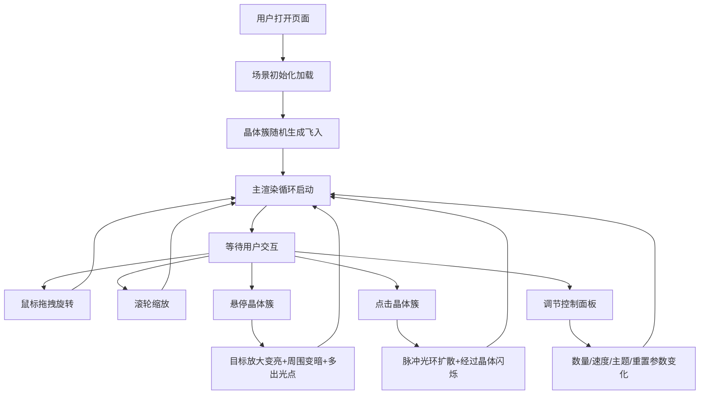

# 晶簇幻境 - 产品需求文档

## 1. 产品概述
「晶簇幻境」是一个基于Three.js的3D交互可视化艺术项目，在幽暗的虚空空间中呈现漂浮的发光晶体簇群落，支持丰富的鼠标交互和参数调控，为用户带来沉浸式的幻彩视觉体验。

- 核心目标：打造视觉冲击力强、交互流畅的3D艺术装置
- 目标用户：设计爱好者、艺术展览观众、技术演示场景
- 市场价值：可作为网页艺术装置、展览互动展示、品牌视觉素材

## 2. 核心功能

### 2.1 功能模块
1. **3D场景渲染模块**：晶体簇生成、光纹动画、粒子系统、光网连接、背景氛围
2. **鼠标交互模块**：视角旋转、滚轮缩放、悬停高亮、点击脉冲
3. **控制面板模块**：数量调节、速度调节、主题切换、视角重置

### 2.2 功能详情

| 模块名称 | 子功能 | 功能描述 |
|----------|--------|----------|
| 3D场景渲染 | 晶体簇生成 | 随机生成半透明发光晶体簇，每簇由多根晶柱组合，不同颜色与形状 |
| 3D场景渲染 | 光纹流动 | 晶柱表面有流动的光纹纹理，速度可调节 |
| 3D场景渲染 | 光点飘散 | 晶体尖端持续飘散出发光粒子 |
| 3D场景渲染 | 漂浮光点 | 场景中存在萤火虫般的细小光点，缓慢随机运动 |
| 3D场景渲染 | 光网连接 | 光点之间存在半透明细丝连接，透明度随距离动态变化 |
| 3D场景渲染 | 整体旋转 | 所有晶体簇缓慢自旋转，整体围绕中心公转 |
| 3D场景渲染 | 视差效果 | 视角旋转时，晶体表面光纹产生细微偏移，增强立体感 |
| 鼠标交互 | 视角旋转 | 鼠标拖拽围绕场景中心旋转视角 |
| 鼠标交互 | 滚轮缩放 | 滚轮控制相机距离，限制3-20单位范围 |
| 鼠标交互 | 悬停响应 | 悬停晶体簇放大变亮（0.5s动画），周围晶体变暗，产生更多光点 |
| 鼠标交互 | 点击脉冲 | 点击触发彩色光环扩散（半径8单位，2秒/圈），所到之处晶体变色闪烁两次（0.3s/次） |
| 控制面板 | 数量滑块 | 5-30范围，默认15，拖动时平滑增减，新晶体从随机位置飞入 |
| 控制面板 | 速度滑块 | 0.1-2.0倍速，默认1.0，控制光纹流动速度 |
| 控制面板 | 主题选择 | 3种预设主题（熔岩之心/深海遗珠/极夜极光），2秒平滑过渡 |
| 控制面板 | 重置视角 | 1.5秒内平滑回到初始视角与缩放 |
| 控制面板 | 交互反馈 | 控件悬停高亮、按下颜色变深、松开弹回 |

## 3. 核心流程

### 3.1 主用户流程
用户打开页面 → 3D场景加载完成，晶体簇缓缓出现 → 用户拖拽旋转视角探索场景 → 滚轮缩放调整观察距离 → 悬停晶体簇观察细节效果 → 点击晶体簇触发脉冲特效 → 打开右下角控制面板调整参数 → 切换主题体验不同氛围 → 点击重置按钮回到初始视角

### 3.2 Mermaid流程图

## 4. 用户界面设计

### 4.1 设计风格
- **整体风格**：幽暗幻彩 / 虚空梦境 / 晶体科幻
- **背景**：深黑(#05020d)到暗紫(#1a0a2e)的径向渐变
- **主色调**：根据主题动态变化
  - 熔岩之心：暖橙(#ff7b3d) → 暗红(#6b0f1a)
  - 深海遗珠：蓝绿(#00d4aa) → 紫灰(#5a4a7a)
  - 极夜极光：冷紫(#a855f7) → 青绿(#2dd4bf)
- **控制面板**：毛玻璃效果（backdrop-filter: blur(16px)），半透明背景（rgba(20,10,40,0.55)），微发光边框（box-shadow + 渐变描边）
- **滑块样式**：自定义轨道和滑块，渐变填充，悬停发光
- **按钮样式**：圆角矩形，渐变边框，悬停亮度提升，按下内阴影

### 4.2 页面布局

| 页面元素 | 位置 | UI细节 |
|----------|------|--------|
| 3D画布 | 全屏铺满 | 背景径向渐变，无滚动条 |
| 控制面板 | 右下方，距右32px距下32px | 宽度280px，圆角16px，内边距20px |
| 面板标题 | 面板顶部 | 字体浅色发光，字号16px，字重500 |
| 滑块组 | 面板主体 | 每项包含标签+数值+滑块，间距16px |
| 主题选择器 | 滑块组下方 | 3个色块按钮，选中状态有光环 |
| 重置按钮 | 面板底部 | 全宽按钮，圆角8px，渐变背景 |

### 4.3 响应式
- 桌面端优先设计（≥1280px）
- 平板端（768-1279px）：控制面板宽度240px，字体略小
- 移动端（<768px）：控制面板移至底部横条，宽度自适应

### 4.4 3D场景指导
- **环境与氛围**：深紫虚空背景，无HDRI，使用雾效(FogExp2，密度0.02)增强空间感
- **灯光设置**：主光源为环境光(0.1强度) + 多个点光源跟随大晶体簇，晶体自发光，不依赖外部光源
- **相机设置**：PerspectiveCamera，fov 60，初始距离10单位，看向原点
- **相机运动**：OrbitControls环绕原点，enableDamping=true，minDistance=3，maxDistance=20
- **构图焦点**：场景中心为视觉焦点，晶体簇分布在半径6单位的球体内，中心区域密度略高
- **后处理效果**：使用UnrealBloomPass实现泛光效果（强度0.6，半径0.5，阈值0.2）
- **性能预算**：30个晶体簇时，draw calls < 200，帧率 ≥ 50fps

## 5. 性能指标
| 指标 | 目标值 |
|------|--------|
| 默认15晶体簇帧率 | ≥ 60fps |
| 最大30晶体簇帧率 | ≥ 50fps |
| 悬停响应延迟 | ≤ 50ms |
| 点击脉冲触发延迟 | ≤ 30ms |
| 主题切换平滑度 | 无明显跳帧 |
