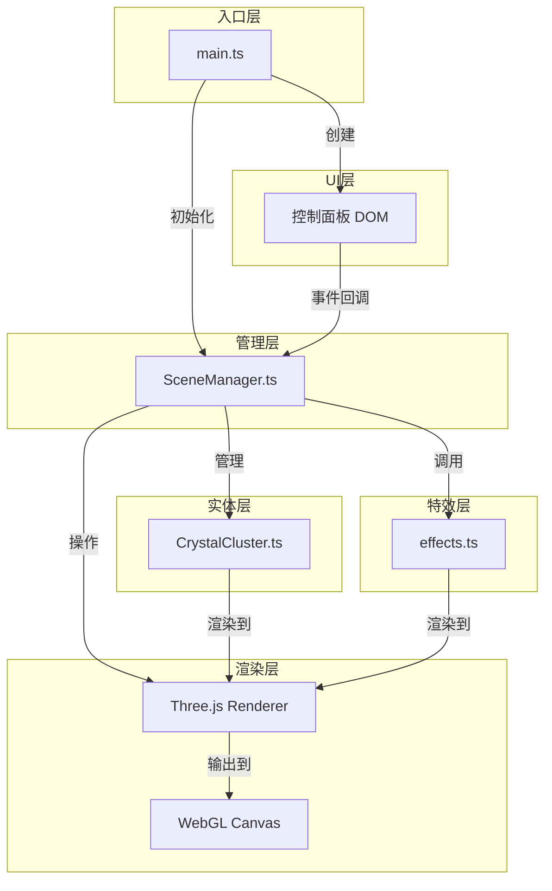

# 晶簇幻境 - 技术架构文档

## 1. 架构设计



## 2. 技术选型说明

| 层级 | 技术 | 版本 | 选型理由 |
|------|------|------|----------|
| 构建工具 | Vite | ^5.0 | 快速冷启动，原生ESM支持，HMR秒级更新 |
| 编程语言 | TypeScript | ^5.3 | 类型安全，重构友好，IDE智能提示 |
| 3D渲染引擎 | Three.js | ^0.160.0 | 成熟稳定的WebGL抽象层，社区生态丰富 |
| 控制器 | OrbitControls | three内置 | 提供拖拽旋转+滚轮缩放，支持阻尼效果 |
| 后处理 | postprocessing(three/addons) | three内置 | UnrealBloomPass实现泛光效果 |
| UI界面 | 原生HTML/CSS | - | 轻量无依赖，便于毛玻璃和渐变样式实现 |

**依赖选择说明**：
- 不使用React/Three Fiber：项目以纯渲染为主，无需组件化状态管理，原生Three.js性能更优
- 不使用额外的动画库：Three.js的THREE.MathUtils.lerp + requestAnimationFrame即可实现所有缓动
- 不使用物理引擎：所有运动均为程序化动画，无需碰撞检测

## 3. 模块职责定义

### 3.1 main.ts - 入口文件
**职责**：
- 创建Renderer、Scene、Camera实例
- 初始化OrbitControls，配置距离限制
- 创建并调用SceneManager
- 创建控制面板DOM元素并绑定到SceneManager
- 启动requestAnimationFrame主循环
- 处理窗口resize事件

**关键初始化参数**：
```
Renderer: antialias=true, alpha=true, powerPreference='high-performance'
Camera: fov=60, near=0.1, far=200, position=(0,0,10)
OrbitControls: enableDamping=true, dampingFactor=0.05, minDistance=3, maxDistance=20
```

### 3.2 CrystalCluster.ts - 晶体簇类
**接口定义**：
```typescript
interface CrystalClusterConfig {
  position: THREE.Vector3;
  theme: ColorTheme;
  crystalCount: number; // 该簇包含的晶柱数量
}

interface HoverState {
  isHovered: boolean;
  targetScale: number;
  targetBrightness: number;
  currentScale: number;
  currentBrightness: number;
}

interface PulseState {
  isPulsing: boolean;
  flashCount: number;
  flashDuration: number;
  elapsed: number;
  originalColors: THREE.Color[];
}

class CrystalCluster extends THREE.Group {
  constructor(config: CrystalClusterConfig);
  update(delta: number, time: number, rippleSpeed: number): void;
  setHovered(hovered: boolean): void;
  triggerPulse(theme: ColorTheme): void;
  setTheme(theme: ColorTheme, transitionProgress?: number): void;
  dispose(): void;
}
```

**内部实现**：
- 晶柱几何体：使用CylinderGeometry，参数随机化（topRadius, bottomRadius, height, radialSegments）
- 晶柱位置：围绕簇中心随机分布在XY平面，高度略有不同
- 晶柱旋转：随机旋转X/Z轴，产生晶体簇的不规则感
- 材质：MeshPhysicalMaterial
  - transparent=true, opacity=0.7~0.85
  - transmission=0.3, roughness=0.15, metalness=0.1
  - emissiveMap使用动态生成的Canvas纹理实现光纹流动
- 光纹纹理：Canvas 2D绘制重复的条纹图案，通过偏移纹理坐标实现流动
- 光晕：每个晶柱添加PointLight（颜色匹配，强度随距离衰减）

### 3.3 SceneManager.ts - 场景管理
**接口定义**：
```typescript
interface SceneCallbacks {
  onClusterCountChange: (count: number) => void;
  onRippleSpeedChange: (speed: number) => void;
  onThemeChange: (theme: ColorTheme) => void;
  onResetCamera: () => void;
}

type ColorTheme = 'lava' | 'deepSea' | 'aurora';

interface ThemePalette {
  colors: [THREE.Color, THREE.Color]; // 渐变起止色
  accentColor: THREE.Color;
}

class SceneManager {
  constructor(
    scene: THREE.Scene,
    camera: THREE.PerspectiveCamera,
    controls: OrbitControls,
    renderer: THREE.WebGLRenderer
  );
  setClusterCount(count: number): void;
  setRippleSpeed(speed: number): void;
  setTheme(theme: ColorTheme): void;
  resetCamera(): void;
  update(delta: number, time: number): void;
  private handleRaycast(): void;
  private handleClick(): void;
  private animateClusterIn(cluster: CrystalCluster): void;
  private animateClusterOut(cluster: CrystalCluster): Promise<void>;
  dispose(): void;
}
```

**关键逻辑**：
- Raycaster进行鼠标拾取，每帧检测悬停对象
- 晶体簇数量变化：新簇从随机方向（球面坐标）飞向目标位置，旧簇飞出后销毁
- 主题切换：保存旧主题颜色，每帧lerp过渡到新主题颜色（2秒）
- 相机重置：保存初始position/target，每帧lerp过渡（1.5秒）
- 悬停管理：同一时间最多一个hovered簇，非hovered簇brightness目标为0.7

### 3.4 effects.ts - 特效模块
**导出内容**：
```typescript
interface FireflyConfig {
  count: number;
  scene: THREE.Scene;
  bounds: number;
}

interface PulseRingConfig {
  position: THREE.Vector3;
  theme: ColorTheme;
  radius: number;
  duration: number;
  scene: THREE.Scene;
  onRadiusReached: (radius: number, position: THREE.Vector3) => void;
}

interface TipParticlesConfig {
  cluster: CrystalCluster;
  scene: THREE.Scene;
  intensity: number; // 1.0=普通, >1.0=悬停加速
}

export class FireflySystem {
  constructor(config: FireflyConfig);
  update(delta: number): void;
  dispose(): void;
}

export class ConnectionNetwork {
  constructor(points: THREE.Points, scene: THREE.Scene, maxDistance: number);
  update(): void;
  dispose(): void;
}

export class PulseRing {
  constructor(config: PulseRingConfig);
  update(delta: number): boolean; // 返回是否完成
  dispose(): void;
}

export class TipParticles {
  constructor(config: TipParticlesConfig);
  update(delta: number): void;
  setIntensity(intensity: number): void;
  dispose(): void;
}
```

**实现要点**：
- FireflySystem：使用BufferGeometry + PointsMaterial，每帧给每个粒子添加Perlin噪声位移
- ConnectionNetwork：每帧遍历所有粒子对，距离<阈值则添加LineSegment，使用ShaderMaterial按距离设置透明度
- PulseRing：使用TorusGeometry + ShaderMaterial，半径从0增长到目标值，透明度渐变，通过回调通知SceneManager触发晶体闪烁
- TipParticles：从晶柱尖端位置发射粒子，向上飘散，透明度fade out，使用BufferGeometry批量渲染

## 4. 文件结构

```
auto221/
├── .trae/documents/
│   ├── 产品需求文档.md
│   └── 技术架构文档.md
├── src/
│   ├── main.ts              # 入口，初始化+主循环
│   ├── CrystalCluster.ts    # 晶体簇类
│   ├── SceneManager.ts      # 场景管理+交互
│   └── effects.ts           # 粒子/光网/脉冲特效
├── index.html               # 入口页面，Canvas挂载点+样式
├── package.json             # 依赖配置
├── vite.config.js           # Vite配置
└── tsconfig.json            # TypeScript严格模式
```

## 5. 性能优化策略

| 优化点 | 策略 |
|--------|------|
| 绘制调用 | 晶体簇内的晶柱使用合并几何或InstancedMesh（若颜色允许） |
| 光纹纹理 | 所有晶柱共享同一张Canvas纹理，仅偏移纹理坐标，不重复创建纹理 |
| 粒子系统 | 统一使用BufferGeometry，position数组复用，避免GC |
| 光网连线 | 空间网格分块，只计算相邻网格内的粒子距离，避免O(n²)全遍历 |
| Raycaster | 仅在鼠标移动后1帧内检测，避免每帧全量检测 |
| 后处理 | Bloom仅作用于emissive通道，阈值设置合理避免全屏泛光 |
| 阴影 | 关闭所有阴影投射/接收，晶体自发光无需阴影 |

## 6. 构建与运行

```bash
# 安装依赖
npm install

# 启动开发服务器（Vite默认端口5173）
npm run dev

# 构建生产版本
npm run build
```
