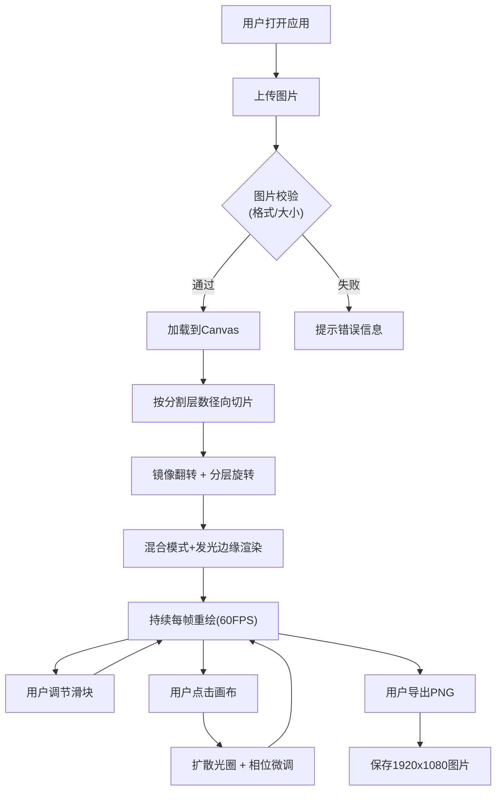

## 1. 产品概述

「碎镜万花筒」是一款基于Web浏览器的交互式视觉艺术装置，让数字艺术家和普通用户通过上传图片，实时体验径向分割、镜像对称与分层旋转带来的几何美学冲击。它将一张静态图片转化为不断演化的对称图案，仿佛透过破碎的万花筒观察世界。

- 核心价值：降低视觉艺术创作门槛，提供即时满足的交互式创作体验
- 目标用户：数字艺术家、设计师、视觉爱好者、教育场景用户

## 2. 核心功能

### 2.1 功能模块

1. **主画布区域**：Canvas 2D渲染核心，图片上传后实时绘制万花筒效果
2. **控制面板**：参数调节、重置、导出功能入口
3. **交互反馈系统**：点击画布触发扩散光圈与相位微调

### 2.2 页面详情

| 页面名称 | 模块名称 | 功能描述 |
|-----------|-------------|---------------------|
| 主页面 | 画布区域 | 居中显示Canvas渲染画布，支持图片上传、点击触发光圈效果、拖拽感知 |
| 主页面 | 控制面板（桌面端） | 右侧固定280px宽度毛玻璃面板，包含：分割层数滑块、镜像角度滑块、旋转速度滑块、重置按钮、导出PNG按钮、图片上传按钮 |
| 主页面 | 控制面板（移动端） | 底部抽屉式菜单，点击汉堡图标展开/收起，功能同桌面端 |

## 3. 核心流程

### 3.1 主创作流程

用户打开应用 → 上传图片（JPG/PNG，最大8MB）→ 图片加载并渲染为初始万花筒图案 → 用户通过滑块实时调节参数（分割层数/镜像角度/旋转速度）→ 画布每秒60帧持续渲染动态效果 → 用户可点击画布触发光圈特效 → 满意后导出1920x1080 PNG图片。

## 4. 用户界面设计

### 4.1 设计风格 — 赛博朋克深空美学

**配色方案：**
- 深空背景：`#0A0A1A`（近黑深蓝）
- 霓虹主色渐变：`#7C3AED`（紫）→ `#3B82F6`（蓝）
- 发光辅助色：`rgba(59,130,246,0.5)`（画布边框光晕）
- 面板半透明：`rgba(255,255,255,0.1)` + `backdrop-filter: blur(10px)`

**视觉元素：**
- 按钮风格：霓虹蓝紫渐变背景，圆角8px，悬浮亮度+30%，点击缩放弹跳（0.95 → 1.05）
- 滑块风格：自定义轨道+霓虹渐变滑块手柄
- 画布边框：`box-shadow: 0 0 15px rgba(59,130,246,0.5)` 细窄发光边
- 整体基调：高对比度、发光元素、硬边几何

**排版：**
- 标题：Orbitron / 科技感无衬线字体，霓虹渐变文字
- 正文：系统无衬线字体，浅灰 `#E5E7EB`

### 4.2 页面设计概览

| 页面区域 | 模块名称 | UI元素细节 |
|-----------|-------------|-------------|
| 画布区 | 主Canvas | 居中显示，发光边框，深空背景环绕，点击触发波纹光圈 |
| 右侧面板 | 参数控制区 | 毛玻璃半透明，标题霓虹渐变，滑块带数值标签，按钮有悬浮/点击动效 |
| 移动端 | 底部抽屉 | 汉堡图标固定右下角，抽屉向上弹出，带遮罩层 |

### 4.3 响应式设计

- **桌面端（≥768px）**：右侧固定280px控制面板，画布占据左侧剩余空间居中显示
- **移动端（<768px）**：控制面板折叠为底部抽屉，画布全屏显示，右下角汉堡图标点击展开抽屉，遮罩层点击关闭

### 4.4 Canvas渲染效果

- **分割线发光**：颜色渐变+透明度0.3-0.8循环动画，周期1.5秒
- **颜色混合**：相邻切片重叠区域使用 `screen` 或 `overlay` 混合模式
- **分层旋转**：内层到外层旋转速度线性递增
- **点击光圈**：半径0→80px，透明度1→0，持续1秒，彩色渐变
