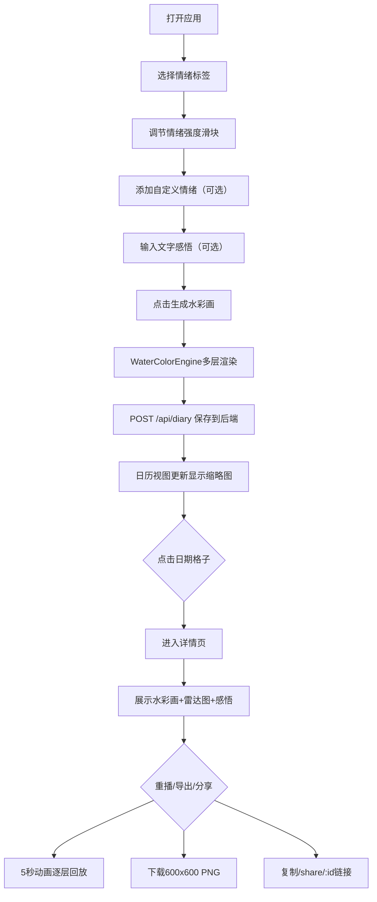

## 1. 产品概述

「情绪色谱·数字水彩日记」是一款将情绪记录与数字艺术融合的Web应用，帮助用户通过色彩与笔触而非文字来记录每日复杂情绪。用户选择情绪标签并调节强度后，系统自动生成一幅独一无二的抽象水彩画作为当日情绪日记，所有日记可在日历视图中浏览、重播和分享。

- 解决用户难以用文字精准描述复杂情绪的痛点，将情绪转化为可视化的艺术作品
- 面向所有希望记录和回顾内心世界的用户，尤其适合创意工作者、情绪敏感人群和艺术爱好者

## 2. 核心功能

### 2.1 用户角色

| 角色 | 注册方式 | 核心权限 |
|------|---------|---------|
| 普通用户 | 无需注册，本地使用 | 创建、浏览、重播、导出、分享日记 |
| 分享访客 | 通过分享链接访问 | 仅查看日记内容，无法编辑 |

### 2.2 功能模块

1. **情绪输入面板**：12种基础情绪标签选择、强度滑块调节、自定义情绪添加、实时色块堆叠预览
2. **水彩画生成引擎**：基于情绪组合和强度的多层Canvas渲染，Perlin噪声扩散、纹理叠加、边缘沉淀效果
3. **日历浏览视图**：月历表格展示日记缩略图，点击进入详情页
4. **详情重播页面**：全尺寸水彩画展示、情绪雷达图、文字感悟、5秒生成动画重播
5. **数据存储与分享**：Express后端内存存储、PNG导出、分享链接生成

### 2.3 页面详情

| 页面名称 | 模块名称 | 功能描述 |
|---------|---------|---------|
| 主页面 | 情绪输入面板 | 12种基础情绪（emoji+色卡）、多选、强度滑块1-5、自定义情绪最多3个、色块堆叠预览区 |
| 主页面 | 生成按钮与感悟输入 | 一键生成水彩画、简短文字感悟输入 |
| 主页面 | 日历视图 | 月历表格、日期情绪色缩略圆、月份切换、选中日内发光效果 |
| 详情页 | 全尺寸画布 | 600x600px水彩画、居中布局、30%留白 |
| 详情页 | 情绪信息区 | 情绪标签列表、Chart.js雷达图、文字感悟（左右分栏） |
| 详情页 | 操作按钮 | 重播生成动画、导出PNG、复制分享链接、返回日历 |

## 3. 核心流程

用户每日登录应用后，在情绪输入面板勾选当天感受到的多种情绪标签，通过滑块调节每种情绪的强度级别。系统实时在右侧展示色块堆叠预览。用户确认后点击"生成本日水彩"按钮，可选填写一段简短文字感悟。水彩引擎在1秒内完成多层渲染，生成的日记条目自动保存并显示在日历视图的对应日期格子中（上方显示主导情绪色的小圆缩略图）。

用户点击日历中的任意日期，进入详情页查看全尺寸水彩画、情绪雷达图和文字记录。点击"重播生成"按钮可在5秒内逐层回放颜料扩散、纹理叠加、边缘沉淀的完整动画过程。用户可将画作导出为PNG文件，或复制分享链接发送给他人查看。

## 4. 用户界面设计

### 4.1 设计风格

- **主色调**：米白色背景 `#F5F0E8`，柔和温暖的整体氛围
- **情绪色板**：愉悦#FFD93D、焦虑#6C5B7B、振奋#FF6B6B、慵懒#A8D8EA、平静#95E1D3、悲伤#748DA6、愤怒#E74C3C、惊喜#F8B500、疲惫#B8B8B8、憧憬#C9B1FF、感恩#F7DC6F、孤独#5D6D7E
- **按钮风格**：圆角胶囊形、悬停背景色渐变过渡0.2s、轻微阴影
- **字体方案**：标题使用思源宋体/Noto Serif SC彰显文艺感，正文使用思源黑体/Noto Sans SC
- **布局风格**：卡片式布局、毛玻璃效果（backdrop-filter: blur(8px)）、大量留白营造呼吸感
- **图标风格**：使用emoji作为情绪图标，统一圆角设计

### 4.2 页面设计概述

| 页面名称 | 模块名称 | UI元素 |
|---------|---------|---------|
| 主页面 | 情绪输入卡片 | 毛玻璃背景、圆角20px、选中标签弹性缩放scale1.05/0.3s ease-out、滑块渐变轨道 |
| 主页面 | 色块堆叠预览 | 绝对定位叠加、半透明叠色效果、浮动动画 |
| 主页面 | 日历表格 | 7列网格、淡灰色1px边框、选中格0.3px内发光box-shadow:inset 0 0 20px rgba(108,91,123,0.1) |
| 详情页 | 画布置中 | 四周30%留白、柔和外阴影、600x600固定尺寸 |
| 详情页 | 分栏布局 | 左栏雷达图（Chart.js）、右栏标签+感悟文字 |
| 全局 | 响应式 | 768px以下单列布局、隐藏次要装饰元素 |

### 4.3 响应式

采用 Desktop-first 设计，断点 768px：
- 桌面端：情绪输入区与预览区左右并排，详情页左右分栏
- 移动端（<768px）：所有区域转为单列纵向堆叠，日历格子缩小尺寸，隐藏色块堆叠预览的装饰动画，触控优化按钮最小尺寸44x44px

### 4.4 动效设计

- 标签选中：弹性缩放 `transform: scale(1.05)`，`transition: 0.3s cubic-bezier(0.34, 1.56, 0.64, 1)`
- 按钮悬停：背景色渐变 `transition: background-color 0.2s ease`
- 水彩生成重播：5秒内分4阶段（底色扩散0-1.5s → 纹理叠加1.5-3s → 边缘沉淀3-4.5s → 整体微调4.5-5s），帧率≥30fps
- 页面切换：淡入淡出过渡 `opacity 0.3s ease`
