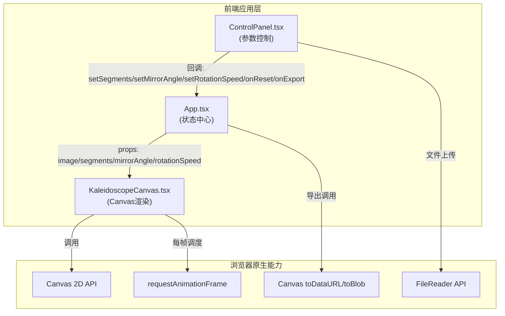

## 1. 架构设计

纯前端应用，无后端依赖。采用单向数据流架构：App.tsx 作为状态中心，将 props 分发到渲染组件与控制组件，控制组件通过回调更新 App 状态。



## 2. 技术栈说明

- **前端框架**：React 18 + TypeScript 5（严格模式）
- **构建工具**：Vite 5 + @vitejs/plugin-react 4
- **渲染引擎**：Canvas 2D Context（原生API，无第三方库）
- **动画调度**：requestAnimationFrame（60FPS）
- **状态管理**：React useState/useCallback（轻量场景无需zustand）
- **样式方案**：原生 CSS + CSS Variables（无Tailwind，精准控制Canvas外UI）

**技术选型理由：**
- 不使用three.js：2D效果，Canvas 2D性能更优，包体更小
- 不使用Tailwind：赛博朋克风格需要大量自定义CSS（发光动画、毛玻璃、渐变滑块），原生CSS更可控
- 不引入第三方动画库：Canvas内动画用requestAnimationFrame，UI动效用CSS transition/keyframes

## 3. 目录结构与文件职责

```
auto23/
├── index.html                      # 入口HTML，挂载#root
├── package.json                    # 依赖与脚本(npm run dev)
├── vite.config.js                  # Vite构建配置
├── tsconfig.json                   # TypeScript严格模式配置
└── src/
    ├── main.tsx                    # React入口，渲染App
    ├── App.tsx                     # 主组件，全局状态管理
    ├── App.css                     # 全局样式（深空背景、布局）
    ├── KaleidoscopeCanvas.tsx      # Canvas核心渲染组件
    ├── KaleidoscopeCanvas.css      # Canvas容器样式
    ├── ControlPanel.tsx            # 控制面板组件
    ├── ControlPanel.css            # 控制面板样式（毛玻璃、霓虹）
    └── types.ts                    # 共享类型定义
```

**文件调用关系：**
```
main.tsx → App.tsx
App.tsx → KaleidoscopeCanvas.tsx (传props)
App.tsx → ControlPanel.tsx (传props+回调)
App.tsx → types.ts (引用类型)
KaleidoscopeCanvas.tsx → types.ts (引用类型)
ControlPanel.tsx → types.ts (引用类型)
```

**数据流方向：**
1. 用户在ControlPanel操作 → 回调函数 → 更新App.tsx的state
2. App.tsx state变化 → props传递 → KaleidoscopeCanvas重渲染/重绘
3. KaleidoscopeCanvas内部：props → draw函数 → Canvas 2D输出

## 4. 核心算法与数据结构

### 4.1 径向分割算法

```typescript
// 将图片按N等份切分为扇形切片
function drawWedgeSector(
  ctx: CanvasRenderingContext2D,
  image: HTMLImageElement,
  cx: number, cy: number,
  radius: number,
  startAngle: number, endAngle: number,
  mirror: boolean
): void
```

**步骤：**
1. save() 保存上下文
2. beginPath() → arc() + lineTo(cx,cy) → closePath() 构建扇形裁剪区
3. clip() 应用裁剪
4. 如需镜像：scale(-1, 1) 或 rotate 实现镜像翻转
5. drawImage() 将图片绘制到裁剪区域
6. restore() 恢复上下文

### 4.2 分层旋转速度计算

```typescript
// layer: 0 = 最内层, layerCount-1 = 最外层
// baseSpeed: 用户设定的基础速度(0-5)
function getLayerRotationSpeed(
  layer: number,
  layerCount: number,
  baseSpeed: number
): number {
  const factor = 0.3 + (layer / Math.max(layerCount - 1, 1)) * 1.7; // 0.3x ~ 2.0x
  return baseSpeed * factor;
}
```

### 4.3 发光边缘动画

```typescript
// t: 当前时间秒数, period=1.5s
const alpha = 0.3 + 0.5 * (0.5 + 0.5 * Math.sin((t / 1.5) * Math.PI * 2));
// alpha ∈ [0.3, 0.8]
```

### 4.4 导出高清PNG流程

1. 创建离屏canvas（1920x1080）
2. 调用相同的draw函数，但以更大尺寸渲染
3. canvas.toBlob((blob) => ...) 获取Blob
4. 创建a标签 + URL.createObjectURL + download属性触发下载

## 5. 性能优化策略

### 5.1 帧率保障（目标60FPS @ 12层分割）

- **离屏缓存**：将原始图片预渲染到离屏Canvas，避免每帧drawImage解码
- **减少状态切换**：批量绘制同类型切片，减少save/restore调用
- **分层渲染**：使用globalCompositeOperation而非逐像素混合
- **时间驱动而非帧驱动**：旋转基于deltaTime，掉帧也不影响动画速度

### 5.2 内存管理

- 图片上传后撤销objectURL
- 组件卸载时cancelAnimationFrame
- 离屏canvas按需创建复用

### 5.3 单次导出 ≤ 500ms

- 复用draw逻辑，避免重复计算
- toBlob替代toDataURL（异步不阻塞UI）
- 必要时将drawImage采样优化

## 6. 交互事件定义

| 事件源 | 事件 | 回调参数 | 处理逻辑 |
|--------|------|----------|----------|
| 上传按钮 | change | FileList | 校验8MB/JPG/PNG → FileReader → 设置imageData |
| 分割层数滑块 | input | number(1-12) | 更新segments，触发重绘参数 |
| 镜像角度滑块 | input | number(0-360) | 更新mirrorAngle，度转弧度计算 |
| 旋转速度滑块 | input | number(0-5) | 更新rotationSpeed（倍速） |
| 重置按钮 | click | - | segments=6, mirrorAngle=0, rotationSpeed=1, phases清空 |
| 导出按钮 | click | - | 创建1920x1080离屏canvas → draw → toBlob → 下载 |
| Canvas | click | {x,y,event} | 推入ripple队列，随机微调各切片phase |
| Canvas | resize | - | 重新计算canvas显示尺寸，保持正方形1:1 |
