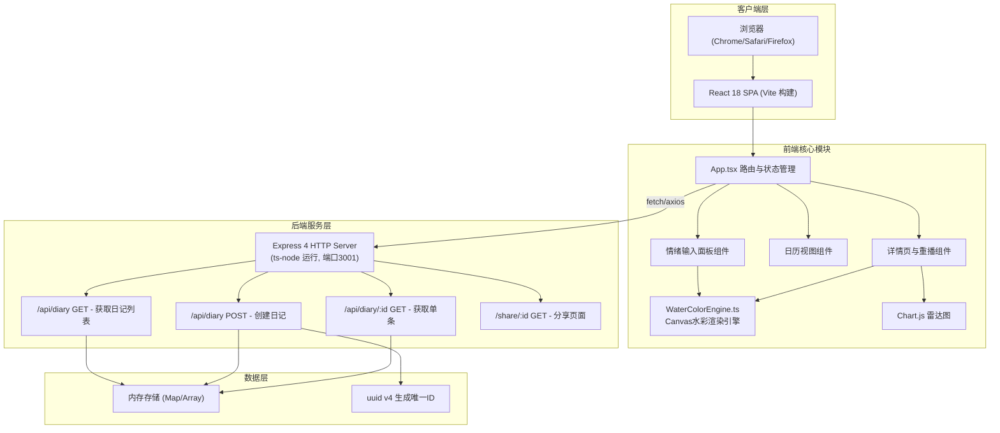
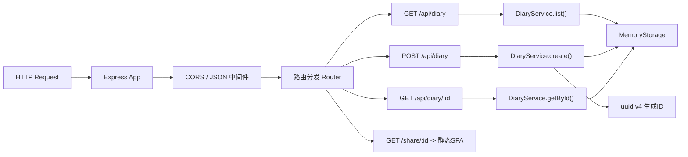
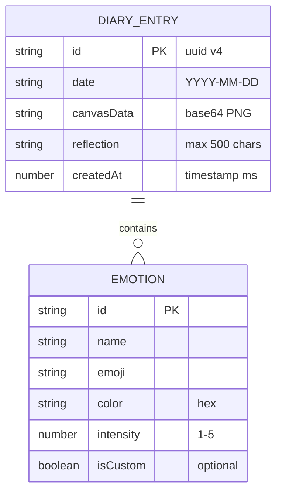

## 1. 架构设计



## 2. 技术描述

- **前端框架**：React 18 + TypeScript 5（严格模式）
- **构建工具**：Vite 5，`@vitejs/plugin-react` 插件，代理 `/api` 至 `http://localhost:3001`
- **后端框架**：Express 4 + TypeScript，通过 `ts-node` 直接运行
- **图表库**：Chart.js + react-chartjs-2（情绪强度雷达图）
- **唯一ID**：uuid v4 生成分享ID
- **数据存储**：内存存储（服务端 `Map<string, DiaryEntry>`，进程重启丢失）
- **图形渲染**：HTML5 Canvas 2D + OffscreenCanvas 预渲染 + Perlin 噪声算法
- **启动方式**：`npm run dev` 同时启动 Vite (5173) 和 Express (3001)（使用 concurrently 或 npm-run-all）

## 3. 路由定义

| 路由 | 页面/目的 |
|------|----------|
| `/` | 主页面：情绪输入 + 日历视图 |
| `/diary/:id` | 详情页：水彩画 + 雷达图 + 重播 + 感悟 |
| `/share/:id` | 分享只读页：仅查看，无编辑按钮 |
| `/api/diary` | GET：返回全部日记数组；POST：创建新日记 |
| `/api/diary/:id` | GET：返回指定ID的单条日记 |

前端路由使用 `react-router-dom@6` 管理，后端 Express 路由管理API端点。

## 4. API 定义

### TypeScript 类型定义

```typescript
interface Emotion {
  id: string;
  name: string;
  emoji: string;
  color: string;  // hex, e.g. "#FFD93D"
  intensity: 1 | 2 | 3 | 4 | 5;
  isCustom?: boolean;
}

interface DiaryEntry {
  id: string;           // uuid v4
  date: string;         // YYYY-MM-DD
  emotions: Emotion[];
  intensities: Record<string, number>;  // emotionId -> 1-5
  canvasData: string;   // base64 PNG data URL
  reflection: string;   // 文字感悟, max 500字
  createdAt: number;    // timestamp
}

// POST /api/diary 请求体
interface CreateDiaryRequest {
  date: string;
  emotions: Emotion[];
  intensities: Record<string, number>;
  canvasData: string;
  reflection: string;
}

// POST /api/diary 响应
interface CreateDiaryResponse {
  success: boolean;
  data: DiaryEntry;
}

// GET /api/diary 响应
interface ListDiaryResponse {
  success: boolean;
  data: DiaryEntry[];
}
```

### 接口规范

- 所有请求体和响应均采用 `application/json` 格式
- 成功响应统一包裹：`{ success: true, data: ... }`
- 失败响应：`{ success: false, error: string }`
- CORS：开发环境 Vite 代理已处理，生产端 Express 启用 `cors` 中间件
- 错误码：200 成功，400 参数错误，404 日记不存在

## 5. 服务端架构图



后端采用轻量三层结构：
- **路由层 (server/index.ts)**：定义HTTP端点、解析参数、校验
- **服务层 (内嵌)**：DiaryService 提供业务方法 list/create/getById
- **存储层 (内嵌)**：MemoryStorage 使用 `Map<string, DiaryEntry>` + 数组索引

## 6. 数据模型

### 6.1 数据模型 ER 图



### 6.2 内存存储结构

服务端 `server/index.ts` 中维护以下数据结构：

```typescript
// 主存储：ID -> DiaryEntry
const diaryStore: Map<string, DiaryEntry> = new Map();

// 日期索引（加速按日期查询，日历视图使用）
const dateIndex: Map<string, DiaryEntry> = new Map();

// 有序列表（按日期倒序返回）
const diaryList: DiaryEntry[] = [];
```

### 6.3 12种基础情绪预置数据

```typescript
const BASE_EMOTIONS: Omit<Emotion, 'intensity'>[] = [
  { id: 'joy',       name: '愉悦', emoji: '😊', color: '#FFD93D' },
  { id: 'anxiety',   name: '焦虑', emoji: '😰', color: '#6C5B7B' },
  { id: 'excitement',name: '振奋', emoji: '🤩', color: '#FF6B6B' },
  { id: 'laziness',  name: '慵懒', emoji: '😌', color: '#A8D8EA' },
  { id: 'calm',      name: '平静', emoji: '😇', color: '#95E1D3' },
  { id: 'sadness',   name: '悲伤', emoji: '😢', color: '#748DA6' },
  { id: 'anger',     name: '愤怒', emoji: '😡', color: '#E74C3C' },
  { id: 'surprise',  name: '惊喜', emoji: '🎉', color: '#F8B500' },
  { id: 'tiredness', name: '疲惫', emoji: '😴', color: '#B8B8B8' },
  { id: 'hope',      name: '憧憬', emoji: '✨', color: '#C9B1FF' },
  { id: 'gratitude', name: '感恩', emoji: '🙏', color: '#F7DC6F' },
  { id: 'loneliness',name: '孤独', emoji: '🌙', color: '#5D6D7E' },
];
```
