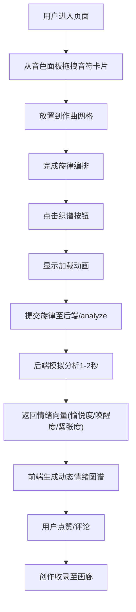

## 1. 产品概述

「音色织图」是一个在线音乐社区的轻量级创意工具，让用户通过拖拽音符卡片来编排简短旋律，系统自动分析旋律的情绪特征并生成动态色彩与图案可视化，支持社区互动。

- 核心价值：将抽象音乐旋律转化为可视情绪图谱，降低音乐创作门槛，提供视觉化的创意表达体验
- 目标用户：音乐爱好者、视觉艺术爱好者、寻求创意表达的普通用户

## 2. 核心功能

### 2.1 用户角色

| 角色 | 注册方式 | 核心权限 |
|------|----------|----------|
| 普通用户 | 无需注册，访客模式 | 创作旋律、生成情绪图谱、点赞评论、浏览画廊 |

### 2.2 功能模块

1. **作曲网格编辑器**：5行×16列五线谱式网格，拖拽音符卡片编排旋律
2. **情绪图谱可视化**：Canvas动态渲染渐变网格与流动粒子
3. **社区互动区**：点赞功能、评论功能
4. **创作历史画廊**：展示最近10条创作的缩略图，支持重新加载

### 2.3 页面详情

| 页面名称 | 模块名称 | 功能描述 |
|----------|----------|----------|
| 主页面 | 音色面板 | 展示3种音色卡片（低音深蓝、中音翠绿、高音橙红），支持拖拽 |
| 主页面 | 作曲网格 | 5行×16列毛玻璃网格，接收音符拖拽，支持重新拖拽删除，悬停显示音高提示 |
| 主页面 | 工具栏 | 织谱按钮、清空按钮，电光蓝主色调，弹性缩放动画 |
| 主页面 | 情绪图谱区 | Canvas画布，根据情绪向量渲染动态渐变网格与50-80个流动粒子，鼠标悬停暂停粒子显示情绪关键词 |
| 主页面 | 社区互动区 | 点赞按钮（心形+1动画）、评论输入框（支持表情）、评论列表（倒序排列） |
| 主页面 | 创作画廊 | 底部横向滚动，展示最近10条创作缩略图，悬停放大显示信息，点击重新加载 |

## 3. 核心流程

用户从音色面板拖拽音符卡片到作曲网格编排旋律，点击织谱按钮提交至后端进行情绪分析，返回后渲染动态情绪图谱，用户可以点赞评论，创作自动收录至历史画廊。

## 4. 用户界面设计

### 4.1 设计风格

- **主色调**：深色基调 #0A0A1A，电光蓝 #00D4FF（按钮主色），霓虹紫 #B44DFF（按钮悬停色）
- **辅助色**：低音深蓝 #1E40AF，中音翠绿 #10B981，高音橙红 #F97316
- **背景效果**：从底部缓慢上浮的蓝紫色径向渐变光晕
- **磨砂玻璃效果**：背景模糊8px，半透明白色填充（RGB 255,255,255,0.05），半透明黑色边框
- **按钮样式**：圆角8px，悬停0.3秒弹性缩放(scale 1.05)，点击0.1秒按下回缩(scale 0.95)
- **字体**：标题使用艺术感字体，正文使用现代无衬线字体
- **布局风格**：左右分栏布局（作曲区40% + 图谱区60%），移动端改为上下排列

### 4.2 页面设计概览

| 页面名称 | 模块名称 | UI元素 |
|----------|----------|--------|
| 主页面 | 音色面板 | 垂直排列3个圆形卡片(30px)，颜色对应音区，拖拽时半透明阴影跟随 |
| 主页面 | 作曲网格 | 毛玻璃样式，格子分隔线亮度30%白色细线，悬停边框变亮+音高提示标签 |
| 主页面 | 加载动画 | 旋转光晕+「正在编织情绪图谱...」文字，1-2秒显示 |
| 主页面 | 情绪图谱 | 渐变网格背景(愉悦度→冷暖色/唤醒度→放射或平行)，50-80粒子贝塞尔运动(紧张度→乱流或螺旋)，1.5秒渐入+粒子爆发 |
| 主页面 | 点赞按钮 | 心形图标，点击填充红色+1弹出动画，电光蓝默认色 |
| 主页面 | 评论区 | 输入框支持表情，提交1秒渐隐确认提示，评论带默认几何彩色头像 |
| 主页面 | 画廊 | 缩略图120x80px圆角微光边框，悬停150%放大显示名称点赞数 |

### 4.3 响应式设计

- **桌面端**（≥1200px）：最大宽度1200px居中，左右留白，左作曲区右图谱区
- **平板端**（768-1199px）：布局保持，适当缩小间距
- **移动端**（<768px）：竖排布局，作曲网格与图谱上下排列各占50%高度，工具栏图标化缩小至80%尺寸，评论列表可左右滑动
- **触摸优化**：拖拽支持触摸事件，点击区域不小于44px

### 4.4 性能指标

- 作曲网格交互响应时间：< 50ms（拖拽、放置、删除）
- 情绪图谱动画帧率：≥ 55FPS（50-80粒子）
- API响应时间：≤ 3秒（含模拟分析）
