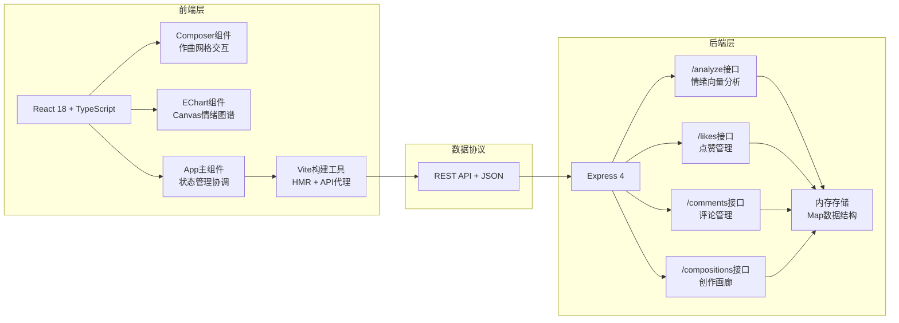
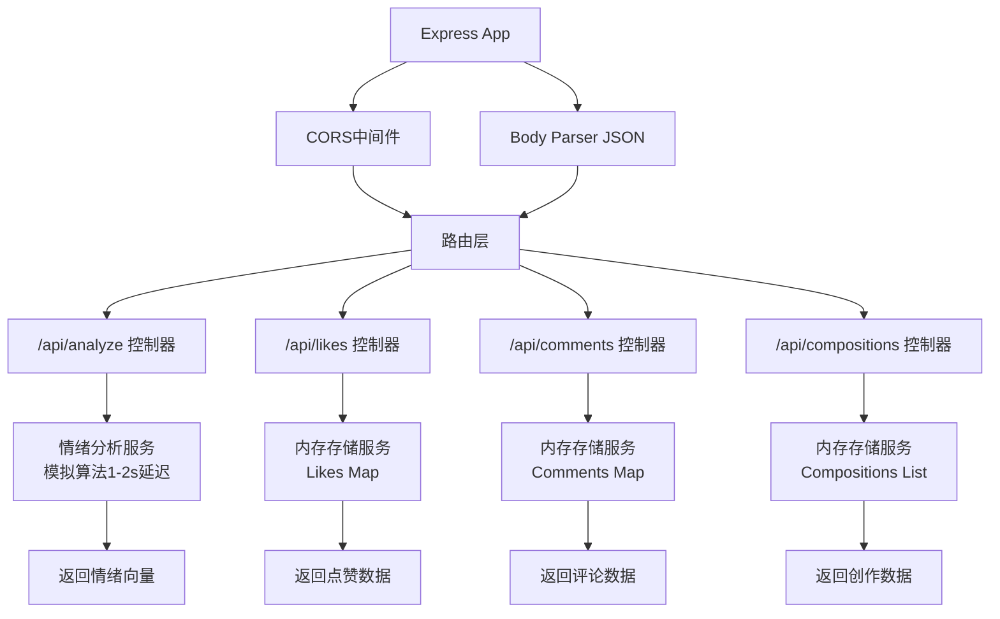
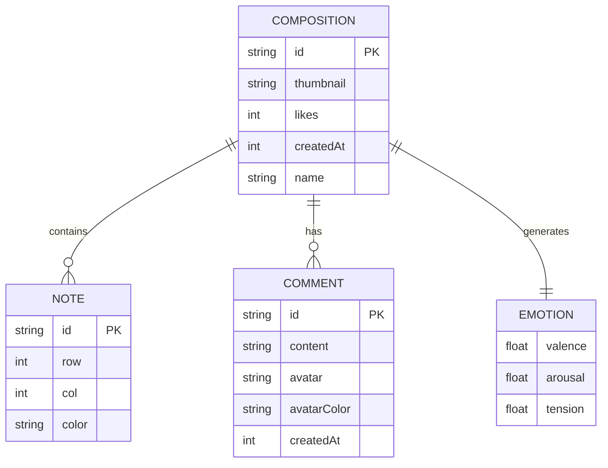

## 1. 架构设计



## 2. 技术说明

- **前端框架**：React 18 + TypeScript
- **构建工具**：Vite（HMR配置，API代理至后端端口3001）
- **样式方案**：原生CSS（CSS变量、动画、媒体查询）+ 磨砂玻璃效果
- **图标库**：lucide-react
- **状态管理**：React Hooks（useState, useRef, useEffect）+ 组件props传递
- **后端框架**：Express 4（Node.js）
- **数据存储**：内存存储（JS Map结构，页面刷新保留数据因服务器内存持久）
- **API协议**：REST API + JSON格式
- **CORS**：cors中间件支持跨域

## 3. 路由定义

| 路由 | 类型 | 用途 |
|------|------|------|
| / | - | 前端入口页面，Vite托管 |
| /api/analyze | POST | 分析旋律返回情绪向量 |
| /api/likes/:id | POST | 点赞操作 |
| /api/likes/:id | GET | 获取点赞数 |
| /api/comments/:id | POST | 提交评论 |
| /api/comments/:id | GET | 获取评论列表 |
| /api/compositions | POST | 保存创作至画廊 |
| /api/compositions | GET | 获取画廊列表 |
| /api/compositions/:id | GET | 获取单条创作详情 |

## 4. API定义

### 数据类型

```typescript
interface Note {
  id: string;
  row: number;     // 0-4 (5个八度音区，0为最高，4为最低)
  col: number;     // 0-15 (16拍)
  color: 'bass' | 'mid' | 'treble';
}

interface MelodyData {
  notes: Note[];
}

interface EmotionVector {
  valence: number;     // 愉悦度 0-1 (高=暖色, 低=冷色)
  arousal: number;     // 唤醒度 0-1 (高=放射状, 低=平行状)
  tension: number;     // 紧张度 0-1 (高=乱流, 低=螺旋)
}

interface AnalyzeResponse {
  success: boolean;
  emotion: EmotionVector;
  compositionId: string;
}

interface Comment {
  id: string;
  content: string;
  avatar: string;      // 几何形图标标识
  avatarColor: string; // 头像颜色
  createdAt: number;
}

interface LikeResponse {
  likes: number;
  liked: boolean;
}

interface Composition {
  id: string;
  notes: Note[];
  emotion: EmotionVector;
  thumbnail: string;   // base64缩略图
  likes: number;
  comments: Comment[];
  createdAt: number;
  name: string;
}
```

### 请求/响应示例

**POST /api/analyze**
```json
// Request
{
  "notes": [
    { "id": "uuid1", "row": 2, "col": 0, "color": "mid" },
    { "id": "uuid2", "row": 0, "col": 4, "color": "treble" }
  ]
}

// Response
{
  "success": true,
  "emotion": {
    "valence": 0.75,
    "arousal": 0.6,
    "tension": 0.3
  },
  "compositionId": "comp-uuid-xxx"
}
```

## 5. 服务器架构图



## 6. 数据模型

### 6.1 数据模型关系



### 6.2 内存存储结构

服务器端使用以下内存结构持久化数据（服务器运行期间有效）：

```javascript
// 点赞集合 - key: compositionId, value: { count: number, users: Set() }
const likesStore = new Map();

// 评论集合 - key: compositionId, value: Comment[]
const commentsStore = new Map();

// 创作画廊 - 数组，最多保留10条，新创作插入头部
const compositionsStore = [];

// 情绪分析模拟算法：基于音符分布计算
// - 愉悦度：高音(橙红)多=高，低音(深蓝)多=低
// - 唤醒度：音符密度高=高，稀疏=低
// - 紧张度：相邻音符跳变大=高，平缓=低
```

## 7. 项目文件结构

```
auto230/
├── .trae/documents/
│   ├── PRD.md              # 产品需求文档
│   └── architecture.md     # 技术架构文档
├── package.json            # 依赖与脚本配置
├── vite.config.js          # Vite配置 + API代理
├── tsconfig.json           # TypeScript严格模式配置
├── index.html              # 入口页面（深色渐变背景）
├── server.js               # Express后端入口
├── src/
│   ├── main.tsx            # React应用入口
│   ├── App.tsx             # 主应用组件
│   ├── index.css           # 全局样式
│   └── components/
│       ├── Composer.tsx    # 作曲网格组件
│       ├── EChart.tsx      # 情绪图谱Canvas组件
│       ├── SoundPanel.tsx  # 音色面板组件
│       ├── Community.tsx   # 社区互动组件(点赞+评论)
│       └── Gallery.tsx     # 创作画廊组件
└── types/
    └── index.ts            # 共享类型定义
```
