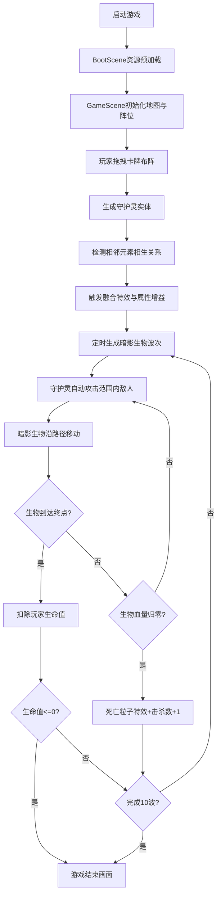

## 1. 产品概述
「灵契召唤」是一款幻想主题的2D塔防策略卡牌游戏，玩家通过召唤元素守护灵布阵抵御暗影生物潮。
- 核心玩法：拖拽卡牌布阵、元素相生融合、塔防波次挑战
- 目标用户：喜欢策略塔防和卡牌收集类游戏的玩家
- 产品价值：融合五行生克策略与塔防玩法，提供高策略深度和视觉反馈

## 2. 核心功能

### 2.1 功能模块
1. **主游戏场景**：战斗地图、六边形阵位网格、暗影生物路径导航
2. **卡牌召唤系统**：底部卡牌库存、拖拽布阵、守护灵生成
3. **元素融合系统**：相邻阵位元素相生检测、融合特效连接、属性增益
4. **波次战斗系统**：10波暗影生物自动生成、三种生物类型、自动攻击与碰撞
5. **UI反馈系统**：波次显示、生命值心形图标、击杀计数、过渡动画

### 2.2 页面详情
| 页面名称 | 模块名称 | 功能描述 |
|---------|---------|---------|
| 游戏主界面 | 战斗地图区 | 800x600画布，深空渐变背景，蜿蜒发光路径，六边形阵位网格 |
| 游戏主界面 | 卡牌库存区 | 底部毛玻璃面板，4种元素卡牌，显示剩余数量，支持拖拽 |
| 游戏主界面 | 顶部信息栏 | Wave进度、红色心形生命值(10颗)、击杀数统计 |
| 游戏主界面 | 过渡提示 | 波次清除文字、3秒倒计时闪烁、游戏结束画面 |

## 3. 核心流程
玩家启动游戏 → 加载资源完成 → 进入战斗场景 → 拖拽守护灵卡牌到六边形阵位 → 守护灵自动攻击范围内暗影生物 → 相邻守护灵满足相生规则触发融合 → 每15秒生成一波敌人（共10波）→ 暗影生物沿路径移动至终点扣除生命 → 玩家生命值归零或完成10波 → 游戏结束

## 4. 用户界面设计

### 4.1 设计风格
- **主色调**：深空蓝紫(#1a0a2e)渐变至暗红(#3d0a0a)，金色光晕(#ffd700)点缀
- **元素色**：火(#ff4500)、水(#1e90ff)、风(#7fff00)、地(#8b4513)
- **按钮/边框**：六边形发光边框，微弱金色光晕，毛玻璃半透明效果
- **字体**：奇幻风格衬线字体，标题大号加粗，正文清晰易读
- **布局**：战斗区居中，信息栏顶部固定，卡牌库存底部固定，响应式letterbox
- **动效风格**：所有交互0.2-0.4秒平滑过渡，粒子特效丰富，光晕呼吸动画

### 4.2 页面设计概览
| 页面名称 | 模块名称 | UI元素 |
|---------|---------|---------|
| 游戏主界面 | 战斗地图区 | 深蓝紫星空渐变背景，蜿蜒发光路径节点，6个六边形阵位(金色边框+旋转元素徽记)，守护灵精灵(呼吸光效+元素光环)，暗影生物(拖曳残影) |
| 游戏主界面 | 卡牌库存区 | 半透明毛玻璃背景(blur+白色半透明边框)，4张元素卡牌(图标+数量数字)，拖拽时半透明虚影跟随鼠标 |
| 游戏主界面 | 顶部信息栏 | 左侧Wave X/10文字，中间10颗红色心形图标，右侧击杀数数字，波次清除过渡文字居中闪烁，倒计时大数字闪烁 |
| 游戏主界面 | 特效层 | 守护灵弹丸拖尾，击中粒子爆散(5-8个)，融合连接线(流动渐变色)，死亡粒子爆炸，放置扩散光晕 |

### 4.3 响应式
- 桌面端优先，画布固定800x600尺寸
- 窗口缩放时保持宽高比，使用letterbox留黑填充居中显示
- 鼠标拖拽操作为主，不涉及移动端触控

### 4.4 视觉层次与深度
- **背景层**：深空星空渐变 + 微弱星点闪烁粒子
- **路径层**：发光路径节点 + 蜿蜒连接线
- **阵位层**：六边形底座 + 旋转徽记 + 金色光晕
- **实体层**：守护灵精灵(带呼吸光环) + 暗影生物(带残影)
- **特效层**：弹丸拖尾 + 粒子爆散 + 融合连接线
- **UI层**：顶部信息栏 + 底部卡牌面板 + 过渡提示文字
