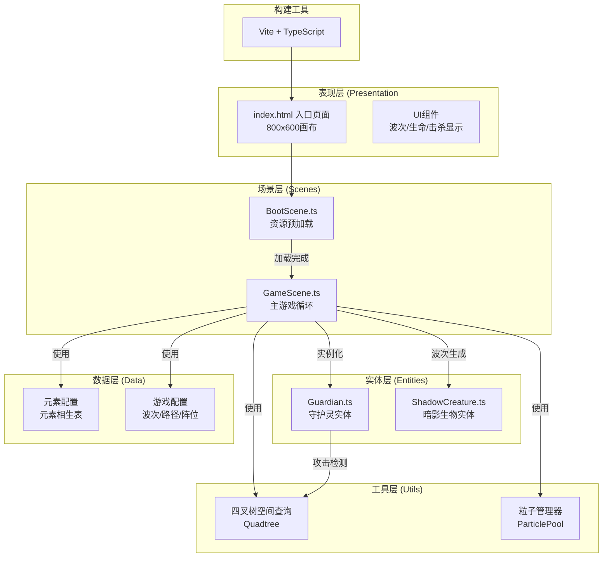

## 1. 架构设计


## 2. 技术描述
- **前端框架**：Phaser 3 (3.80+ - 2D游戏引擎，负责游戏循环、物理交互、精灵动画、粒子系统
- **构建工具**：Vite 5.x - 快速开发服务器与打包
- **编程语言**：TypeScript 5.x - 严格模式，类型安全
- **渲染方式**：无后端，纯前端游戏应用
- **数据管理**：Phaser场景内状态管理

## 3. 项目文件结构

| 文件路径 | 职责 | 调用关系 |
|-------|------|---------|
| package.json | 项目依赖与启动脚本 | - |
| vite.config.js | Vite构建配置 | - |
| tsconfig.json | TypeScript严格模式配置 | - |
| index.html | 入口HTML，画布容器，星空背景 | 引入 src/main.ts |
| src/main.ts | 入口，创建Phaser.Game实例，注册场景，配置800x600 | 加载 BootScene, GameScene |
| src/scenes/BootScene.ts | 预加载精灵图、音频、粒子配置 | 完成后跳转GameScene |
| src/scenes/GameScene.ts | 主场景：阵位布局、路径导航、碰撞检测、召唤逻辑、波次管理、UI更新 | 实例化 Guardian, ShadowCreature |
| src/entities/Guardian.ts | 守护灵实体：元素类型、攻击、融合状态、动画 | GameScene调用attack(), updateFusion() |
| src/entities/ShadowCreature.ts | 暗影生物：路径移动、血量、被击特效、死亡动画 | GameScene调用move(), takeDamage() |
| src/utils/Quadtree.ts | 四叉树空间优化碰撞查询 | GameScene, Guardian用于范围查询 |
| src/utils/ParticlePool.ts | 对象池粒子管理（上限300） | GameScene全局粒子回收 |
| src/config/elements.ts | 元素配置：相生规则、颜色、弹丸类型 | GameScene, Guardian读取 |
| src/config/gameConfig.ts | 游戏配置：波次数据、路径点、阵位坐标 | GameScene读取 |

## 4. 核心数据模型

### 4.1 元素类型定义
```typescript
type ElementType = 'fire' | 'water' | 'wind' | 'earth';

interface ElementConfig {
  name: string;          // 中文名
  color: number;       // 十六进制颜色
  projectileColor: number; // 弹丸颜色
  generates: ElementType | null; // 相生元素
  icon: string;       // 图标标识
}

// 相生规则：火生土、土生金(地)、金(地)生水、水生木(风)、木(风)生火
```

### 4.2 守护灵数据
```typescript
interface GuardianData {
  element: ElementType;
  x: number;
  y: number;
  slotIndex: number;
  baseDamage: number;      // 基础攻击力
  baseAttackSpeed: number; // 基础攻速(次/秒)
  range: number;        // 射程(像素)
  hp: number;
  isFused: boolean;
  fusedPartners: number[]; // 融合的相邻阵位索引
}
```

### 4.3 暗影生物数据
```typescript
type CreatureType = 'normal' | 'elite' | 'flying';

interface ShadowCreatureData {
  type: CreatureType;
  hp: number;
  maxHp: number;
  speed: number;
  pathIndex: number;   // 当前路径点索引
  pathProgress: number; // 段内进度 0-1
  isFlying: boolean;
}
```

### 4.4 波次配置
```typescript
interface WaveConfig {
  waveNumber: number;
  totalWaves: number;   // 本波敌人数
  spawnInterval: number; // 生成间隔(ms)
  composition: { type: CreatureType; count: number }[];
}
```

### 4.5 阵位配置
```typescript
// 6个六边形阵位坐标(相对800x600
interface SlotConfig {
  index: number;
  x: number;
  y: number;
  neighbors: number[]; // 相邻阵位索引(6方向)
  guardian: Guardian | null;
}
```

## 5. 核心算法与性能优化

### 5.1 四叉树空间查询
- 目的：优化弹丸碰撞检测，同帧最多处理上限15个弹丸
- 结构：Quadtree节点分4象限，递归划分
- 查询：给定圆形范围(射程半径100)返回候选生物列表

### 5.2 粒子对象池
- 上限：300个粒子总量限制
- 回收策略：粒子生命周期结束自动回收复用
- 分类：攻击弹丸、击中爆散(5-8)、死亡爆炸、融合、放置光晕

### 5.3 帧率保证60FPS措施
- 弹丸碰撞每帧最多处理上限15个
- 路径移动增量计算而非距离
- 精灵纹理复用
- 无效实体及时销毁
- 脏矩形渲染优化

## 6. 游戏循环数据流
```
每帧update()
  ├── ShadowCreature.update()
  │     └── 沿路径移动(线性插值路径点)
  │     └── 到达终点→扣生命+移除
  ├── 构建Quadtree(插入全部creatures)
  ├── Guardian.update()
  │     └── 攻击冷却计时
  │     └── Quadtree.queryRange()→范围内creatures
  │     └── 选择最近目标→发射弹丸
  │     └── 弹丸碰撞检测(≤15/帧)
  │     └── 弹丸命中→粒子+扣血+闪烁
  ├── 波次计时→生成敌人
  ├── 融合检测→相邻相生→连线+属性增益
  └── UI更新→波次/生命/击杀
```
