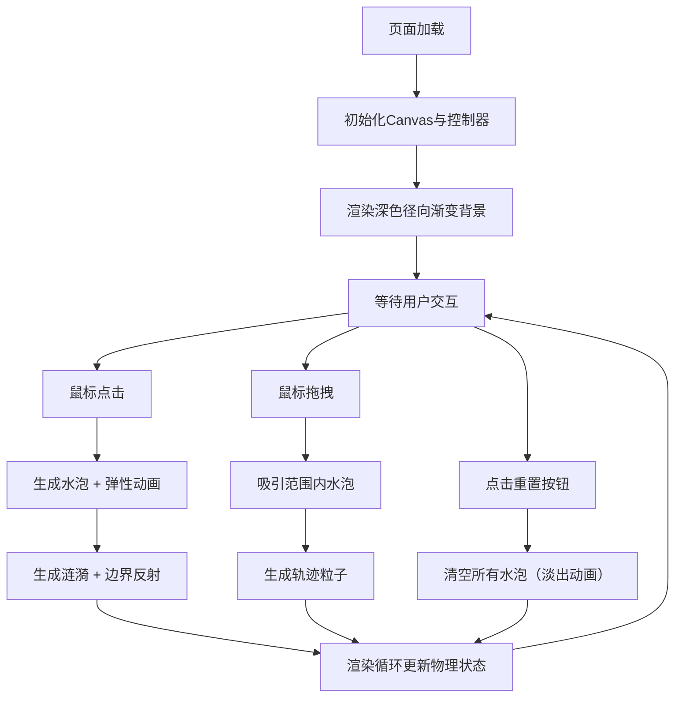

## 1. 产品概述

「微光回响」是一个基于 Canvas API 的交互式动态微观水体生态艺术作品，用户通过点击和拖拽在画布上播撒发光水泡，观察水泡间的物理互动与涟漪扩散，形成不断变化的视觉奇观。

- 核心价值：提供沉浸式的交互式艺术体验，通过简单的操作创造复杂多变的视觉美感
- 目标用户：喜欢创意艺术、放松解压、视觉交互体验的用户

## 2. 核心特性

### 2.1 功能模块
1. **画布渲染层**：全屏视口 Canvas，深蓝到黑色径向渐变背景
2. **水泡系统**：点击生成发光水泡，包含弹性动画、渐变着色、光晕效果
3. **涟漪系统**：水泡生成时扩散环形涟漪，遇边界反射
4. **物理交互系统**：水泡间排斥力、鼠标拖拽吸引力、连线发光效果
5. **粒子系统**：鼠标拖拽轨迹生成飘散微光点
6. **控制面板**：左上角半透明磨砂玻璃面板，显示水泡数量与重置按钮

### 2.2 页面详情
| 页面名称 | 模块名称 | 功能描述 |
|-----------|-------------|---------------------|
| 主页 | 画布渲染 | 全屏 Canvas，深色径向渐变背景，响应视口尺寸变化 |
| 主页 | 水泡生成 | 点击画布生成 10-18px 发光水泡，0.3s 弹性放大动画，亮白到半透明蓝渐变 |
| 主页 | 涟漪扩散 | 水泡生成时向外扩散半透明环形涟漪，1.2s 持续时间，遇边界反射 |
| 主页 | 水泡漂移 | 水泡以 0.1-0.3px/帧 随机方向缓慢漂移 |
| 主页 | 排斥交互 | 水泡距离 <30px 时产生柔和排斥力，连线短暂亮起浅蓝色 0.3s |
| 主页 | 拖拽吸引 | 鼠标拖拽时 60px 范围内水泡被吸引（0.4倍排斥力），水泡轻微拉长变形 |
| 主页 | 轨迹粒子 | 拖拽轨迹持续飘散 2-3px 蓝紫色微光点，每帧 5-10 个，0.6s 渐隐 |
| 主页 | 控制面板 | 左上角圆角磨砂玻璃面板，实时显示水泡数量，重置按钮（清空+淡出动画） |

## 3. 核心流程

用户打开页面 → 看到深色渐变背景与控制面板 → 点击画布生成水泡与涟漪 → 观察水泡漂移与排斥互动 → 拖拽鼠标吸引水泡并产生光点轨迹 → 随时可点击重置清空画布

## 4. 用户界面设计

### 4.1 设计风格
- **主色调**：深蓝到黑色径向渐变（中心略亮），营造深邃水下氛围
- **强调色**：亮白→半透明蓝渐变水泡，浅蓝色交互连线，蓝紫色轨迹粒子
- **控制面板**：圆角 12px，磨砂玻璃效果（backdrop-filter: blur(10px)），深色半透明底色 rgba(10, 20, 40, 0.55)，边框 1px 半透明白色
- **字体**：现代无衬线字体，轻量级字重
- **按钮**：圆角 8px，悬停时轻微提亮，点击时微缩反馈

### 4.2 页面设计概述
| 页面名称 | 模块名称 | UI 元素 |
|-----------|-------------|-------------|
| 主页 | 背景层 | Canvas 径向渐变：从 #0a1628（中心）到 #000000（边缘） |
| 主页 | 水泡视觉 | 径向渐变填充 + shadowBlur 光晕，边缘柔和发光 |
| 主页 | 涟漪视觉 | 细线条圆形，透明度随半径递减，边缘反射时保持连续 |
| 主页 | 交互连线 | 细线半透明浅蓝色，淡出动画 |
| 主页 | 控制面板 | 绝对定位左上角 20px，内边距 16px，宽度约 200px |
| 主页 | 重置按钮 | 背景半透明蓝，白色文字，hover 时增加不透明度 |

### 4.3 响应性
- Canvas 自动适配视口尺寸，窗口 resize 时重新计算尺寸
- 控制面板固定左上角，移动端缩小内边距
- 所有交互支持触摸屏（touchstart / touchmove / touchend）

### 4.4 性能要求
- 100 个水泡同时存在时保持 50FPS 以上
- 采用 requestAnimationFrame 渲染循环
- 合理优化碰撞检测（空间分区或限制检测对数）
- 及时清理已消亡的涟漪和粒子对象
