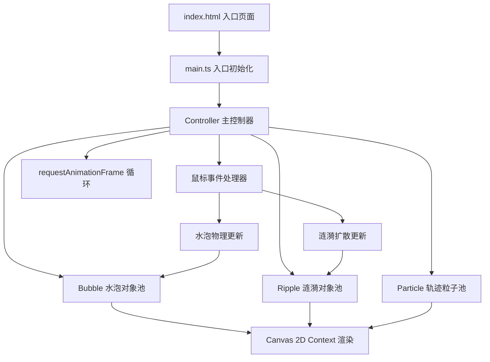

## 1. 架构设计



## 2. 技术说明

- **前端框架**：原生 TypeScript（无 UI 框架，纯 Canvas 渲染）
- **构建工具**：Vite 5.x
- **语言目标**：ES2020，严格模式 TypeScript
- **渲染引擎**：Canvas 2D API（使用 shadowBlur 实现发光效果）
- **后端**：无（纯前端静态项目）

## 3. 文件结构定义

```
项目根目录/
├── package.json          # 项目配置与依赖
├── vite.config.js        # Vite 基础配置
├── tsconfig.json         # TypeScript 严格模式配置
├── index.html            # 入口页面（内联渐变背景样式）
└── src/
    ├── main.ts           # 入口文件：初始化 Canvas 与 Controller
    ├── bubble.ts         # Bubble 类：位置/速度/颜色/渲染/排斥/吸引
    ├── ripple.ts         # Ripple 类：位置/半径/透明度/扩散/反射
    └── controller.ts     # Controller 类：管理对象池/事件/动画循环
```

## 4. 核心类定义

### 4.1 Bubble 类 (src/bubble.ts)

| 成员 | 类型 | 说明 |
|------|------|------|
| x, y | number | 水泡中心坐标 |
| vx, vy | number | 速度分量（0.1-0.3 px/帧） |
| radius | number | 半径（5-9 px，即直径 10-18 px） |
| scale | number | 当前缩放比（弹性动画用） |
| targetScale | number | 目标缩放比 |
| birthTime | number | 生成时间戳 |
| isAttracted | boolean | 是否正被鼠标吸引 |
| attractDeform | number | 吸引时的变形系数（0-1） |
| update(dt, canvasW, canvasH) | 方法 | 更新位置，边界环绕，缩放动画 |
| render(ctx) | 方法 | 径向渐变填充 + shadowBlur 光晕 |
| applyRepulsion(other: Bubble) | 方法 | 计算并应用排斥力，返回是否触发连线 |
| applyAttraction(mx, my, strength) | 方法 | 应用鼠标吸引力，设置变形 |

### 4.2 Ripple 类 (src/ripple.ts)

| 成员 | 类型 | 说明 |
|------|------|------|
| x, y | number | 涟漪中心坐标 |
| radius | number | 当前半径 |
| maxRadius | number | 最大半径 |
| alpha | number | 当前透明度 |
| reflected | Set<string> | 已反射的边记录（防止连续反射） |
| velocity | number | 扩散速度 |
| lifeTime | number | 总生命周期（1.2s） |
| age | number | 已存在时间 |
| update(dt, canvasW, canvasH) | 方法 | 半径扩大，透明度衰减，边界反射检测 |
| render(ctx) | 方法 | stroke 环形，透明度随 age 渐变 |
| isDead() | 方法 | 返回是否超过生命周期 |

### 4.3 Controller 类 (src/controller.ts)

| 成员 | 类型 | 说明 |
|------|------|------|
| canvas | HTMLCanvasElement | Canvas 元素引用 |
| ctx | CanvasRenderingContext2D | 2D 渲染上下文 |
| bubbles | Bubble[] | 水泡数组 |
| ripples | Ripple[] | 涟漪数组 |
| particles | Particle[] | 轨迹粒子数组 |
| connectionLines | ConnectionLine[] | 临时连线数组 |
| mouseX, mouseY | number | 当前鼠标坐标 |
| isDragging | boolean | 是否处于拖拽状态 |
| lastFrameTime | number | 上一帧时间戳 |
| countDisplay | HTMLElement | 水泡数量显示元素 |
| init() | 方法 | 绑定事件，启动动画循环 |
| handleClick(x, y) | 方法 | 生成水泡 + 涟漪 |
| handleDragStart(x, y) | 方法 | 开始拖拽状态 |
| handleDragMove(x, y) | 方法 | 更新鼠标位置，吸引水泡，生成粒子 |
| handleDragEnd() | 方法 | 结束拖拽，水泡恢复 |
| reset() | 方法 | 触发清空淡出动画 |
| loop(timestamp) | 方法 | rAF 循环：更新 → 渲染 |
| renderBackground() | 方法 | 绘制径向渐变背景 |
| updatePhysics(dt) | 方法 | 更新水泡/涟漪/粒子，处理排斥与吸引 |

## 5. 关键算法说明

### 5.1 排斥力计算
```
距离 d < 30px 时：
  力大小 = k * (30 - d) / 30  （d 越小力越大）
  方向：沿两水泡连线向外
  每个水泡各分一半力，叠加到速度上
  同时记录连线显示
```

### 5.2 吸引力计算
```
鼠标 60px 范围内：
  d = 水泡到鼠标距离
  力大小 = 0.4 * 排斥力基准 * (60 - d) / 60
  方向：指向鼠标
  同时设置 deform 系数实现拉长变形
```

### 5.3 涟漪边界反射
```
涟漪接近边界时，检查半径是否越过：
  越过边界 → 在镜像位置生成新涟漪片段
  原涟漪继续扩散，保持视觉连续性
  使用 reflected Set 防止同一边重复反射
```

### 5.4 水泡渲染
```
径向渐变：
  中心: rgba(255, 255, 255, 0.95)
  50%:  rgba(180, 220, 255, 0.7)
  边缘: rgba(80, 150, 255, 0.15)
shadowBlur = radius * 1.5
shadowColor = rgba(100, 180, 255, 0.6)
```

## 6. 性能优化策略

- 使用增量时间 dt 而非固定帧步长，保证不同帧率下视觉一致
- 水泡排斥检测：限制每帧最多检测前 N 对（如 100 个水泡限制 500 对/帧）
- 对象复用：涟漪/粒子消亡后从数组中 splice，避免 GC 压力
- Canvas 状态最小化：批量设置 shadow/shadowBlur，避免频繁 save/restore
- 粒子数量上限：单帧粒子总数不超过 300
