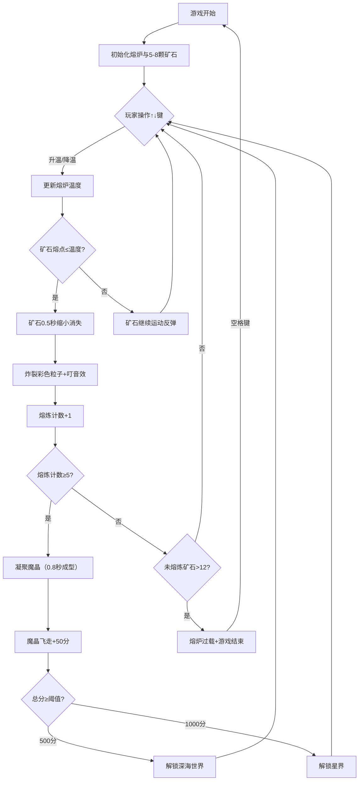

## 1. 产品概述

「像素熔炉·炼晶模拟」是一款基于 Canvas 2D 的浏览器像素粒子模拟游戏，玩家扮演神秘铁匠，通过精确控制熔炉温度，将不同颜色、不同熔点的矿石粒子熔炼成魔晶来获取分数。
- 核心玩法：温度策略 + 粒子物理模拟，通过键盘↑↓调节温度，将矿石熔炼为魔晶
- 目标用户：像素游戏爱好者、极客玩家、休闲游戏玩家
- 产品价值：提供沉浸式的像素粒子视觉体验，结合策略温控的挑战性玩法
- 市场定位：轻量级网页小游戏，可扩展多世界解锁机制提供长期可玩性

## 2. 核心功能

### 2.1 用户角色

| 角色 | 注册方式 | 核心权限 |
|------|----------|----------|
| 玩家 | 无需注册，直接进入游戏 | 完整游戏体验，温度控制、熔炼操作 |

### 2.2 功能模块

1. **游戏主界面（Furnace 熔炉画布）**：矿石粒子生成、物理运动、熔炉温度控制、熔炼反馈、魔晶合成、粒子特效
2. **得分面板（ScoreBoard）**：分数显示、世界解锁状态展示、得分动画
3. **游戏引擎**：主循环（requestAnimationFrame）、粒子系统、物理碰撞、渲染优化
4. **音效系统**：Web Audio API 合成音效
5. **世界系统**：多世界解锁、背景渐变切换、边界光带特效
6. **游戏状态管理**：游戏开始/暂停/结束/重置、过载检测

### 2.3 页面详情

| 页面名称 | 模块名称 | 功能描述 |
|----------|----------|----------|
| 游戏主界面 | 熔炉画布 | 400×300px圆角矩形熔炉，矿石粒子生成与运动，温度显示条，粒子炸裂特效，魔晶凝聚与飞走动画 |
| 游戏主界面 | 温度控制系统 | ↑键升温(+20°C/次，上限1200°C)，↓键降温(-20°C/次，下限100°C)，温度>1000°C数字变红 |
| 游戏主界面 | 矿石熔炼系统 | 熔点≤当前温度时矿石0.5秒缩小消失，炸裂8-12颗彩色粒子，0.6秒淡出，"叮"音效 |
| 游戏主界面 | 魔晶合成系统 | 每熔炼5颗矿石凝聚1颗魔晶（六边形+彩虹光晕+2秒旋转），0.8秒成型，飞走+50分 |
| 游戏主界面 | 进度滞后提醒 | 上一颗魔晶飞走前未完成5颗熔炼时，熔炉抖动±2px/0.3秒+红色边框闪烁0.2秒 |
| 游戏主界面 | 世界解锁系统 | 500分解锁深海世界(深蓝背景+淡蓝光带），1000分解锁星界（暗紫背景+粉色光带），解锁弹窗"世界解锁！" |
| 游戏主界面 | 过载与重置 | 未熔炼矿石>12颗时剧烈抖动0.5秒+显示"熔炉过载"，所有矿石飞散淡出，空格重置 |
| 得分面板 | 分数显示 | 当前总分+世界名称，得分增长时1.2x→1.0x弹跳动画0.2秒 |
| 得分面板 | 响应式适配 | 视口<500px时熔炉缩小为250×180px，字号14px |

## 3. 核心流程

玩家进入游戏 → 初始熔炉内生成5-8颗随机矿石 → 键盘↑↓调节温度 → 矿石达到熔点熔炼 → 炸裂粒子+音效 → 累计5次熔炼凝聚魔晶 → 魔晶飞走+50分 → 累计分数解锁新世界 → 矿石过载则游戏结束 → 空格键重置

## 4. 用户界面设计

### 4.1 设计风格
- **主色调**：炉火橙红（#ff6600）、金黄（#ffd700）、深色背景（#1a1a1a）
- **辅助色**：矿石七色（红/橙/黄/绿/青/蓝/紫）、魔晶彩虹光晕、深海蓝（#0a1f3a）、星界紫（#2a0a2a）
- **熔炉边框**：#ff6600 橙色2px边框，圆角矩形
- **炉膛内部**：半透明渐变灰褐色
- **字体**：等宽字体（温度显示）、金色粗体（解锁文字）
- **布局**：中央游戏画布 + 底部得分面板
- **视觉风格**：像素粒子发光、径向渐变矿石、六边形魔晶旋转、流动光带

### 4.2 页面设计概述

| 页面名称 | 模块名称 | UI元素 |
|----------|----------|----------|
| 游戏主界面 | 熔炉区域 | 400×300圆角矩形熔炉，#ff6600边框，内部渐变灰褐色炉膛，左上角120×20温度条，白色等宽温度值（>1000°C变红） |
| 游戏主界面 | 矿石粒子 | 半径6-12px随机，七色随机，径向渐变（中心亮边缘暗），边界反弹物理 |
| 游戏主界面 | 熔炼特效 | 矿石0.5秒缩小消失，炸裂8-12颗同色粒子向四周30-60px/s飞散，0.6秒淡出 |
| 游戏主界面 | 魔晶 | 六边形边长8px，半透明彩虹光晕，2秒旋转，0.8秒凝聚，六角星高光旋转动画 |
| 游戏主界面 | 世界特效 | 500分背景3秒渐变深蓝+20颗淡蓝光带循环，1000分渐变暗紫+粉色光带，顶部金色"世界解锁！"弹窗1.5秒 |
| 游戏主界面 | 过载特效 | 剧烈抖动0.5秒，中央红色32px"熔炉过载"，矿石飞散淡出，游戏暂停 |
| 得分面板 | 分数区域 | 深色面板，当前总分+已解锁世界名称，得分增长数字弹跳1.2x→1.0x（0.2秒） |

### 4.3 响应式设计
- **桌面端**：熔炉400×300px，温度条120×20px，字号正常
- **移动端（<500px）**：熔炉250×180px，温度指示器字号14px，得分面板字号14px
- **触控适配**：键盘操作优先

### 4.4 性能约束
- 主循环稳定60FPS（requestAnimationFrame）
- 帧渲染时间≤16ms
- 粒子峰值≤100颗（含飞散粒子），超限时停止新矿石生成
- 离屏Canvas缓存静态背景层，仅重绘变化粒子
