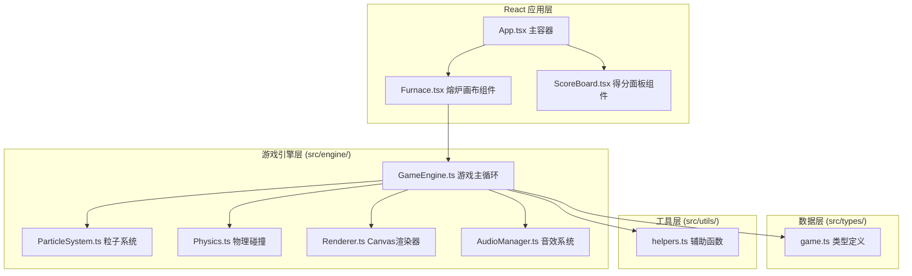

## 1. 架构设计



## 2. 技术描述

- **前端框架**：React 18 + TypeScript（严格模式）
- **构建工具**：Vite 5 + @vitejs/plugin-react
- **渲染引擎**：Canvas 2D API（离屏Canvas缓存静态层）
- **音效**：Web Audio API（原生合成，无外部资源）
- **动画循环**：requestAnimationFrame（60FPS目标）
- **状态管理**：React useState/useRef（游戏引擎内部使用ref避免重渲染）
- **路由**：单页面游戏，无需路由
- **后端**：无后端，纯前端游戏
- **数据库**：无持久化，游戏状态内存存储

## 3. 文件结构与调用关系

```
auto24/
├── package.json                          # 项目依赖与启动脚本
├── vite.config.js                        # Vite构建配置
├── tsconfig.json                         # TypeScript严格模式配置
├── index.html                            # 入口HTML (#root)
└── src/
    ├── main.tsx                          # React入口，挂载App
    ├── App.tsx                           # 主容器：组合Furnace+ScoreBoard，管理score/world，接收onScore事件
    ├── types/
    │   └── game.ts                       # 类型定义：Ore/MagicCrystal/Particle/World/GameState
    ├── engine/
    │   ├── GameEngine.ts                 # 游戏主循环、温度控制、熔炼逻辑、魔晶合成、状态管理
    │   ├── ParticleSystem.ts             # 粒子生成/更新/回收、矿石炸裂、边界光带粒子
    │   ├── Physics.ts                    # 边界反弹、粒子运动更新、碰撞检测
    │   ├── Renderer.ts                   # Canvas渲染、离屏Canvas缓存、矿石/魔晶/粒子绘制
    │   └── AudioManager.ts               # Web Audio API合成"叮"音效
    ├── utils/
    │   └── helpers.ts                    # 随机数、颜色映射、熔点计算、插值函数
    └── components/
        ├── Furnace.tsx                   # 熔炉画布：Canvas引用、键盘事件、onScore回调、响应式布局
        └── ScoreBoard.tsx                # 得分面板：score/world props、得分弹跳动画
```

**数据流向**：
1. Furnace.tsx → GameEngine.ts：键盘↑↓事件 → 更新温度状态
2. GameEngine.ts → ParticleSystem.ts：熔炼触发 → 生成炸裂粒子
3. GameEngine.ts → Renderer.ts：每帧更新游戏状态 → 渲染到Canvas
4. GameEngine.ts → AudioManager.ts：熔炼瞬间 → 播放"叮"音效
5. GameEngine.ts → Furnace.tsx：魔晶飞走 → 触发onScore(50)回调
6. Furnace.tsx → App.tsx：抛出onScore事件 → 更新score状态
7. App.tsx → ScoreBoard.tsx：score/world props → 渲染UI
8. App.tsx → Furnace.tsx：world变化 → 触发世界视觉切换

## 4. 核心数据模型（TypeScript 类型）

```typescript
// ============ 枚举类型 ============
enum OreColor { Red, Orange, Yellow, Green, Cyan, Blue, Purple }
enum WorldType { Default, DeepSea, StarRealm }
enum GameStatus { Playing, Paused, GameOver }

// ============ 实体类型 ============
interface Ore {
  id: number;
  x: number; y: number;         // 位置
  vx: number; vy: number;       // 速度 (px/s)
  radius: number;               // 初始半径 6-12px
  color: OreColor;              // 颜色枚举
  hexColor: string;             // 十六进制颜色值
  meltingPoint: number;         // 熔点 300-1000°C
  meltingProgress: number;      // 熔炼进度 0-1 (0.5秒完成)
  isMelting: boolean;           // 是否正在熔炼
  isMelted: boolean;            // 是否已熔炼完成
}

interface MagicCrystal {
  id: number;
  x: number; y: number;         // 位置
  rotation: number;             // 当前旋转角度
  condenseProgress: number;     // 凝聚进度 0-1 (0.8秒成型)
  flyProgress: number;          // 飞走进度 0-1
  isFlying: boolean;            // 是否在飞走
  isFormed: boolean;            // 是否成型
}

interface Particle {
  id: number;
  x: number; y: number;
  vx: number; vy: number;
  color: string;
  alpha: number;                // 透明度
  life: number;                 // 剩余寿命(秒)
  maxLife: number;              // 初始寿命
  size: number;                 // 大小
  type: 'explosion' | 'glow' | 'border';
  borderPosition?: number;      // 边界粒子位置 0-1 (沿边界循环)
  borderSide?: 'top'|'right'|'bottom'|'left';
}

// ============ 游戏状态 ============
interface GameState {
  temperature: number;          // 当前温度 100-1200°C
  ores: Ore[];                  // 未熔炼矿石
  meltedCount: number;          // 本次魔晶周期已熔炼数(0-5)
  crystals: MagicCrystal[];     // 魔晶列表
  particles: Particle[];        // 所有粒子
  world: WorldType;             // 当前世界
  score: number;                // 总分数
  status: GameStatus;           // 游戏状态
  shakeIntensity: number;       // 抖动强度
  shakeDuration: number;        // 抖动剩余时间
  borderFlash: number;          // 边框闪烁剩余时间
  backgroundTransition: number; // 背景渐变进度 0-1
  prevWorld: WorldType;         // 上一个世界(用于渐变)
  unlockedPopup: number;        // 解锁弹窗剩余显示时间
  overloadText: number;         // 过载文字剩余显示时间
  lastCrystalTime: number;      // 上一颗魔晶飞走时间戳
  crystalPending: boolean;      // 是否有待凝聚的魔晶
}
```

## 5. 核心逻辑实现要点

### 5.1 矿石与熔点映射
- 颜色→熔点映射：红(300-400)→橙(400-500)→黄(500-600)→绿(600-700)→青(700-800)→蓝(800-900)→紫(900-1000)
- 颜色→十六进制：红#ff4444、橙#ff8800、黄#ffdd00、绿#44dd44、青#44dddd、蓝#4488ff、紫#aa44ff

### 5.2 主循环时序 (每帧)
1. 更新物理：所有矿石位置 += 速度 × deltaTime，边界反弹
2. 温度系统：检测键盘输入，更新温度
3. 熔炼检测：遍历矿石，temperature≥meltingPoint → 标记isMelting
4. 熔炼进度：isMelting矿石的meltingProgress += deltaTime/0.5，完成→生成炸裂粒子+音效+meltingCount++
5. 魔晶合成：meltingCount≥5且无待凝聚→生成新魔晶（凝聚中）
6. 魔晶状态：condenseProgress→1→isFlying→飞出屏幕→score+=50→触发onScore回调
7. 进度滞后检测：距离上次魔晶飞走超时且有新熔炼需求→抖动+红框闪烁
8. 粒子系统：更新粒子位置/透明度/寿命，移除过期粒子
9. 过载检测：未熔炼矿石数>12→游戏结束
10. 世界解锁：score达到阈值→渐变背景+生成边界光带粒子+解锁弹窗
11. 特效更新：抖动衰减、边框闪烁、背景渐变、弹窗倒计时
12. 渲染：Renderer绘制全部元素

### 5.3 渲染优化策略
- 离屏Canvas缓存：熔炉背景（含圆角矩形+渐变炉膛）绘制到离屏Canvas，每帧直接drawImage
- 脏矩形区域：仅重绘粒子位置变化区域（简化实现：全屏重绘但确保≤16ms）
- 粒子池：预先分配粒子对象，回收重用，避免GC
- 矿石限流：总粒子数(ore+particle+crystal)≤100时暂停新矿石生成

### 5.4 魔晶绘制
- 基础六边形：Math.cos/sin计算6个顶点，rotation角度旋转
- 彩虹光晕：createRadialGradient多层叠加透明彩虹色
- 六角星高光：2个交错旋转的等边三角形（或6个矩形），随时间独立旋转

## 6. 性能预算
- 单帧CPU时间：≤16ms（60FPS）
- 同时存在矿石数：≤20颗（触发过载阈值12，留余量）
- 同时存在粒子数：≤80颗（总预算100-20预留）
- 内存占用：≤50MB（纯前端小应用）
- 首屏加载：≤2s（纯代码，无资源依赖）
