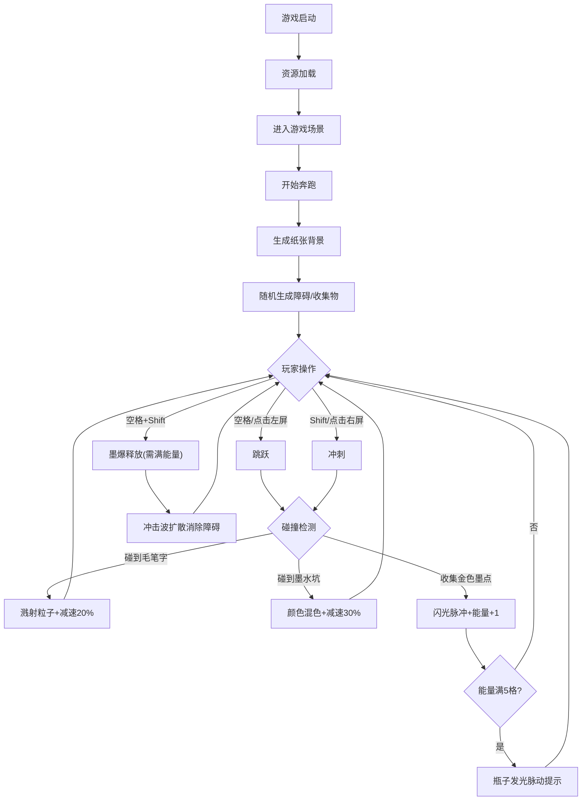

## 1. 产品概述

「墨迹竞速」是一款2D横向卷轴跑酷小游戏，玩家控制一滴墨水在由各种纸张纹理构成的赛道上奔跑，通过跳跃和冲刺躲避字迹障碍与墨水坑洞，收集金色墨点积攒能量并释放墨爆技能。游戏以中国传统水墨艺术为视觉风格，融合晕染、宣纸纹理等美学元素。

- 核心玩法：跑酷躲避 + 资源收集 + 技能释放
- 目标用户：休闲游戏玩家、国风艺术爱好者
- 产品价值：将传统水墨美学与现代跑酷玩法结合，提供独特视觉体验的同时保持游戏趣味性

## 2. 核心功能

### 2.1 功能模块
1. **游戏主场景**：赛道滚动、纸张背景切换、障碍物生成、碰撞检测
2. **玩家控制系统**：墨滴移动、跳跃（空格）、冲刺（Shift）、墨爆释放（空格+Shift）
3. **障碍物系统**：毛笔字障碍（带晕染动画）、墨水坑洞（带波纹效果）
4. **收集系统**：金色墨点收集、能量条积攒、能量满格视觉提示
5. **技能系统**：墨爆冲击波、范围消除字迹障碍、粒子特效
6. **UI界面系统**：分数显示、能量条（发光小瓶子）、响应式适配
7. **音效系统**：背景音乐、碰撞音效、收集音效、技能音效
8. **移动端适配**：触控操作（左半屏跳跃/右半屏冲刺）、自动缩放

### 2.2 功能详情

| 模块名称 | 功能项 | 详细描述 |
|---------|--------|---------|
| 背景系统 | 纸张切换 | 宣纸/牛皮纸/素描纸三种纹理，每10秒随机切换，0.5秒卷纸过渡动画 |
| 障碍系统 | 毛笔字障碍 | 随机汉字（静/飞/墨等），独立障碍物，0.3秒中心向外晕染动画 |
| 障碍系统 | 碰撞反馈 | 碰撞点产生3-5个黑色溅射粒子，扩散半径20-40px，持续0.5秒，速度降低20%持续1秒 |
| 障碍系统 | 墨水坑洞 | 半透明深蓝色圆形，边缘波纹扰动，每80-150像素随机生成 |
| 障碍系统 | 坑洞反馈 | 0.5秒颜色渐变混色动画，速度降低30%持续1.5秒 |
| 收集系统 | 金色墨点 | 跑道上方30-60px高度随机分布，收集时0.2秒金黄色环形闪光脉冲 |
| 收集系统 | 能量系统 | 每5个金色墨点能量满格，左上角色发光小瓶子图标，满格时发光上下脉动 |
| 技能系统 | 墨爆释放 | 空格+Shift触发，0.8秒圆形黑色冲击波扩散，消除范围内字迹障碍 |
| 技能系统 | 墨爆特效 | 冲击波覆盖障碍染黑碎裂消失，屏幕四周黑色粒子飞溅 |
| UI系统 | 分数显示 | 毛笔字体风格，淡墨色，晕染毛边效果，半透明显示 |
| 音效系统 | 背景音乐 | 古筝+笛子轻快旋律 |
| 音效系统 | 交互音效 | 水花溅落（碰撞）、清脆铃铛（收集）、低沉鼓声+纸张撕裂（墨爆） |
| 响应式 | 移动端 | 宽度<768px自动缩放，隐藏装饰元素，触控操作支持 |
| 性能 | 帧率控制 | 60fps流畅运行，粒子数≤150个，内存占用稳定 |

## 3. 核心流程

游戏启动 → 加载资源 → 进入游戏场景 → 玩家控制墨滴奔跑 → 随机生成障碍与收集物 → 碰撞检测与反馈 → 能量积攒 → 释放技能 → 游戏循环 → 游戏结束/重新开始

## 4. 用户界面设计

### 4.1 设计风格
- **主色调**：黑色(#1a1a1a)、白色(#ffffff)、米黄色(#f5f0e1)、靛蓝色(#1e3a5f)
- **视觉风格**：仿古水墨风，宣纸纹理基底，晕染毛边效果
- **字体**：毛笔书法风格字体，标题大气磅礴，正文飘逸灵动
- **动效**：所有交互带水墨晕染过渡，强调"墨"的流动感

### 4.2 页面设计

| 区域 | 元素 | UI特点 |
|-----|------|--------|
| 游戏画面 | 赛道区域 | 横向滚动，纸张纹理背景，毛笔字障碍/墨水坑洞/金色墨点 |
| 左上角 | 能量条 | 发光小瓶子图标，半透明，5格墨量显示，满格时发光上下脉动 |
| 右上角 | 分数显示 | 毛笔字风格数字，淡墨色，晕染毛边，半透明叠加 |
| 画面中心 | 玩家墨滴 | 黑色椭圆墨滴，带高光，拖尾效果，碰撞时变形 |
| 全屏 | 墨爆特效 | 黑色冲击波圆环，粒子飞溅，屏幕轻微震动 |

### 4.3 响应式设计
- **桌面端（默认）**：画布1280×720，键盘操作（空格跳跃/Shift冲刺）
- **移动端（<768px）**：画布自适应缩放，隐藏非核心装饰元素
- **触控操作**：左半屏点击=跳跃，右半屏点击=冲刺，双指同时按=墨爆

### 4.4 性能约束
- 最大粒子数：150个（对象池复用）
- 目标帧率：60fps
- 场景元素：超出屏幕范围自动回收复用
- 内存：无泄漏，纹理资源统一管理
