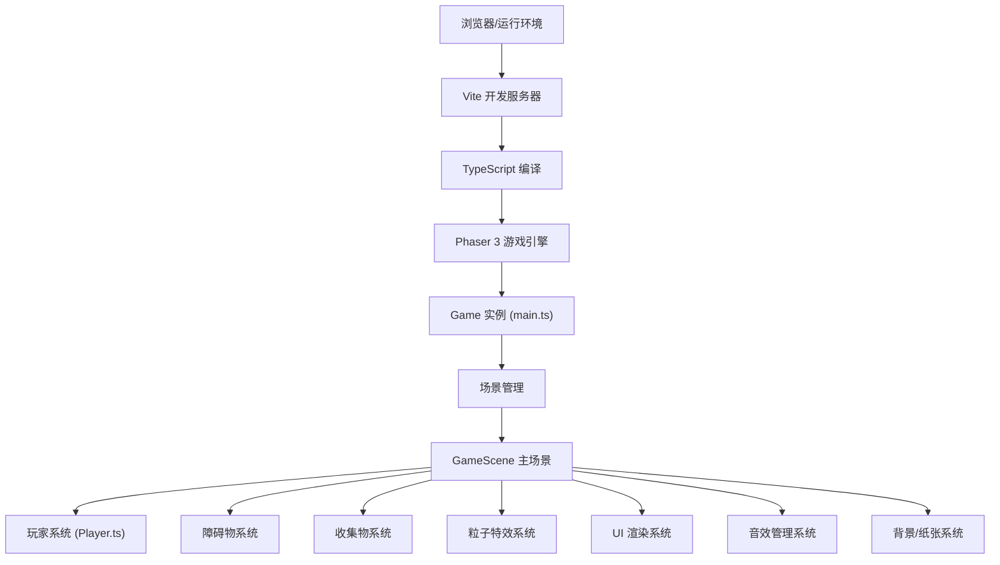

## 1. 架构设计



## 2. 技术描述

- **前端框架**：Phaser 3.70+ (2D游戏引擎)
- **开发语言**：TypeScript 5.0+ (严格模式, target ES2020)
- **构建工具**：Vite 5.0+ (HMR热更新, 快速构建)
- **包管理器**：npm
- **物理引擎**：Phaser Arcade Physics (轻量高效碰撞检测)
- **资源管理**：Phaser Loader (程序化生成纹理，无需外部图片资源)
- **音效**：Web Audio API + Phaser Sound Manager (程序化合成音效)
- **适配方案**：Phaser Scale Manager + 响应式CSS

## 3. 项目结构

```
auto242/
├── package.json           # 依赖配置: phaser, vite, typescript
├── vite.config.js         # Vite构建配置, base: '/'
├── tsconfig.json          # TS严格模式, target ES2020
├── index.html             # 入口HTML, 深灰背景
└── src/
    ├── main.ts            # 游戏入口, Phaser Game初始化
    ├── scenes/
    │   └── GameScene.ts   # 游戏主场景, 核心逻辑
    └── objects/
        └── Player.ts      # 玩家墨滴对象
```

## 4. 核心模块设计

### 4.1 main.ts - 游戏入口
- 职责：创建Phaser.Game实例，配置画布大小、物理引擎、场景注册
- 关键配置：
  - type: Phaser.AUTO (自动Canvas/WebGL)
  - width/height: 1280×720 (ScaleManager自适应)
  - physics: arcade
  - backgroundColor: '#2d2d2d'
  - scene: [GameScene]

### 4.2 Player.ts - 玩家墨滴类
- 继承：Phaser.Physics.Arcade.Sprite
- 核心属性：
  - baseColor: 当前墨滴颜色 (Phaser.Display.Color)
  - isJumping: 跳跃状态
  - isDashing: 冲刺状态
  - energy: 能量值 (0-5)
  - speedMultiplier: 速度倍率(减速效果)
  - slowdownTimer: 减速计时
- 核心方法：
  - jump(): 跳跃逻辑，重力反弹
  - dash(): 冲刺加速，短暂无敌
  - releaseInkBlast(): 墨爆技能，触发冲击波
  - hitObstacle(): 碰撞毛笔字，粒子+减速
  - fallIntoPit(): 掉入墨坑，混色+减速
  - collectInkDot(): 收集墨点，能量+1
  - update(time, delta): 帧更新，状态机驱动

### 4.3 GameScene.ts - 主场景
- 生命周期：
  - preload(): 资源预加载(程序化生成纹理)
  - create(): 场景初始化，创建对象、物理、输入监听
  - update(time, delta): 游戏循环更新
- 子系统：
  - **纸张背景系统**：3种纹理程序化生成，10秒切换定时器，0.5秒tween过渡动画
  - **障碍生成系统**：毛笔字(Canvas绘制+晕染Shader)，墨水坑洞(波纹动画)，对象池复用
  - **收集物系统**：金色墨点生成，位置随机(30-60px高度)，碰撞检测
  - **碰撞管理**：Arcade Physics overlap/collide，回调分发
  - **粒子系统**：ParticleEmitterManager，对象池≤150粒子
  - **UI系统**：DOM/Canvas UI层，能量瓶+分数渲染
  - **音效系统**：WebAudio程序化合成，BGM循环+事件音效
  - **响应式适配**：ScaleManager FIT模式，移动端检测+触控映射

## 5. 程序化资源生成

### 5.1 纹理生成 (Graphics → Texture)
- **宣纸纹理**：米黄底 + 随机纤维噪点 + 不规则斑点
- **牛皮纸纹理**：深棕底 + 粗糙颗粒噪点 + 折痕线条
- **素描纸纹理**：白色底 + 细密网格噪点 + 铅笔纹理
- **毛笔字障碍**：Canvas 2D fillText + radialGradient晕染
- **墨水坑洞**：Graphics圆形 + alpha渐变 + 波纹mask
- **金色墨点**：Graphics圆形 + radialGradient发光
- **能量瓶**：Graphics矢量绘制 + glow滤镜

### 5.2 音效合成 (WebAudio)
- **BGM古筝**：OscillatorNode + 五声音阶 + 泛音模拟
- **BGM笛子**：OscillatorNode正弦 + 颤音LFO
- **水花碰撞**：白噪声 + bandpass滤波器 + 包络
- **铃铛收集**：高频正弦叠加 + 指数衰减
- **鼓声墨爆**：低频正弦扫频 + 噪声冲击
- **纸张撕裂**：滤波白噪声 + 渐变高通

## 6. 性能优化方案

### 6.1 对象池模式
- 障碍物池：毛笔字/墨水坑对象复用，超出边界重置
- 粒子池：Phaser ParticleEmitterManager自动管理，上限150
- 收集物池：金色墨点循环复用

### 6.2 渲染优化
- 静态纹理预生成，避免每帧重绘
- 离屏Canvas预渲染字体/UI元素
- 可见性剔除：屏幕外元素暂停更新
- 纹理Atlas：纸张纹理合并图集

### 6.3 计算优化
- 碰撞检测：Arcade Physics AABB，避免复杂形状
- 定时器合并：统一update循环驱动，减少独立Timer
- 数学计算：预存常量，避免重复计算

## 7. 输入控制映射

| 操作 | 桌面端 | 移动端 |
|-----|--------|--------|
| 跳跃 | 空格键 | 点击左半屏 |
| 冲刺 | Shift键 | 点击右半屏 |
| 墨爆 | 空格+Shift同时 | 双指同时按 |
| 暂停 | P键 | 暂停按钮(可选) |

## 8. 颜色常量定义

```typescript
// 主色调
const COLORS = {
  INK_BLACK: 0x1a1a1a,      // 墨黑
  PAPER_WHITE: 0xffffff,    // 纸白
  RICE_PAPER: 0xf5f0e1,     // 宣纸米黄
  KRAFT_PAPER: 0xc4a574,    // 牛皮纸棕
  SKETCH_PAPER: 0xf8f6f0,   // 素描纸白
  INDIGO_BLUE: 0x1e3a5f,    // 靛蓝
  PIT_BLUE: 0x2a4a7f,       // 墨坑深蓝
  GOLD_INK: 0xffd700,       // 金色墨点
  GOLD_GLOW: 0xffec8b,      // 金色光晕
}
```
