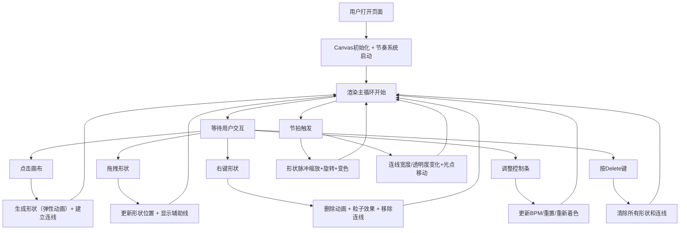

## 1. 产品概述

「律动几何」是一款面向创意工作室的音乐节奏可视化交互工具，用户通过点击和拖拽在画布上生成与实时音频频谱联动的动态几何图案，形成一幅由声音驱动的可视化艺术画布。

- 主要目的：提供直观的音乐节奏可视化创作体验，让设计师和视觉艺术家通过简单的交互生成动态视觉作品
- 目标用户：创意工作室设计师、视觉艺术家、音乐可视化爱好者
- 产品价值：降低音乐可视化创作门槛，提供即插即用的节奏驱动视觉效果生成器

## 2. 核心功能

### 2.1 功能模块

1. **主画布区域**：几何形状生成、拖拽交互、动画渲染、连线网络绘制
2. **节奏控制条**：BPM调节、节拍强度指示、节拍重置、随机颜色分配
3. **节奏模拟系统**：模拟节拍数据生成（BPM、强度、时间戳）

### 2.2 功能详情

| 页面/模块 | 子模块 | 功能描述 |
|-----------|--------|----------|
| 主画布 | 形状生成 | 点击画布生成随机几何形状（六边形、三角形、菱形等），半径20-35px，颜色从预设色板选取，0.3秒弹性放大动画 |
| 主画布 | 形状拖拽 | 拖拽移动形状，拖拽时显示半透明辅助定位线（与最近形状的虚线连线）和尺寸标注 |
| 主画布 | 节奏动画 | 每拍（约0.45秒）形状产生脉冲缩放（1.3倍）、旋转（10-20度）、颜色亮度变化（强拍+30%），内部渐变旋转方向随节拍变化 |
| 主画布 | 连线网络 | 每个新形状自动与最近2-3个形状建立半透明发光连线，颜色取两端颜色混合，线宽1-4px随强度变化，透明度0.2-0.8随节拍变化，连线中央光点沿连线移动 |
| 主画布 | 删除功能 | 右键删除形状（0.2秒收缩+彩色粒子扩散效果），Delete键一键清除全部 |
| 节奏控制条 | BPM调节 | 滑块在80-180范围调节BPM，显示当前数值 |
| 节奏控制条 | 强度指示 | 条状指示器随节拍跳动 |
| 节奏控制条 | 重置按钮 | 重置节拍计时器 |
| 节奏控制条 | 随机颜色 | 一键重新分配所有形状颜色 |

## 3. 核心流程

用户打开应用后看到深蓝色渐变画布，页面底部是半透明毛玻璃控制条。

主要用户流程：
1. 用户点击画布 → 生成几何形状（弹性动画）→ 自动建立与最近形状的连线
2. 用户拖拽形状 → 位置更新 + 辅助线显示 + 连线位置同步更新
3. 每节拍触发 → 所有形状脉冲缩放/旋转/变色 → 连线宽度/透明度变化 → 光点移动
4. 用户右键形状 → 删除动画 + 粒子效果 → 相关连线移除
5. 用户调整控制条 → BPM更新影响节拍频率 / 重置节拍 / 重新分配颜色
6. 用户按Delete键 → 清除全部形状和连线

## 4. 用户界面设计

### 4.1 设计风格

- **主色调**：深蓝到黑的径向渐变背景（营造深邃空间感）
- **色板**：暖红(#FF6B6B)、亮橙(#FFA94D)、明黄(#FFE066)、青蓝(#4DABF7)、淡紫(#B197FC)
- **描边**：所有形状2像素宽白色发光描边
- **控制条**：毛玻璃效果（rgba(255,255,255,0.1)背景 + 10px模糊半径）
- **连线**：发光线条 + 轻微模糊阴影
- **字体**：简约现代无衬线字体，标题白色
- **光标**：自定义点击和拖拽样式

### 4.2 页面设计概述

| 模块 | UI元素 | 样式描述 |
|------|--------|----------|
| 背景 | 径向渐变 | center → #0a1628 → #000000 |
| 标题 | 文字 | 页面左上角白色简约字体"律动几何" |
| 形状 | 几何图形 | 2px白色发光描边 + 半透明渐变填充 + 发光阴影 |
| 连线 | 发光线条 | 颜色混合两端 + blur阴影 + 动态宽度/透明度 |
| 辅助线 | 虚线 | 形状拖拽时与最近形状的半透明虚线 + 尺寸标注文字 |
| 粒子效果 | 小圆点 | 删除时20个彩色粒子扩散，3-5px大小，50px半径渐隐 |
| 控制条 | 底部条 | 毛玻璃背景，高度约80px，内边距16px |
| BPM滑块 | 横向滑块 | 自定义轨道+拇指样式，范围80-180 |
| 强度指示 | 垂直条 | 20px宽，高度随节拍强度0-100%变化，渐变填充 |
| 按钮 | 圆角按钮 | 半透明白色背景，hover时加深，圆角8px |

### 4.3 响应式

- 桌面端优先设计，Canvas占满视口
- 控制条随视口宽度自适应，最小支持1024px宽度
- 移动端触控优化：touchstart/touchmove/touchend事件映射

## 5. 性能约束

- 形状数量上限：60个（接近上限时自动删除最早未选中的形状）
- 连线数量上限：180条
- 动画帧率：≥55FPS（使用requestAnimationFrame）
