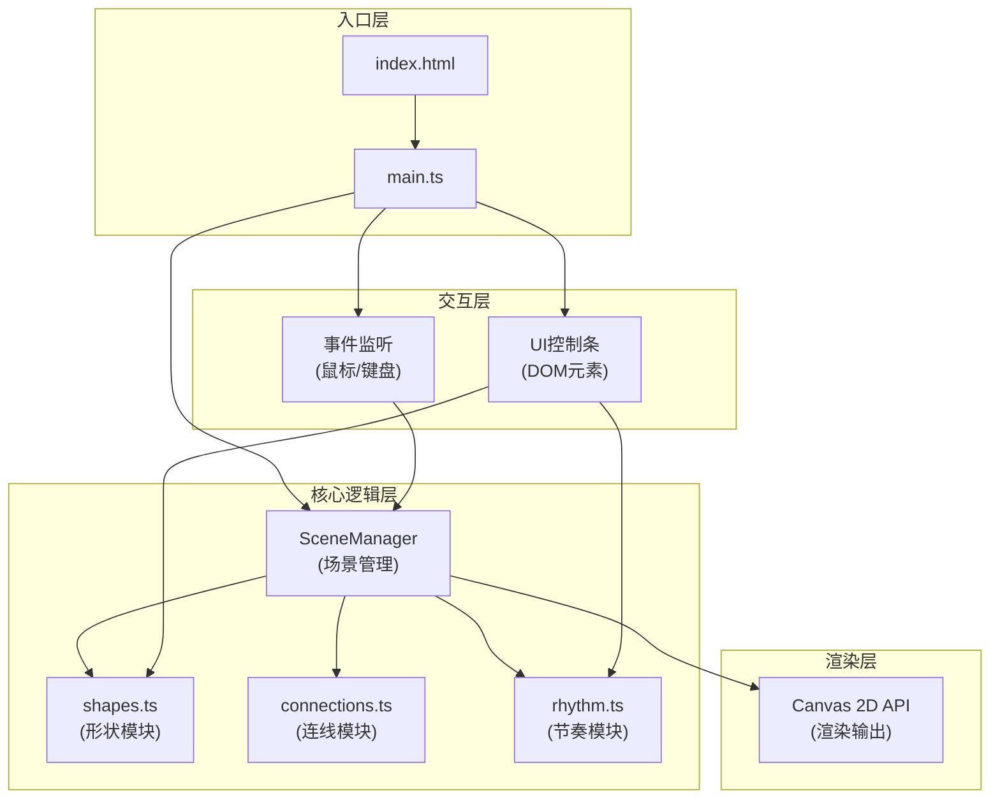

## 1. 架构设计

纯前端架构，无后端服务，采用模块化职责分离设计。



**数据流向**：
1. 用户事件（点击/拖拽/右键/键盘）→ main.ts 事件监听 → SceneManager 分发给 shapes/connections
2. 节奏系统 rhythm.ts → getCurrentBeat() → 每帧被 SceneManager 调用 → 传入 shapes.update() / connections.update()
3. shapes.ts 状态更新 → SceneManager 收集 → Canvas 绘制
4. connections.ts 依赖 shapes.ts 的位置数据 → 计算连线 → Canvas 绘制
5. UI控制条DOM事件 → 修改 rhythm.ts 的 BPM 参数 / 调用 shapes.ts 的重着色方法

**调用关系**：
- main.ts → 实例化 SceneManager，注入 rhythm 实例
- SceneManager → 持有 Shapes[]、Connection[]，调用其 update/draw
- SceneManager → 每帧调用 rhythm.getCurrentBeat()，将结果传递给 shape/connection.update()
- connections.ts → 在新形状添加时，读取 shapes[] 找最近邻建立连线
- rhythm.ts → 独立模块，仅被 SceneManager 和 UI控制条读取/修改

## 2. 技术说明

- **前端框架**：无（纯 TypeScript + Canvas API）
- **构建工具**：Vite 5.x
- **类型系统**：TypeScript 5.x（严格模式）
- **唯一ID**：uuid 9.x
- **初始化工具**：npm init vite-init

## 3. 文件结构

```
auto248/
├── package.json          # 依赖配置(vite, typescript, uuid) + 脚本(npm run dev)
├── vite.config.js        # Vite配置(严格模式)
├── tsconfig.json         # TypeScript严格模式配置
├── index.html            # 入口页面(深色径向渐变背景 + 标题 + Canvas + 控制条)
└── src/
    ├── main.ts           # 入口：Canvas初始化、事件绑定、动画循环、场景管理
    ├── shapes.ts         # 几何形状类(位置/大小/旋转/颜色/缩放动画)
    ├── connections.ts    # 连线网络管理(最近邻连接、动态宽度/透明度、光点)
    └── rhythm.ts         # 节拍模拟(BPM/强度/时间戳，getCurrentBeat)
```

## 4. 模块类型定义

### 4.1 rhythm.ts 接口

```typescript
export interface BeatData {
  bpm: number;
  intensity: number;      // 0.2 - 1.0
  timestamp: number;      // 当前时间戳
  isBeat: boolean;        // 是否正好在节拍点上
  beatProgress: number;   // 当前节拍内进度 0-1
  beatIndex: number;      // 第几个节拍
}

export class RhythmEngine {
  constructor(initialBpm?: number); // 默认130
  setBPM(bpm: number): void;        // 范围80-180，超限夹紧
  getBPM(): number;
  reset(): void;                     // 重置节拍计时器
  getCurrentBeat(): BeatData;        // 每帧调用
}
```

### 4.2 shapes.ts 接口

```typescript
export type ShapeType = 'hexagon' | 'triangle' | 'diamond' | 'pentagon' | 'octagon';
export type ShapeColor = '#FF6B6B' | '#FFA94D' | '#FFE066' | '#4DABF7' | '#B197FC';

export interface ShapeState {
  id: string;
  type: ShapeType;
  x: number;
  y: number;
  baseRadius: number;      // 20-35
  currentScale: number;    // 当前缩放（动画用）
  rotation: number;        // 弧度
  color: ShapeColor;
  gradientRotation: number; // 渐变旋转
  createdAt: number;
  isSelected: boolean;
  isDragging: boolean;
  isDeleting: boolean;      // 删除动画中
  deleteProgress: number;   // 0-1
  spawnProgress: number;    // 生成动画进度0-1（0.3秒从0→1.2→1）
  pulseProgress: number;    // 当前脉冲进度0-1
  lastPulseBeat: number;
  rotationDelta: number;    // 本次旋转增量
}

export interface Particle {
  x: number;
  y: number;
  vx: number;
  vy: number;
  size: number;             // 3-5
  color: string;
  life: number;             // 剩余寿命0-1
}

export class ShapeManager {
  shapes: Shape[];
  particles: Particle[];
  maxShapes: number;        // 60

  addShape(x: number, y: number): Shape;      // 点击生成，自动删除超量
  removeShape(id: string): void;              // 右键删除，触发粒子效果
  clearAll(): void;                           // Delete键
  randomizeColors(): void;                    // 随机颜色按钮
  getShapeAtPoint(x: number, y: number): Shape | null;
  getNearestShapes(shape: Shape, count: number): Shape[];
  update(dt: number, beat: BeatData): void;   // 每帧更新
  draw(ctx: CanvasRenderingContext2D, beat: BeatData): void;
}
```

### 4.3 connections.ts 接口

```typescript
export interface Connection {
  id: string;
  shapeAId: string;
  shapeBId: string;
  lightPointProgress: number;  // 光点位置0-1
}

export interface DragGuide {
  shapeId: string;
  targetShapeId: string;
}

export class ConnectionManager {
  connections: Connection[];
  maxConnections: number;      // 180
  dragGuides: DragGuide[];     // 拖拽时的辅助线

  onShapeAdded(shape: Shape, allShapes: Shape[]): void;  // 连最近2-3个
  onShapeRemoved(shapeId: string): void;
  clearAll(): void;
  setDragGuides(shape: Shape | null, allShapes: Shape[]): void;
  update(dt: number, beat: BeatData): void;   // 更新光点位置
  draw(ctx: CanvasRenderingContext2D, shapes: Shape[], beat: BeatData): void;
}
```

### 4.4 main.ts 场景管理

```typescript
class SceneManager {
  canvas: HTMLCanvasElement;
  ctx: CanvasRenderingContext2D;
  rhythm: RhythmEngine;
  shapes: ShapeManager;
  connections: ConnectionManager;
  lastTime: number;
  rafId: number;
  
  init(): void;
  bindEvents(): void;
  loop(currentTime: number): void;
  resize(): void;
}
```

## 5. 动画实现要点

### 5.1 形状生成动画（0.3秒弹性）
- spawnProgress 从0→1，使用 easeOutElastic 缓动
- scale = progress < 0.7 ? map(progress,0,0.7,0,1.2) : map(progress,0.7,1,1.2,1)

### 5.2 节拍脉冲缩放
- beat.isBeat 为 true 时触发 pulseProgress 从0→1
- 缩放叠加：pulseScale = 1 + 0.3 * sin(pulseProgress * π)
- 旋转 delta = random(10°, 20°) * randomSign()，使用 lerp 平滑

### 5.3 删除动画（0.2秒）
- deleteProgress 0→1
- scale = 1 - deleteProgress（收缩到0）
- 同时生成20个粒子，初速度向外，life随progress衰减

### 5.4 连线光点移动
- lightPointProgress += (beat.bpm / 60) * dt（每秒前进 BPM/60 次循环）
- progress = fract(progress)，在连线上来回 ping-pong

## 6. 性能优化

- 离屏缓存：形状路径（六边形等）预计算顶点坐标，每帧仅变换矩阵
- 减少 context 状态切换：按颜色分组绘制，减少 fillStyle 赋值
- 距离计算优化：使用距离平方比较，避免开方
- 自动降载：超60个形状自动删除最早且未被选中的
- requestAnimationFrame + dt（deltaTime）计算，保证动画速度与帧率无关
