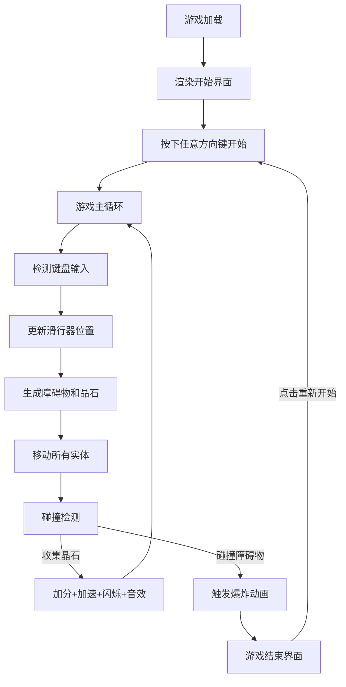

# 晶矿竞速·深渊滑行 产品需求文档 (PRD)

## 1. 产品概述

「晶矿竞速·深渊滑行」是一款浏览器端2D竞速游戏，玩家操控一艘由发光水晶构成的滑行器，在不断向下延伸的深渊隧道中躲避障碍物并收集能量晶石。游戏通过流畅的粒子特效、渐进式难度和沉浸式视觉体验，为独立游戏爱好者提供快节奏的休闲娱乐体验。

- **目标用户**: 独立游戏爱好者、休闲玩家、HTML5游戏体验者
- **产品价值**: 提供即时上手、视觉华丽、挑战性递增的网页游戏体验

## 2. 核心功能

### 2.1 功能模块

1. **游戏主场景**: Canvas渲染的2D深渊隧道，包含滑行器、障碍物、晶石、粒子系统
2. **滑行器操控系统**: 键盘方向键控制（上加速、下减速、左右平移）
3. **粒子特效系统**: 尾迹粒子、爆炸碎片、静态星光、屏幕闪烁
4. **碰撞与收集系统**: 障碍物碰撞检测、晶石收集判定
5. **计分与等级系统**: 实时得分、速度等级、最高纪录
6. **游戏状态管理**: 开始、进行中、结束状态切换，重新开始
7. **音效系统**: Web Audio API实现晶石收集音效

### 2.2 功能详情

| 模块名称 | 功能点 | 详细描述 |
|-----------|--------|----------|
| 滑行器操控 | 方向键控制 | 上键加速、下键减速、左右键平移，轨道限制在屏幕70%宽度内 |
| 滑行器外观 | 水晶拼装 | 由12个发光矩形晶石拼成，发光描边#00BFFF宽度2px |
| 尾迹粒子 | 持续生成 | 每秒100颗，直径2-4px，颜色#00BFFF~#8A2BE2随机，生命周期1秒 |
| 障碍物 | 六边形 | 每0.8-1.5秒生成，边长20-30px，颜色#8B0000，速度=玩家速度×1.2 |
| 碰撞检测 | 游戏结束 | 触碰障碍物触发爆炸，50颗碎片散射0.8秒 |
| 能量晶石 | 菱形收集物 | 每1.5-3秒生成，边长15px，颜色#FFD700，脉冲光晕20-25px循环 |
| 加速机制 | 渐进提升 | 每收集一颗晶石速度+5%，屏幕白光闪烁0.3秒 |
| 音效 | 上升音调 | 晶石收集时频率600-1000Hz线性递增，持续0.2秒 |
| 粒子颜色 | 速度映射 | 慢→快：蓝→紫→红渐变，粒子大小2px→4px |
| 隧道星光 | 背景装饰 | 随机静态粒子，直径1-3px，白色，透明度0.1-0.5缓慢变化 |
| UI显示 | 得分与等级 | 左上角实时显示得分(每晶石+10)和速度等级(1-10级) |
| 游戏结束 | 遮罩界面 | 半透明黑色遮罩(0.7)，显示最终得分和最高纪录，重新开始按钮 |

## 3. 核心流程

## 4. 用户界面设计

### 4.1 设计风格

- **主色调**: 深空蓝渐变背景（#0A0A2E → #1A1A4E，从上到下）
- **强调色**: 青色#00BFFF、紫色#8A2BE2、金色#FFD700、深红#8B0000
- **隧道壁**: 半透明紫色渐变线条（#8A2BE2，透明度0.4），宽度入口100%到底部60%收窄
- **按钮风格**: 圆角矩形，hover时颜色从#00BFFF变为#00DDFF，缩放1.0→1.1→1.0（0.2秒）
- **字体**: monospace字体族，UI文字白色半透明，字号18px
- **发光效果**: 得分和等级带#00BFFF发光投影（模糊半径3px）
- **UI容器**: 圆角矩形背景（圆角8px，黑色#000000透明度0.5）

### 4.2 界面布局

| 区域 | 元素 | 样式说明 |
|------|------|----------|
| 左上角 | 得分显示 | 圆角矩形背景，monospace 18px，白色半透明，发光投影 |
| 左上角下方 | 速度等级 | 圆角矩形背景，monospace 18px，白色半透明，发光投影 |
| 屏幕中央(游戏结束) | 遮罩层 | 半透明黑色0.7，全屏覆盖 |
| 遮罩中央 | 最终得分 & 最高纪录 | 大字号monospace，白色，发光效果 |
| 遮罩下方 | 重新开始按钮 | 圆角8px，青色背景，hover动画，monospace字体 |

### 4.3 响应式设计

- 桌面端优先，Canvas自适应窗口大小
- 键盘操控为主，支持鼠标点击按钮
- 游戏区域保持比例，不强制缩放变形

## 5. 性能要求

| 指标 | 要求 |
|------|------|
| 渲染帧率 | 稳定60FPS |
| 粒子数量上限 | 峰值不超过200个，超出移除最旧粒子 |
| 碰撞检测响应 | ≤16ms/帧 |
| 浏览器兼容 | 支持Canvas 2D和Web Audio API的现代浏览器 |
