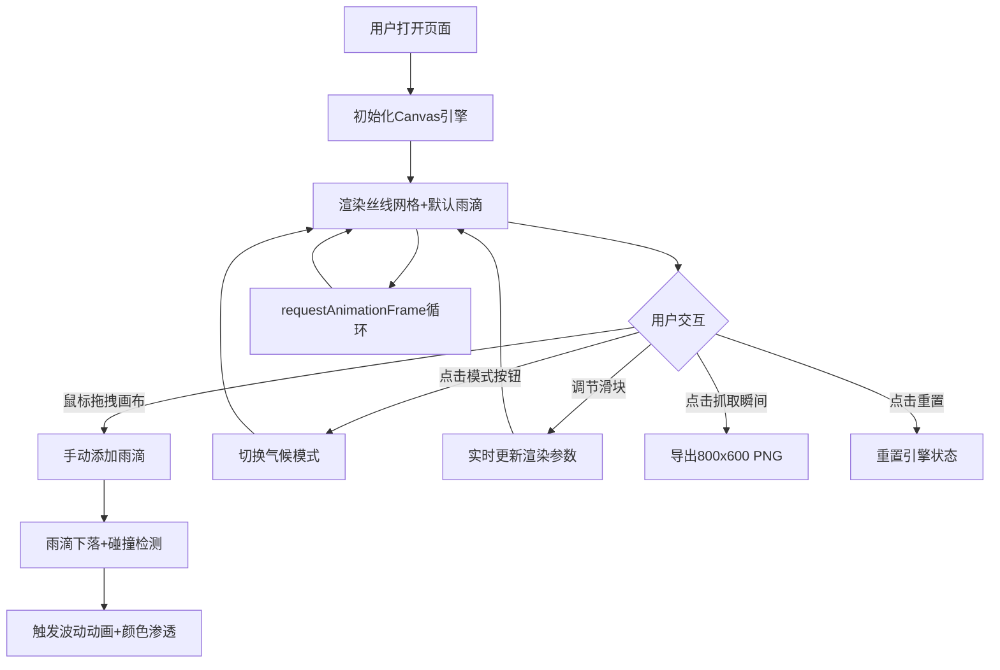

## 1. 产品概述
「雨落织锦」是一款在浏览器中运行的交互式动态壁纸生成器，通过模拟织布机上彩色丝线与雨滴碰撞的艺术效果，让用户实时创作不断演进的织锦画。解决了传统静态壁纸缺乏生机动感和个性化创作空间的问题，提供沉浸式的视觉创作体验。

## 2. 核心功能

### 2.1 功能模块
1. **主画布区域**：丝线编织引擎渲染、雨滴碰撞动画、波动环与水花效果
2. **控制面板**：气候模式切换按钮、四个实时参数调节滑块
3. **操作功能**：鼠标拖拽手动添加雨滴、抓取瞬间导出PNG、重置织布机

### 2.2 页面详情
| 页面名称 | 模块名称 | 功能描述 |
|---------|---------|---------|
| 主页面 | 丝线编织引擎 | 50×50根丝线网格，每根丝线20个带渐变色圆点，每帧按正弦波偏移模拟梭子韵律 |
| 主页面 | 雨滴碰撞系统 | 手动拖拽添加雨滴 + 自动随机雨滴（≤15颗），碰撞触发1.5秒双环波动动画 + 2秒颜色渗透效果 |
| 主页面 | 气候模式切换 | 细雨（≤5颗雨滴+丝线透明度闪烁）/骤雨（≤25颗+速度600px/s）/晴空（无雨滴+丝线呼吸光效） |
| 主页面 | 实时参数调节 | 丝线振幅（0-10px）、丝线频率（0.5-3Hz）、雨滴速度（100-600px/s）、颜色偏移速度（0-20度/秒） |
| 主页面 | 导出与重置 | 抓取瞬间（800×600 PNG导出）、重置织布机（恢复初始状态） |

## 3. 核心流程

## 4. 用户界面设计

### 4.1 设计风格
- **主色调**：画布背景深色木质纹理 `#3E2C1A`，两侧留白亚麻色 `#F5E6D3`
- **强调色**：雨滴蓝 `#4A90D9` 用于模式激活边框、波动环光晕
- **按钮样式**：柔软圆形胶囊（`border-radius: 20px`），半透明磨砂玻璃（`backdrop-filter: blur(8px)`），激活态带 `#4A90D9` 柔和发光边框
- **滑块样式**：磨砂玻璃卡片容器，圆角矩形轨道，圆形带光晕手柄
- **过渡动画**：所有控件 0.2s ease-out 过渡

### 4.2 页面设计概述
| 模块名称 | UI元素 |
|---------|-------|
| 主画布 | 4:3宽高比（最小600×450px），木质背景，亚麻边带织物纹理，Canvas居中 |
| 模式按钮组 | 左上角，三个胶囊按钮横向排列，磨砂玻璃效果 |
| 滑块控制组 | 右侧磨砂玻璃卡片，四个垂直排列滑块，带数值标签 |
| 操作按钮 | 画布下方或控制面板底部，抓取瞬间+重置织布机按钮 |
| 雨滴与效果 | 圆形雨滴（6px半径），双环径向渐变波动，6-10个随机水花粒子 |

### 4.3 响应式
- **大屏（>1024px）**：左右布局，画布居中，控制面板在右侧，模式按钮在画布左上角
- **中屏（768-1024px）**：画布自适应缩放，控制面板宽度压缩
- **小屏（<768px）**：上下布局，模式按钮和滑块折叠到画布下方，保持画布最小尺寸400×300px
- 触屏设备支持手指拖拽添加雨滴
