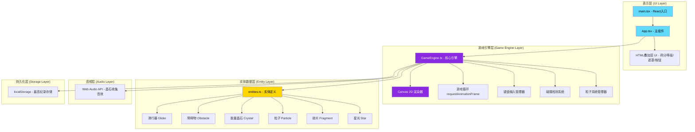
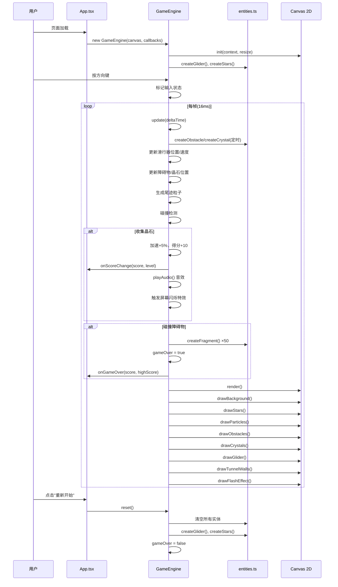

# 晶矿竞速·深渊滑行 技术架构文档

## 1. 架构设计



**数据流向说明：**
1. `main.tsx` → `App.tsx`：渲染根组件
2. `App.tsx` → `GameEngine.ts`：传递canvas引用，监听游戏状态回调（得分、速度、游戏结束）
3. `GameEngine.ts` → `entities.ts`：创建/更新所有游戏实体数据
4. `GameEngine.ts` → Canvas：根据实体数据渲染画面
5. 键盘事件 → `GameEngine.ts`：更新滑行器控制状态
6. `GameEngine.ts` → `App.tsx`：通过回调同步游戏数据用于UI显示
7. `App.tsx` → `GameEngine.ts`：用户点击"重新开始"时触发引擎重置

## 2. 技术描述

### 2.1 核心技术栈

| 类别 | 技术选型 | 版本 | 用途 |
|------|---------|------|------|
| 前端框架 | React | ^18.x | UI组件管理、状态绑定 |
| UI渲染库 | React DOM | ^18.x | 虚拟DOM渲染、事件处理 |
| 语言 | TypeScript | ^5.x | 类型安全、ES模块 |
| 构建工具 | Vite | ^5.x | 快速开发构建、HMR |
| Vite插件 | @vitejs/plugin-react | ^4.x | React JSX支持 |
| Canvas API | Canvas 2D Context | - | 游戏实体与粒子渲染 |
| 音频API | Web Audio API | - | 晶石收集音效合成 |
| 存储 | localStorage API | - | 最高分持久化 |

### 2.2 初始化方式

使用 `npm create vite-init` 脚手架初始化React+TypeScript项目：
```bash
npm init vite-init@latest -y . -- --template react-ts --force
```

### 2.3 无后端架构

本项目为纯前端游戏，无需后端服务，所有数据和逻辑在浏览器端运行。

## 3. 文件结构与职责

```
项目根目录/
├── index.html                  # 入口HTML页面，挂载#root，加载src/main.tsx
├── package.json                # 项目依赖与npm脚本
├── vite.config.ts              # Vite构建配置（React+TypeScript支持）
├── tsconfig.json               # TypeScript严格模式配置
└── src/
    ├── main.tsx                # React入口：createRoot渲染<App />
    ├── App.tsx                 # 主组件
    │                           #  - 管理UI叠加层（得分、等级、遮罩、按钮）
    │                           #  - 创建canvas引用传递给GameEngine
    │                           #  - 游戏状态管理（playing/gameover/idle）
    │                           #  - 监听GameEngine回调更新UI
    │                           #  - 处理"重新开始"按钮点击
    └── game/
        ├── GameEngine.ts       # 核心游戏引擎类
        │                       #  - Canvas初始化与尺寸管理
        │                       #  - requestAnimationFrame游戏主循环
        │                       #  - 键盘事件监听（方向键）
        │                       #  - 滑行器物理更新（位置、速度）
        │                       #  - 障碍物/晶石生成定时器
        │                       #  - 圆形碰撞检测算法
        │                       #  - 粒子生命周期管理（上限200）
        │                       #  - 各实体绘制方法调用
        │                       #  - Web Audio音效播放
        │                       #  - localStorage最高分读写
        │                       #  - 回调通知App.tsx状态变化
        └── entities.ts         # 所有游戏实体的类型与工厂函数
                                #  - TypeScript接口定义（Glider, Obstacle等）
                                #  - 滑行器12块水晶位置布局定义
                                #  - createGlider() - 创建初始滑行器
                                #  - createObstacle() - 随机六边形障碍物
                                #  - createCrystal() - 随机菱形晶石
                                #  - createParticle() - 尾迹/爆炸粒子
                                #  - createStar() - 隧道背景星光
                                #  - 颜色渐变插值工具函数
```

## 4. 模块调用关系

### 4.1 主流程调用序列



## 5. 核心数据结构

### 5.1 实体类型定义（entities.ts）

```typescript
// 2D向量
interface Vector2 { x: number; y: number; }

// 滑行器 - 12块发光水晶
interface Glider {
  position: Vector2;           // 中心点坐标
  velocity: Vector2;           // 速度向量
  speed: number;               // 当前基础速度
  speedMultiplier: number;     // 晶石加速倍率
  crystals: CrystalBlock[];    // 12块水晶子元素（相对坐标+尺寸）
}

// 水晶块（滑行器组成部分）
interface CrystalBlock {
  offsetX: number; offsetY: number;
  width: number; height: number;
}

// 六边形障碍物
interface Obstacle {
  id: number;
  position: Vector2;
  size: number;                // 边长 20-30px
  vertices: Vector2[];         // 6个顶点（用于绘制+碰撞）
  speed: number;
}

// 菱形能量晶石
interface Crystal {
  id: number;
  position: Vector2;
  size: number;                // 边长 15px
  pulsePhase: number;          // 光晕脉冲相位 0-2π
  collected: boolean;
}

// 通用粒子
interface Particle {
  id: number;
  position: Vector2;
  velocity: Vector2;
  size: number;                // 直径 2-4px
  color: string;               // RGB颜色
  life: number;                // 剩余生命周期 ms
  maxLife: number;             // 最大生命周期 ms
}

// 爆炸碎片
interface Fragment {
  id: number;
  position: Vector2;
  velocity: Vector2;
  rotation: number;
  size: number;
  color: string;
  life: number; maxLife: number;
}

// 背景星光
interface Star {
  position: Vector2;
  size: number;                // 1-3px
  alphaPhase: number;          // 透明度变化相位
}

// 游戏状态回调接口
interface GameCallbacks {
  onScoreUpdate: (score: number, level: number) => void;
  onGameOver: (finalScore: number, highScore: number) => void;
}
```

## 6. 核心算法与实现要点

### 6.1 碰撞检测算法

**圆形近似碰撞**（为了性能≤16ms响应）：
- 将滑行器近似为半径约30px的圆
- 将六边形障碍物近似为其外接圆（半径=size）
- 将菱形晶石近似为半径约15px的圆
- 判定：两圆心距离 < 半径之和 → 碰撞

### 6.2 粒子颜色渐变算法

```
速度等级 1-4 → 颜色插值: #00BFFF (蓝) → #8A2BE2 (紫)
速度等级 5-10 → 颜色插值: #8A2BE2 (紫) → #FF0000 (红)
使用线性RGB插值函数 interpolateColor(from, to, t)
```

### 6.3 速度等级映射

```typescript
// speedMultiplier ∈ [1.0, ~∞)，映射到等级 1-10
const level = Math.min(10, Math.floor((speedMultiplier - 1) / 0.05) + 1);
// 每收集1颗晶石: speedMultiplier *= 1.05, +5%
```

### 6.4 隧道壁收窄渲染

```typescript
// 每条水平线 y ∈ [0, canvasHeight]
const t = y / canvasHeight; // 0.0 (顶部) → 1.0 (底部)
const widthRatio = 1.0 - (t * 0.4); // 100% → 60%
const wallX = (canvasWidth / 2) * (1 - widthRatio);
// 左右壁: x = wallX 和 x = canvasWidth - wallX
```

### 6.5 粒子生命周期管理

- 尾迹：每帧生成 `100 / 60 ≈ 1-2` 个粒子
- 总粒子池维护：`Array<Particle>`，按 `id`（时间递增）排序
- 每帧：`while (particles.length > 200) particles.shift();` 移除最旧
- 每帧：遍历更新粒子 `life -= deltaTime`，life≤0时删除

## 7. 性能保障策略

| 策略 | 说明 |
|------|------|
| 圆形碰撞 | 避免复杂多边形碰撞，O(n)时间复杂度 |
| 粒子池上限 | 200个硬限制，最旧优先淘汰 |
| requestAnimationFrame | 与显示器刷新同步，避免掉帧抖动 |
| deltaTime校准 | 所有运动乘以帧间隔，高刷新率屏幕不加速 |
| Canvas批量绘制 | 同色粒子批量路径绘制，减少context状态切换 |
| 离屏计算 | 数学运算不在render()中，在update()中预先完成 |

## 8. 开发与构建

```bash
# 安装依赖
npm install

# 开发服务器 (Vite, HMR)
npm run dev

# 生产构建
npm run build

# 预览生产构建
npm run preview
```
