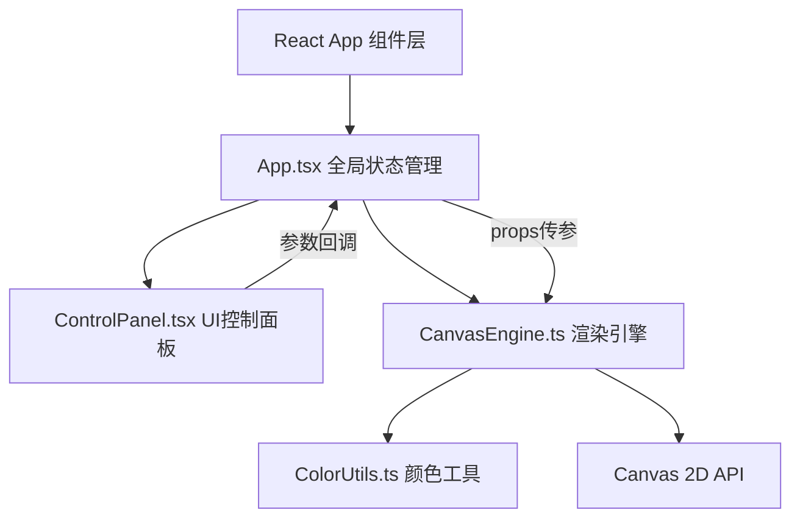

## 1. 架构设计



## 2. 技术描述
- **前端框架**：React 18 + TypeScript（严格模式）
- **构建工具**：Vite 5 + @vitejs/plugin-react（启用严格模式+路径别名@）
- **渲染引擎**：Canvas 2D API（原生，不引入第三方Canvas库）
- **状态管理**：React useState（轻量场景，无需zustand）
- **无后端**：纯前端应用，数据/状态均在内存

## 3. 目录结构与路由
单页应用，无路由。文件组织结构：

```
auto25/
├── index.html                  # Vite入口HTML
├── package.json                # 依赖配置
├── tsconfig.json               # TS严格配置
├── vite.config.js              # Vite配置（别名+严格模式）
└── src/
    ├── App.tsx                 # 主组件（全局状态+协调）
    ├── main.tsx                # React入口（挂载App）
    ├── CanvasEngine.ts         # Canvas渲染引擎类
    ├── controls/
    │   └── ControlPanel.tsx    # 控制面板（模式按钮+滑块）
    └── utils/
        └── ColorUtils.ts       # HSL/RGB颜色转换与插值
```

## 4. 关键类型定义（TypeScript）

```typescript
// 气候模式
export type ClimateMode = 'drizzle' | 'shower' | 'clear';

// 渲染参数
export interface EngineParams {
  amplitude: number;      // 丝线振幅 0-10
  frequency: number;      // 丝线频率 0.5-3
  dropSpeed: number;      // 雨滴速度 100-600
  hueShiftSpeed: number;  // 颜色偏移速度 0-20
  mode: ClimateMode;
}

// 丝线粒子点
interface ThreadPoint { x: number; y: number; hueOffset: number; }
interface Thread { points: ThreadPoint[]; isHorizontal: boolean; baseIndex: number; hueBase: number; }

// 雨滴
interface RainDrop { x: number; y: number; vy: number; radius: number; alive: boolean; }

// 波动环
interface Ripple { x: number; y: number; t: number; duration: number; threadIdx: number; }

// 水花粒子
interface Splash { x: number; y: number; vx: number; vy: number; life: number; maxLife: number; size: number; }

// 颜色偏移记录
interface ColorBleed { threadIdx: number; pointIdx: number; t: number; duration: number; }
```

## 5. CanvasEngine 设计要点
1. **初始化**：创建离屏Canvas？不需要，直接用主Canvas。尺寸按容器4:3自适应。
2. **主线程循环**：`requestAnimationFrame` 驱动，记录 `lastTime` 计算 `dt`（delta time），所有动效基于 dt 而非帧数，保证不同刷新率一致。
3. **丝线绘制**：每帧先更新每根丝线的20个点的位置（正弦波叠加），再用逐点画圆（带HSL渐变，色相按 index + hueTime + hueShift 计算）。
4. **雨滴系统**：维护雨滴数组，`update(dt)` 时做重力下落 + 与每根丝线做碰撞检测（点-线段距离阈值判定）。
5. **碰撞响应**：触发 Ripple（波动环）+ Splash（水花）+ ColorBleed（颜色渗透）三个效果队列。
6. **性能优化**：
   - 丝线预先计算基础位置，只做偏移更新，避免每帧重建数组。
   - 碰撞检测：先粗筛（只检测接近雨滴Y的5-6根丝线），再精算点距离。
   - 限制最大雨滴数，超出不新增。
7. **导出**：`canvas.toDataURL('image/png')`，导出前将Canvas临时调整为800×600重绘一帧，导出后恢复。
8. **重置**：清空雨滴/波动/水花数组，重置 hueTime=0，丝线回归正弦初始相位。

## 6. ColorUtils 设计
```typescript
hslToRgb(h: number, s: number, l: number): [number, number, number];
rgbToCss(r: number, g: number, b: number, a?: number): string;
lerpHue(h1: number, h2: number, t: number): number;  // 色相环最短路径插值
blendColorBleed(baseHue: number, targetHue: number, amount: number): number;
```

## 7. UI组件通信
- App.tsx 持有 `params` 状态（useState）和 canvasRef（useRef）。
- App.tsx 将 params 传入 CanvasEngine（通过 engine.setParams() 方法，避免每帧重建引擎）。
- ControlPanel.tsx 接收 App 传入的当前 params + onChange 回调，受控组件模式。
- CanvasEngine 实例用 useRef 保存，组件卸载时调用 engine.destroy() 取消 rAF 循环。
