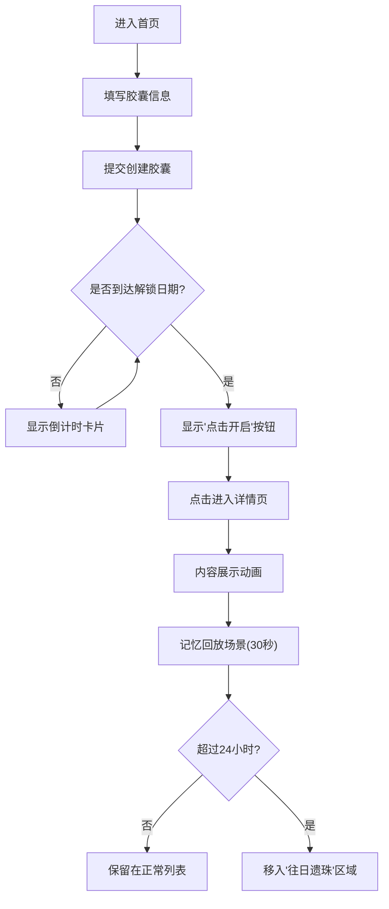

# 时光胶囊 - 产品需求文档（PRD）

## 1. 产品概述

时光胶囊是一款面向所有互联网用户的数字记忆封存与分享应用，用户可以为未来的某个日期封装文字、图片和心情，时间到达后解锁重温美好记忆。

- **核心价值**：让用户能够"慢下来"，为未来的自己或他人留下珍贵的数字记忆，通过时间的仪式感赋予回忆更多情感深度
- **目标用户**：追求生活仪式感、喜欢记录生活、渴望与未来对话的年轻群体

## 2. 核心功能

### 2.1 用户角色
| 角色 | 注册方式 | 核心权限 |
|------|----------|----------|
| 普通用户 | 无需注册，匿名使用 | 创建胶囊、查看胶囊列表、打开已解锁胶囊、体验记忆回放 |

### 2.2 功能模块
1. **首页**：胶囊创建表单、筛选栏、胶囊列表（含"往日遗珠"区域）
2. **胶囊详情页**：解锁内容展示、记忆回放动画、交互式粒子场景

### 2.3 页面详情
| 页面名称 | 模块名称 | 功能描述 |
|---------|---------|----------|
| 首页 | 创建表单 | 填写标题、内容、图片URL、心情颜色、解锁日期并提交 |
| 首页 | 筛选栏 | 按状态筛选（未解锁/已解锁/全部）、按心情颜色标签过滤 |
| 首页 | 胶囊列表 | 网格布局展示胶囊卡片，实时倒计时，支持点击进入详情 |
| 首页 | 往日遗珠 | 展示已解锁超过24小时的胶囊，灰显处理 |
| 详情页 | 内容展示 | 文字渐入、图片缩放淡入、心情颜色扩散动画 |
| 详情页 | 记忆回放 | 全屏渐变动画+飘浮粒子+鼠标交互，持续30秒 |

## 3. 核心流程

用户创建胶囊 → 填写信息并选择未来日期 → 系统封存胶囊 → 时间流逝中倒计时实时更新 → 到达解锁日期 → 胶囊变为"点击开启"按钮 → 用户点击进入详情页 → 内容逐项展示动画 → 自动启动30秒记忆回放场景 → 超过24小时后胶囊移入"往日遗珠"区域

## 4. 用户界面设计

### 4.1 设计风格
- **主色调**：深灰底色 (#1a1a2e)，12种柔和心情色系（黄昏橙、星夜蓝、晨雾紫、薄荷绿、玫瑰粉、柠檬黄、深海青、樱花粉、日落红、云雾灰、森林绿、薰衣草）
- **卡片风格**：毛玻璃效果（背景模糊8px），圆角12px，悬浮阴影（hover时上移4px，阴影扩大）
- **字体**：标题粗体无衬线，正文无衬线字体
- **按钮风格**：胶囊形状（圆角20px），下拉菜单0.2秒伸缩动画
- **整体调性**：极简主义，富有情感温度的深色界面

### 4.2 页面设计概览
| 页面名称 | 模块名称 | UI元素 |
|---------|---------|--------|
| 首页 | 创建表单 | 输入框（标题/内容/图片URL）、颜色选择器、日期选择器、提交按钮 |
| 首页 | 筛选栏 | 状态切换胶囊按钮、颜色标签组、展开动画 |
| 首页 | 胶囊卡片 | 倒计时标签、心情色背景、毛玻璃、脉冲动画（解锁时） |
| 详情页 | 内容区 | 文字逐行渐入、图片缩放+淡入、颜色扩散背景 |
| 详情页 | 粒子场景 | Canvas粒子、全屏渐变、鼠标交互聚集 |

### 4.3 响应式设计
- 桌面端（≥1024px）：3列网格布局
- 平板端（768px-1023px）：2列网格布局
- 移动端（<768px）：1列网格布局
- 所有交互元素支持触摸操作

### 4.4 动画与动效
- 列表项切换：0.3秒淡入动画
- 卡片悬浮：0.2秒上移+阴影放大过渡
- 解锁按钮：1.5秒周期脉冲呼吸灯
- 内容展示：文字→图片→颜色 分阶段入场
- 粒子场景：布朗运动轨迹，鼠标引力交互
