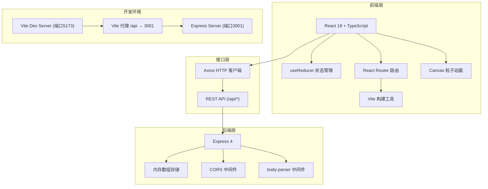
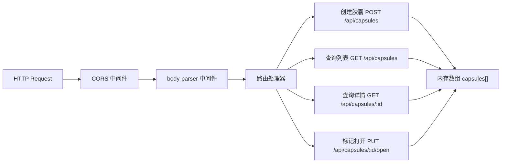
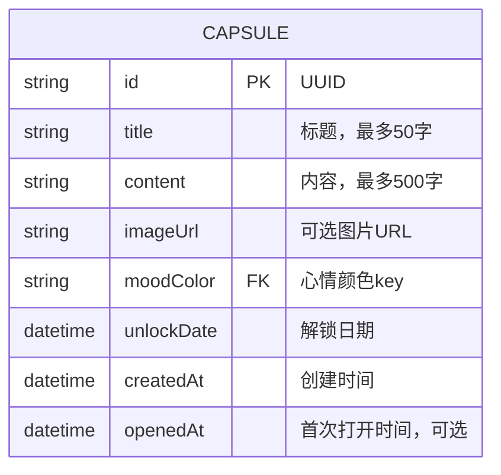

# 时光胶囊 - 技术架构文档

## 1. 架构设计



## 2. 技术选型说明

| 层级 | 技术 | 版本 | 说明 |
|------|------|------|------|
| 前端框架 | React | 18.x | 函数组件 + Hooks |
| 语言 | TypeScript | 5.x | 严格模式，类型安全 |
| 构建工具 | Vite | 5.x | 热更新，快速构建 |
| 路由 | React Router DOM | 6.x | 声明式路由 |
| HTTP客户端 | Axios | 1.x | 请求/响应拦截 |
| 后端框架 | Express | 4.x | 轻量级REST API |
| ID生成 | uuid | 9.x | 生成唯一胶囊ID |
| 数据存储 | 内存数组 | - | 无需数据库，重启清空 |
| 代理 | Vite proxy | - | /api 转发到 3001 端口 |

## 3. 路由定义

| 路由路径 | 页面组件 | 说明 |
|---------|---------|------|
| `/` | `HomePage` | 首页：创建表单 + 胶囊列表 |
| `/capsule/:id` | `CapsulePage` | 胶囊详情页：内容展示 + 记忆回放 |
| `*` | 重定向到 `/` | 404处理 |

## 4. API 接口定义

### 4.1 TypeScript 类型定义

```typescript
interface Capsule {
  id: string;
  title: string;
  content: string;
  imageUrl?: string;
  moodColor: MoodColorKey;
  unlockDate: string; // ISO date string
  createdAt: string; // ISO date string
  openedAt?: string; // ISO date string, set when first opened
}

type MoodColorKey =
  | 'duskOrange' | 'starryBlue' | 'mistPurple'
  | 'mintGreen' | 'rosePink' | 'lemonYellow'
  | 'deepSea' | 'cherryPink' | 'sunsetRed'
  | 'cloudGray' | 'forestGreen' | 'lavender';

type FilterStatus = 'all' | 'locked' | 'unlocked';
```

### 4.2 REST API 列表

| 方法 | 路径 | 请求体 | 响应 | 说明 |
|------|------|--------|------|------|
| `POST` | `/api/capsules` | `{title, content, imageUrl?, moodColor, unlockDate}` | `Capsule` | 创建胶囊 |
| `GET` | `/api/capsules` | - | `Capsule[]` | 获取所有胶囊列表 |
| `GET` | `/api/capsules/:id` | - | `Capsule \| {error: string}` | 获取单个胶囊详情 |
| `PUT` | `/api/capsules/:id/open` | - | `Capsule` | 标记胶囊为已打开（设置openedAt） |

## 5. 服务端架构



## 6. 数据模型

### 6.1 实体关系图



### 6.2 数据校验规则
- `title`: 非空，长度 1-50 字符
- `content`: 非空，长度 1-500 字符
- `imageUrl`: 可选，有效URL格式
- `moodColor`: 必须属于12种预设颜色key之一
- `unlockDate`: 必须为未来日期（至少1天后，最多365天）
- `openedAt`: 首次打开时设置，之后不可修改

### 6.3 状态判定规则（由前端计算）
- **未解锁 (locked)**: `Date.now() < new Date(unlockDate)`
- **已解锁未过期 (unlocked)**: `Date.now() >= new Date(unlockDate)` 且 `!openedAt` 或 `Date.now() - openedAt < 24h`
- **已过期 (expired)**: `openedAt` 存在 且 `Date.now() - openedAt >= 24h`
