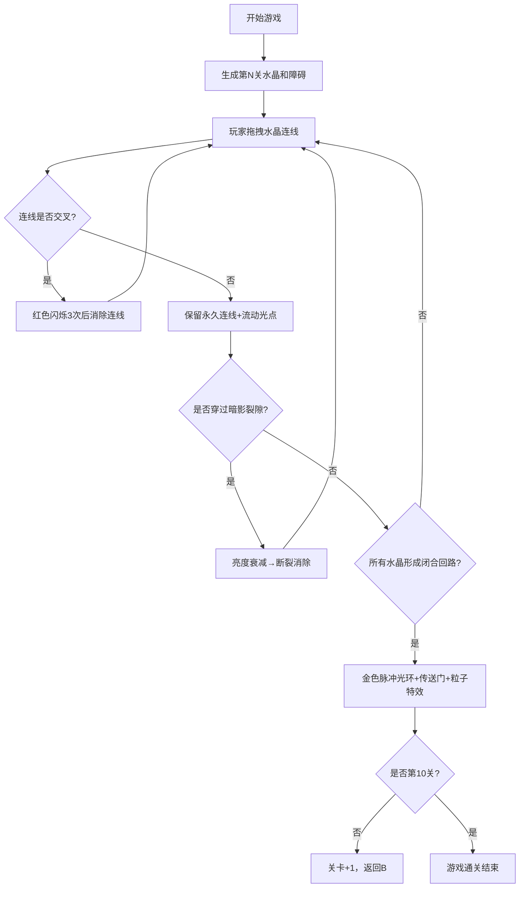

## 1. 产品概述

「晶脉织网」是一款2D连线解谜游戏，玩家在被魔法能量笼罩的浮空岛屿上，通过拖拽连接发光水晶，形成不交叉的闭合能量回路来激活传送门通关。

- **核心玩法**：拖拽连线 + 回路闭合判定 + 障碍规避
- **目标用户**：休闲益智游戏爱好者
- **市场价值**：玩法轻松上手，关卡渐进式难度，具备高度重玩性

## 2. 核心功能

### 2.1 功能模块
1. **游戏主场景**：水晶生成、连线绘制、拖拽交互、通关判定
2. **水晶实体系统**：位置随机生成、呼吸脉动动画、激活状态切换
3. **连线系统**：引导线、永久连线、流动光点、交叉检测
4. **障碍系统**：暗影裂隙（连线断裂）、时间衰减区域（脉动减速）
5. **通关特效**：金色脉冲光环、传送门动画、粒子爆炸
6. **UI系统**：关卡显示、重新开始按钮、星空背景

### 2.2 页面详情
| 页面名称 | 模块名称 | 功能描述 |
|-----------|-------------|---------------------|
| 游戏主界面 | 星空背景层 | 动态闪烁星星，深邃太空氛围 |
| 游戏主界面 | 游戏区域 | 640x480居中画布，磨砂玻璃边框 |
| 游戏主界面 | 水晶实体 | 随机位置/颜色，呼吸脉动，高亮吸附 |
| 游戏主界面 | 连线系统 | 引导线+永久连线，流动光点，交叉检测消除 |
| 游戏主界面 | 障碍层 | 暗影裂隙、时间衰减区域 |
| 游戏主界面 | UI层 | 关卡数显示、重启按钮、通关特效 |

## 3. 核心流程

玩家进入游戏 → 第1关开始，4颗水晶随机生成 → 玩家拖拽连接水晶 → 系统检测连线是否交叉 → 交叉则闪烁红色消除，不交叉保留连线 → 所有水晶形成闭合回路（每颗恰好2条连线）→ 触发通关特效 → 进入下一关，水晶数量+1 → 最高第10关（10颗水晶）

## 4. 用户界面设计

### 4.1 设计风格
- **主色调**：深邃星空黑 (#0a0a1a) 为底色，配合暖色系水晶（橙 #FF8C42、金 #FFD166、粉 #EF476F、紫 #9B5DE5）
- **辅助色**：连线渐变混合色，暗影裂隙纯黑带旋转纹理，时间衰减区半透明紫 (#7B2CBF 50%透明度)
- **按钮样式**：圆形重启按钮，带旋转发光光环，悬停时光环加速旋转
- **字体**：使用 Orbitron（科幻感发光字体），CSS text-shadow 模拟发光效果
- **布局风格**：居中对称布局，游戏区域四周有 8px 半透明磨砂玻璃边框 (backdrop-filter: blur)
- **动画风格**：所有动效采用 ease-in-out 缓动，水晶呼吸周期1.5s，光点流动周期0.8s

### 4.2 页面设计概述
| 页面名称 | 模块名称 | UI元素 |
|-----------|-------------|-------------|
| 游戏主界面 | 星空背景 | 100+随机星星，每2秒随机闪烁 |
| 游戏主界面 | 游戏边框 | 8px半透明白色磨砂玻璃，圆角16px |
| 游戏主界面 | 水晶 | 半径20px圆，外发光阴影，1.0-1.2倍呼吸脉动 |
| 游戏主界面 | 引导线 | 白色半透明，3px线宽，跟随鼠标 |
| 游戏主界面 | 永久连线 | 4px线宽，两端颜色渐变，中间流动光点 |
| 游戏主界面 | 暗影裂隙 | 半径30px黑色旋涡，缓慢旋转 |
| 游戏主界面 | 时间衰减区 | 半径40px半透明紫圆，缓慢漂移 |
| 游戏主界面 | 关卡文字 | 左上角Orbitron字体，淡入淡出发光效果 |
| 游戏主界面 | 重启按钮 | 右上角圆形，带旋转光环 |
| 游戏主界面 | 通关特效 | 金色脉冲+传送门旋转+粒子爆炸 |

### 4.3 响应式
- **桌面优先设计**：游戏画布固定640x480，整体居中
- **移动端适配**：使用viewport meta标签，画布等比缩放至屏幕宽度
- **触摸优化**：将mousedown/mousemove/mouseup事件替换为pointer事件，同时支持鼠标和触摸拖拽
- **触摸目标**：水晶半径20px，满足最小44px触摸区域（通过扩大交互热区实现）

### 4.4 性能优化设计
- 使用 Phaser 3 的 Graphics 对象进行批量渲染，避免每帧重建
- 水晶脉动和连线动画使用时间增量 (delta time) 计算，保证不同帧率下一致性
- 交叉检测采用线段相交算法（O(n²)复杂度，最多10颗水晶可接受）
- 粒子特效采用对象池管理，避免频繁GC
