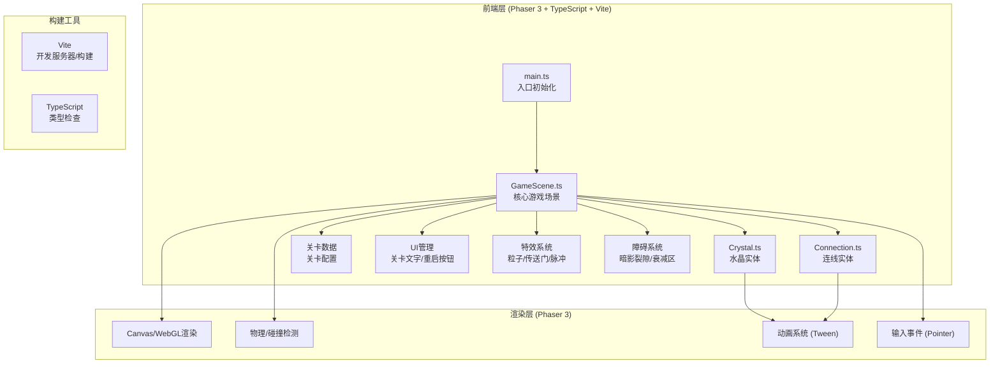

## 1. 架构设计



## 2. 技术描述
- **前端框架**：Phaser 3.70（2D游戏引擎，自带Canvas/WebGL渲染、输入、动画、粒子系统）
- **开发语言**：TypeScript 5.x（严格模式）
- **构建工具**：Vite 5.x（HMR热更新，输出到dist目录）
- **包管理**：npm
- **初始化方式**：手动创建项目结构（不使用Vite模板，因为需要Phaser而非React/Vue）

## 3. 文件结构与调用关系

```
项目根目录
├── package.json          # 依赖: phaser, vite, typescript
├── vite.config.js        # Vite配置，root为./，build.outDir为dist
├── tsconfig.json         # strict: true，target: ES2020
├── index.html            # 入口HTML，星空背景CSS
└── src/
    ├── main.ts           # 入口，创建Phaser.Game实例，注册GameScene
    ├── scenes/
    │   └── GameScene.ts  # 核心场景：调用Crystal/Connection，管理游戏状态
    └── entities/
        ├── Crystal.ts    # 水晶实体：被GameScene创建和管理
        └── Connection.ts # 连线实体：被GameScene创建和管理
```

### 数据流向
```
main.ts (实例化Phaser.Game)
    ↓ 传递 scene: [GameScene] 和 level初始数据
GameScene (create生命周期)
    ↓ 根据关卡配置生成 → crystals: Crystal[]
    ↓ 生成障碍 → rifts: Obstacle[], decayZones: DecayZone[]
    ↓ 监听 pointerdown/move/up 事件
用户拖拽操作
    ↓ GameScene记录 startCrystal, 绘制临时引导线
    ↓ pointerup 时检测是否落在目标水晶上
    ↓ 若有效 → 创建 new Connection(c1, c2) → connections.push()
    ↓ 调用 Connection.render() 绘制渐变线+流动光点
    ↓ 调用 Connection.checkIntersection(others) 检测交叉
    ↓ 调用 GameScene.checkClosedLoop() 检测通关
    ↓ 通关 → 播放粒子/传送门动画 → scene.restart(level+1)
```

## 4. 核心类接口定义

### 4.1 Crystal 类
```typescript
interface ICrystal {
  x: number; y: number; radius: number;
  color: number; colorName: 'orange'|'gold'|'pink'|'purple';
  isActivated: boolean;  // 是否在回路中
  connectionCount: number; // 当前连接数（目标=2）
  pulsePhase: number;    // 呼吸动画相位 0-2π
  
  update(time: number, delta: number): void;  // 每帧更新脉动
  setHighlight(on: boolean): void;            // 悬停高亮1.3倍
  activate(): void;                           // 激活状态
  deactivate(): void;                         // 取消激活
  containsPoint(px: number, py: number): boolean; // 点是否在水晶内（含热区扩展）
}
```

### 4.2 Connection 类
```typescript
interface IConnection {
  crystalA: Crystal; crystalB: Crystal;
  pathPoints: {x:number;y:number}[];  // 连线采样点（用于裂隙碰撞检测）
  brightness: number;  // 亮度 0-1，穿过裂隙时衰减
  isValid: boolean;    // 是否有效（未断裂/未交叉）
  
  render(graphics: Phaser.GameObjects.Graphics): void; // 渲染渐变连线+光点
  update(time: number, delta: number): void;           // 更新光点流动/亮度
  intersectsWith(other: Connection): boolean;          // 与其他连线是否相交（非端点）
  passesThroughRift(rifts: Obstacle[]): boolean;       // 是否穿过暗影裂隙
  flashAndDestroy(callback: () => void): void;         // 红闪3次后销毁
}
```

### 4.3 线段相交算法
```
输入：线段AB(Ax,Ay,Bx,By) 和 线段CD(Cx,Cy,Dx,Dy)
计算参数t,u：
  denom = (Bx-Ax)(Dy-Cy) - (By-Ay)(Dx-Cx)
  t = ((Cx-Ax)(Dy-Cy) - (Cy-Ay)(Dx-Cx)) / denom
  u = ((Cx-Ax)(By-Ay) - (Cy-Ay)(Bx-Ax)) / denom
相交条件：0 < t < 1 AND 0 < u < 1（排除端点接触）
```

## 5. 关卡配置模型

```typescript
interface LevelConfig {
  level: number;          // 1-10
  crystalCount: number;   // 4,5,6,7,8,9,10,10,10,10
  riftCount: number;      // 0,0,3,3,4,4,4,5,5,5
  hasDecayZone: boolean;  // 第3关起为true
  minSpacing: number;     // 水晶最小间距 100px
}
```

## 6. 性能保障
- **渲染**：Phaser Graphics使用单个对象批量draw，避免频繁创建销毁
- **动画**：所有动画使用delta time归一化，60fps/144fps下表现一致
- **碰撞**：10颗水晶最多45条连线，O(n²)=2025次/帧的线段相交计算完全可以接受
- **内存**：Connection和Crystal对象在scene.restart时自动被Phaser垃圾回收
- **帧率监控**：开发模式下可通过Phaser内置FPS计数器监控，目标>55fps
