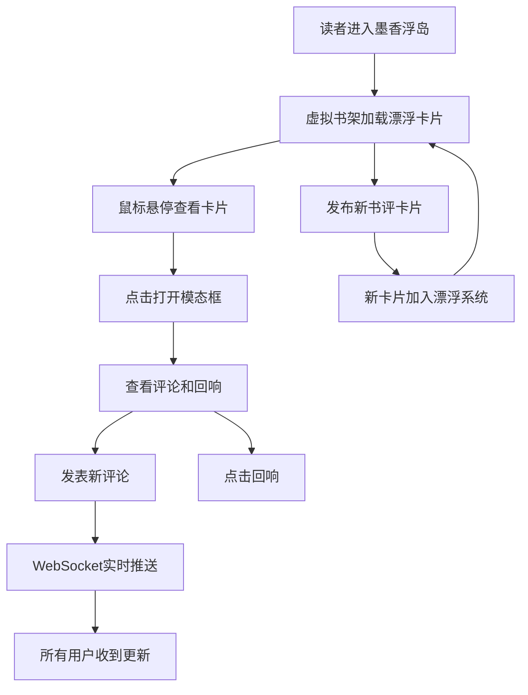

# 墨香浮岛 - 产品需求文档 (PRD)

## 1. 产品概述

「墨香浮岛」是一个社区图书馆线上匿名书评剧场，让读者以匿名身份发布涂鸦风格的书评卡片，卡片像浮游生物般在虚拟书架上漂移碰撞，激发读者之间的思想碰撞与情感共鸣。

- 核心价值：为读者打造一个沉浸式、游戏化的匿名书评共享空间
- 目标用户：热爱阅读、愿意分享读书感悟的社区读者

## 2. 核心功能

### 2.1 用户角色

| 角色 | 注册方式 | 核心权限 |
|------|----------|----------|
| 匿名读者 | 无需注册，自动分配匿名身份 | 发布书评卡片、浏览漂浮卡片、发表评论、点击回响 |

### 2.2 功能模块

1. **虚拟书架主页**：Canvas书架背景、漂浮卡片物理系统、碰撞动画
2. **书评发布模块**：输入表单、标签选择、卡片生成
3. **卡片交互模块**：悬停放大、点击模态框、详情展示
4. **评论回响模块**：评论列表、回响计数、WebSocket实时推送
5. **背景动画模块**：书架纹理、书本发光、光带流动

### 2.3 页面详情

| 页面名称 | 模块名称 | 功能描述 |
|----------|----------|----------|
| 主页 | 发布表单 | 匿名填写书名、评论、摘录，选择标签，提交生成卡片 |
| 主页 | 漂浮卡片Canvas | 卡片物理运动、弹性碰撞、边界反弹、四叉树优化 |
| 主页 | 悬浮卡片层 | 鼠标悬停0.3s放大显示、发光效果增强 |
| 模态框 | 卡片详情 | 完整内容、摘录、评论列表、回响按钮 |
| 模态框 | 评论输入 | 100字限制评论提交、实时推送 |

## 3. 核心流程

## 4. 用户界面设计

### 4.1 设计风格

- **主色调**：深棕到暗红线性渐变背景 (#2b1810 → #1a0f0a)
- **卡片色**：根据标签设定（科幻#1a3a5c、历史#3c2a1a、哲学#2a2a3c、诗歌#3c2a4a、随笔#2a3c2a）
- **文字色**：柔和灰白 (#dcdcdc)
- **强调色**：悬停发光金黄色 (#ffd700)
- **按钮风格**：圆角半透明磨砂玻璃，hover过渡平滑
- **字体**：衬线字体显示书名，无衬线字体显示正文
- **布局风格**：全屏沉浸式Canvas + 浮层UI + 模态框
- **动画**：requestAnimationFrame物理动画、CSS transition微交互

### 4.2 页面设计概述

| 页面名称 | 模块名称 | UI元素 |
|----------|----------|--------|
| 主页 | 发布表单 | 固定底部半透明栏、输入框发光边框、标签选择胶囊按钮 |
| 主页 | 书架背景 | 木质竖纹渐变、书本脊背呼吸发光、暖黄光带流动 |
| 主页 | 漂浮卡片 | 180x240圆角卡片、淡蓝边缘发光(3px blur)、标签色渐变 |
| 悬浮层 | 悬停卡片 | 1.5倍缩放、金黄色发光、匿名头像、书名、40字评论预览 |
| 模态框 | 详情层 | 磨砂玻璃(blur 10px)、完整内容、摘录引用块、评论列表 |

### 4.3 响应式设计

- 桌面优先设计，Canvas自适应窗口宽度
- 模态框在小屏幕上全屏展示
- 触摸设备支持tap触发悬停效果和模态框

## 5. 性能与交互约束

- 卡片数量上限60张，帧率低于50fps时动态降至40张
- 碰撞检测使用四叉树空间划分优化
- WebSocket推送频率不超过5次/秒
- 所有过渡动画时长0.3s，ease缓动函数
