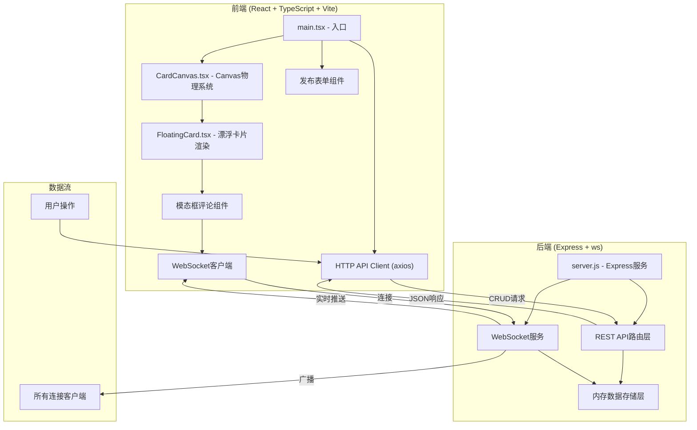
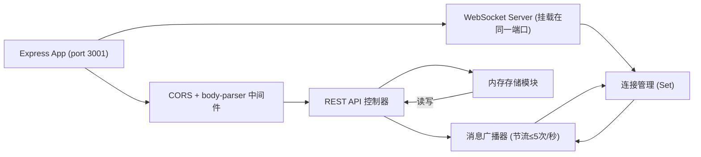

# 墨香浮岛 - 技术架构文档

## 1. 架构设计



## 2. 技术栈说明

- **前端框架**: React 18 + TypeScript (严格模式)
- **构建工具**: Vite + @vitejs/plugin-react
- **状态管理**: React useState/useEffect + useRef（物理引擎状态）
- **HTTP客户端**: axios
- **实时通信**: WebSocket (ws库)
- **后端框架**: Express 4
- **中间件**: cors、body-parser
- **数据存储**: 内存数组（进程内存储）
- **唯一ID**: uuid
- **动画**: requestAnimationFrame + Canvas 2D API + CSS transform

## 3. 文件结构与职责

```
项目根目录
├── package.json              # 依赖配置 + npm run dev 同时启动前后端
├── vite.config.js            # Vite构建配置 + /api, /ws 代理到 3001
├── tsconfig.json             # TypeScript 严格模式配置
├── index.html                # 入口页面 (深色渐变背景)
├── server.js                 # Express后端 (REST + WebSocket + 内存存储)
└── src/
    ├── main.tsx              # React入口、应用根组件、数据流管理
    ├── types/
    │   └── index.ts          # 共享类型定义 (Card, Comment, Echo等)
    ├── components/
    │   ├── CardCanvas.tsx    # Canvas物理引擎: 碰撞、边界、漂移动画
    │   ├── FloatingCard.tsx  # 单张卡片渲染: 悬停放大、点击模态框
    │   ├── CardModal.tsx     # 模态框: 详情、评论列表、回响按钮
    │   └── PublishForm.tsx   # 发布表单: 书名/评论/摘录/标签输入
    ├── hooks/
    │   ├── useWebSocket.ts   # WebSocket连接管理Hook
    │   └── usePhysics.ts     # 物理系统Hook (四叉树、碰撞检测)
    ├── utils/
    │   ├── quadtree.ts       # 四叉树空间划分算法
    │   └── physics.ts        # 物理计算工具 (弹性碰撞、排斥力)
    └── api/
        └── client.ts         # axios API封装 (卡片CRUD、评论、回响)
```

### 文件调用关系与数据流向

1. **server.js** → 接收HTTP请求 (axios) 和WebSocket连接，读写内存数组
2. **api/client.ts** → axios封装，供main.tsx和组件调用后端API
3. **main.tsx** → 管理全局卡片状态，通过props传递给CardCanvas
4. **CardCanvas.tsx** → 循环调用requestAnimationFrame，计算每张卡片物理状态
   - 内部使用quadtree.ts和physics.ts进行碰撞优化
   - 将每张卡片的坐标传递给FloatingCard进行渲染
5. **FloatingCard.tsx** → 渲染DOM卡片层（绝对定位在Canvas上方）
   - 监听鼠标事件 → 悬停放大、点击打开CardModal
   - 挂载时通过useWebSocket接收实时更新
6. **CardModal.tsx** → 调用API获取评论，通过WebSocket接收新评论推送
7. **PublishForm.tsx** → 调用POST /api/cards创建新卡片，成功后main.tsx刷新列表

## 4. 路由与API定义

| 方法 | 路由 | 用途 | 请求体 | 响应 |
|------|------|------|--------|------|
| GET | /api/cards | 获取所有卡片列表 | - | Card[] |
| POST | /api/cards | 创建新书评卡片 | {bookTitle, content, excerpt, tag} | Card |
| GET | /api/cards/:id/comments | 获取卡片评论列表 | - | Comment[] |
| POST | /api/cards/:id/comments | 发表评论 | {content, avatarHue} | Comment |
| POST | /api/cards/:id/echo | 回响点赞 (IP限一次) | {ip} | {echoes: number} |

### TypeScript类型定义

```typescript
type Tag = 'scifi' | 'history' | 'philosophy' | 'poetry' | 'essay';

interface Card {
  id: string;
  bookTitle: string;        // 限30字
  content: string;          // 限200字
  excerpt: string;          // 限80字
  tag: Tag;
  avatarHue: number;        // 0-360，根据标签固定
  echoes: number;
  createdAt: number;
  // 物理状态（前端计算）
  x?: number;
  y?: number;
  vx?: number;
  vy?: number;
}

interface Comment {
  id: string;
  cardId: string;
  content: string;          // 限100字
  avatarHue: number;
  createdAt: number;
}

interface WSMessage {
  type: 'new_comment' | 'new_echo' | 'new_card';
  payload: Comment | { cardId: string; echoes: number } | Card;
}
```

## 5. 后端服务架构



### 内存数据结构

```javascript
const store = {
  cards: Array<Card>,
  comments: Array<Comment>,           // 按cardId索引
  echoedIps: Map<string, Set<string>> // cardId -> Set<ip>
};
```

## 6. 物理系统设计

### 6.1 四叉树空间划分

- 每次动画帧重建四叉树，将卡片按位置划分到4个象限
- 仅对同一象限内的卡片进行碰撞检测，降低O(n²)复杂度

### 6.2 物理规则

- **漂移**: 每帧x += vx, y += vy，速度范围0.3-0.8 px/帧
- **边界反弹**: 距离边界10px时，速度取反并减速
- **弹性碰撞**: 动量守恒简化版，两卡相撞交换法线方向速度
- **排斥力**: 卡片重叠时施加反向推力，距离越近推力越大
- **动态降载**: FPS监控，低于50fps时逐步移除最旧卡片至40张

## 7. 性能优化策略

| 优化点 | 方案 |
|--------|------|
| 碰撞检测 | 四叉树空间划分，仅邻近卡片两两检测 |
| 渲染层 | Canvas绘制底层运动轨迹，DOM层仅渲染交互卡片 |
| 帧率监控 | 统计requestAnimationFrame间隔，动态调整卡片数 |
| WebSocket | 消息队列 + 节流（≤5条/秒）批量推送 |
| DOM更新 | React批量更新 + useMemo避免重复渲染 |
