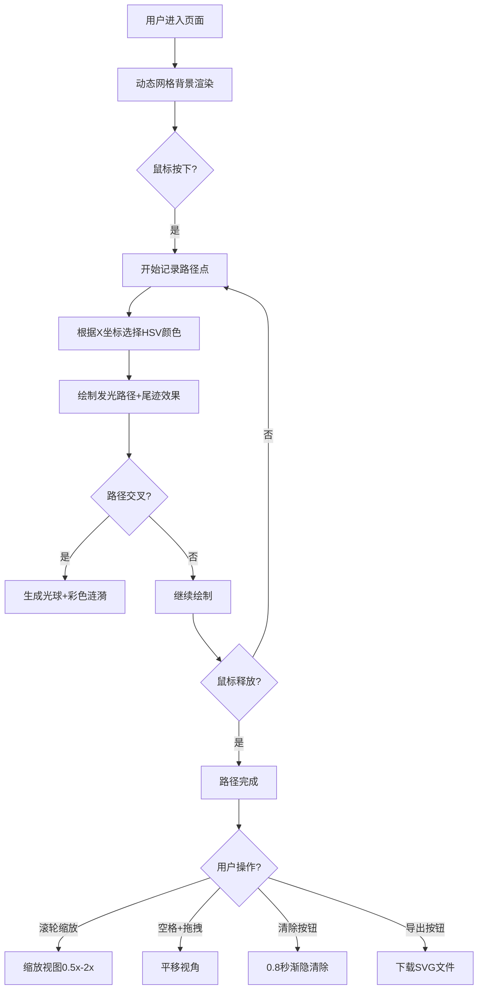

## 1. 产品概述

「镜界迷踪」是一款赛博朋克风格的交互式Canvas绘图应用，用户在动态发光的网格世界中绘制彩色光流路径，体验数字艺术创作的乐趣。

- 主要目标：为用户提供沉浸式的视觉创作体验，通过简单的鼠标交互生成绚丽的光流艺术作品
- 目标用户：数字艺术爱好者、创意工作者、科技美学追求者

## 2. 核心功能

### 2.1 功能模块

1. **画布渲染层**：动态网格背景、路径绘制与尾迹、交叉节点脉冲效果
2. **交互控制层**：鼠标绘制路径、滚轮缩放、空格+拖拽平移
3. **控制面板**：清除路径、导出SVG、路径统计显示

### 2.2 功能详情

| 页面名称 | 模块名称 | 功能描述 |
|-----------|-------------|---------------------|
| 主画布 | 动态网格 | 深青色发光细线，波浪形呼吸抖动，支持缩放和平移变换 |
| 主画布 | 路径绘制 | 鼠标按下绘制，点间距≤5px，颜色随X坐标HSV变化，尾迹衰减1.2秒 |
| 主画布 | 交叉节点 | 路径交叉生成12px光球，3Hz闪烁，扩散40px彩色涟漪 |
| 主画布 | 视图控制 | 滚轮缩放0.5x-2x，空格+拖拽平移 |
| 控制面板 | 清除按钮 | 0.8秒渐隐动画清除所有路径 |
| 控制面板 | 导出按钮 | 将路径转换为SVG文件下载 |
| 控制面板 | 统计显示 | 实时显示当前路径数量 |

## 3. 核心流程

用户打开页面后，看到动态呼吸的网格背景。按下鼠标开始绘制光流路径，路径颜色随水平位置变化，尾迹逐渐消散。不同颜色路径交叉时产生闪光节点和涟漪。用户可通过滚轮缩放、空格拖拽调整视角，完成创作后可导出SVG或清除画布重新开始。

## 4. 用户界面设计

### 4.1 设计风格

- **主色调**：深色背景 #0a0a1a，深青色网格 #00bcd4，路径采用HSV 0-270°全色相
- **发光效果**：所有线条采用Canvas shadowBlur实现霓虹光晕
- **字体风格**：等宽科技感字体，小号半透明信息显示
- **毛玻璃面板**：background: rgba(255,255,255,0.08)，backdrop-filter: blur(8px)
- **动画过渡**：所有交互0.3秒 ease-out

### 4.2 页面设计概述

| 页面名称 | 模块名称 | UI元素 |
|-----------|-------------|-------------|
| 主画布 | 网格层 | 1px深青色线，透明度0.3，3px振幅2秒周期波浪抖动 |
| 主画布 | 路径层 | 4px宽度发光线，末端0.15秒平滑延迟跟随，尾迹1.2秒衰减 |
| 主画布 | 节点层 | 12px光球，3Hz闪烁(0.5-1.0亮度)，40px半径0.6秒涟漪 |
| 控制面板 | 按钮组 | 半透明圆角按钮，毛玻璃效果，hover发光边框 |
| 控制面板 | 统计信息 | 右下角显示路径数量，等宽字体，半透明 |

### 4.3 响应式

- Desktop-first设计，Canvas自适应窗口大小
- 支持高DPI屏幕(devicePixelRatio适配)
- 触摸设备暂不支持(仅鼠标交互)

### 4.4 视觉特效指南

- **发光效果**：shadowColor匹配线条色，shadowBlur=15-25
- **光晕叠加**：路径周围二次绘制低透明度宽线条形成渐变光晕
- **波纹动画**：requestAnimationFrame驱动，基于时间戳计算阶段
- **性能优化**：路径点数上限5000，超出移除最早点，目标60FPS
