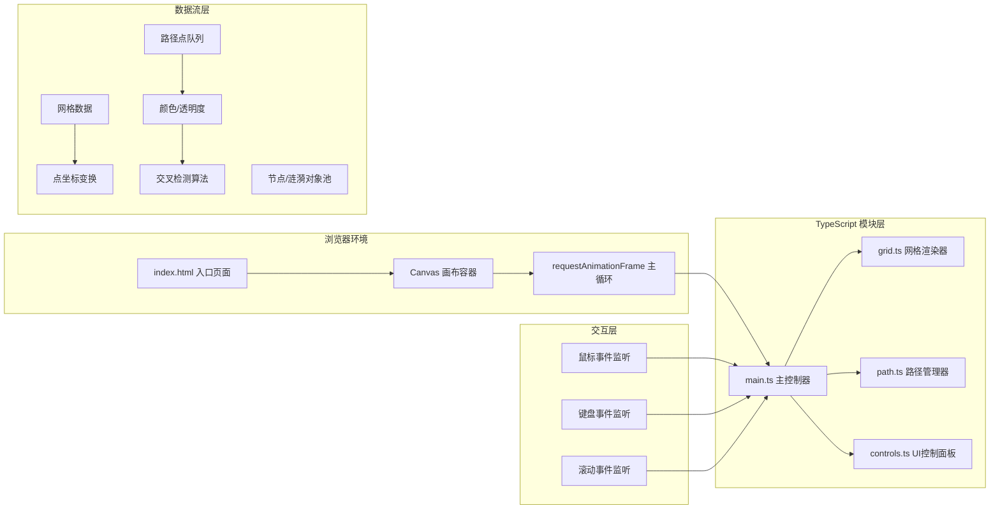

## 1. 架构设计



## 2. 技术描述

- **前端框架**：原生 TypeScript + Canvas 原生 API (无UI框架)
- **构建工具**：Vite 5.x
- **语言标准**：ECMAScript 2020 (ES11)
- **后端**：无（纯前端应用）
- **渲染引擎**：HTML5 Canvas 2D Context
- **开发模式**：npm run dev → Vite开发服务器HMR

## 3. 模块结构定义

| 文件路径 | 职责描述 | 导出接口 |
|-----------|-------------|-------------|
| src/main.ts | 应用入口，初始化画布创建，主循环调度，事件绑定 | 无（入口点 |
| src/grid.ts | 网格渲染，波浪抖动，坐标变换，缩放平移 | Grid类：draw(), setTransform() |
| src/path.ts | 路径点管理，尾迹衰减，交叉检测，节点涟漪 | PathManager类：addPoint(), draw(), checkIntersections(), fadeAll() |
| src/controls.ts | 控制面板DOM渲染，按钮事件，SVG导出 | Controls类：render(), updateCount() |

## 4. 核心数据结构

### 4.1 路径点 (Point

```typescript
interface PathPoint {
  x: number;
  y: number;
  hue: number;
  createdAt: number;
  pathId: number;
}
```

### 4.2 路径 (PathData)
```typescript
interface PathData {
  id: number;
  points: PathPoint[];
  baseHue: number;
  createdAt: number;
  isFading: boolean;
  fadeStartTime: number;
}
```

### 4.3 交叉节点 (IntersectionNode)
```typescript
interface IntersectionNode {
  x: number;
  y: number;
  hue1: number;
  hue2: number;
  createdAt: number;
  ripples: Ripple[];
}
```

### 4.4 涟漪 (Ripple)
```typescript
interface Ripple {
  startTime: number;
  maxRadius: number;
  duration: number;
}
```

### 4.5 视图变换 (ViewTransform)
```typescript
interface ViewTransform {
  scale: number;
  offsetX: number;
  offsetY: number;
}
```

## 5. 性能优化策略

### 5.1 渲染优化
- Canvas双层画布策略：
1. 静态层(背景网格，每帧重绘)
2. 动态层(路径、节点、涟漪)

### 5.2 数据管理
- 路径点环形缓冲，最多5000点，FIFO淘汰
- 交叉检测使用空间网格划分，减少O(n²)比较
- 涟漪对象池复用，避免频繁GC

### 5.3 渲染优化
- 离屏Canvas缓存网格底图(低频更新)
- 使用getTransform()缓存计算
- 批量路径使用Path2D对象

## 6. 事件处理策略

### 6.1 坐标系统
```
屏幕坐标 → 世界坐标变换：
worldX = (screenX - offsetX) / scale
screenX = worldX * scale + offsetX
```

### 6.2 颜色系统
- 色相从鼠标屏幕X坐标映射：
```
hue = (screenX / canvasWidth) * 270
```

### 6.3 路径平滑
- 末端平滑：指数移动平均EMA，α = 0.15秒窗口：
```
smoothedX = prevX + (targetX - prevX) * (1 - exp(-dt/τ))
```

## 7. 文件结构

```
auto255/
├── package.json
├── vite.config.js
├── tsconfig.json
├── index.html
├── src/
│   ├── main.ts
│   ├── grid.ts
│   ├── path.ts
│   └── controls.ts
```
