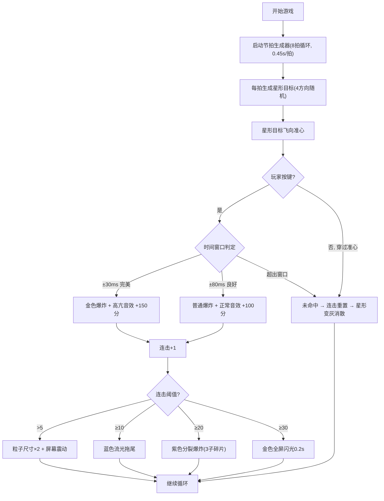

## 1. 产品概述
「鼓点碎星」是一款运行于浏览器中的2D节奏动作游戏，玩家需跟随程序生成的随机节拍，在星形目标抵达屏幕中央准心时按下对应方向键完成打击。
- 主要目的：通过精准的节奏打击操作，结合视听反馈，为玩家提供爽快的节奏感与连击成就感
- 目标用户：喜欢音乐节奏类游戏、追求操作手感与视觉刺激的休闲玩家

## 2. 核心功能

### 2.1 功能模块
1. **主游戏界面**：节奏星轨生成、星形目标飞行、打击判定、粒子特效、UI显示、暂停功能
2. **节拍系统**：8拍循环节拍生成器，固定0.45秒拍间隔
3. **打击反馈系统**：完美/良好/未命中三级判定，对应不同音效与粒子效果
4. **连击奖励系统**：连击5/10/20/30分别解锁增强特效
5. **音效系统**：程序生成鼓点节拍与打击音效（Web Audio API）

### 2.2 页面详情
| 页面名称 | 模块名称 | 功能描述 |
|-----------|-------------|---------------------|
| 主游戏界面 | 节奏星轨生成 | 每拍从上下左右四个方向之一发射星形目标，恒定速度飞向准心，到达时恰为拍点 |
| 主游戏界面 | 打击判定 | 玩家按方向键，±30ms内完美命中，±80ms内良好命中，超出则未命中 |
| 主游戏界面 | 粒子特效 | 命中爆炸粒子15个，速度60-120px/s，0.6秒渐隐；连击>5粒子翻倍+屏幕震动 |
| 主游戏界面 | 连击系统 | 实时显示连击数，数字弹跳动画；10连击蓝流光、20连击紫分裂、30连击金闪光 |
| 主游戏界面 | 得分系统 | 左上角显示得分，良好命中+100，完美命中+150 |
| 主游戏界面 | 暂停功能 | 右下角半透明暂停按钮，点击后显示黑色半透明覆盖层，游戏暂停 |

## 3. 核心流程
玩家打开页面后，游戏自动开始播放8拍循环鼓点。星形目标从屏幕四周按节拍逐一飞向中央准心。玩家观察星形颜色与来向，在其抵达准心时按下对应方向键（↑↓←→）。命中后产生爆炸粒子与音效，连击数累加并可能触发奖励特效。未命中则连击重置。玩家可随时点击右下角暂停按钮暂停游戏。

## 4. 用户界面设计

### 4.1 设计风格
- **主色调**：深空蓝渐变背景（#0a0a2e → #1a1a4e），营造宇宙星夜氛围
- **星形目标配色**：上-浅绿#88ff88、下-浅蓝#88ccff、左-浅粉#ff88cc、右-浅黄#ffcc88
- **强调色**：完美命中金色、连击10蓝、连击20紫、连击30金
- **准心**：淡蓝色脉冲光环（透明度0.5，周期1秒），由内向外扩散
- **字体**：使用等宽数字字体显示得分与连击数，增强科技感；整体无衬线字体
- **视觉风格**：深空霓虹风格，发光边缘、柔和辉光、粒子丰富

### 4.2 页面设计概述
| 页面名称 | 模块名称 | UI 元素 |
|-----------|-------------|-------------|
| 主游戏界面 | 背景 | 深空蓝径向渐变，从上到下 #0a0a2e 到 #1a1a4e |
| 主游戏界面 | 准心 | 屏幕正中央，脉冲光环（淡蓝、透明度0.5、1秒周期扩散） |
| 主游戏界面 | 星形目标 | 5尖角发光星形，外接圆半径18px，4种颜色对应4方向 |
| 主游戏界面 | 粒子特效 | 爆炸粒子15个，颜色同星形，0.6秒渐隐，速度60-120px/s |
| 主游戏界面 | 得分显示 | 左上角白色大号字体，实时更新 |
| 主游戏界面 | 连击显示 | 右上角，数字+单位，每次增加时1.2倍缩放弹跳动画 |
| 主游戏界面 | 暂停按钮 | 右下角半透明白色圆形按钮，悬停加深 |
| 主游戏界面 | 暂停覆盖层 | 黑色半透明(rgba(0,0,0,0.7))全屏覆盖 |

### 4.3 响应性
- 桌面端优先，Canvas 自适应窗口大小
- 键盘操作：方向键 ↑ ↓ ← → 对应四个打击方向
- 不支持移动端触摸操作（纯桌面体验）

### 4.4 性能预算
- 帧率：稳定 60FPS（requestAnimationFrame）
- 粒子上限：峰值不超过 200 个
- 内存占用：低于 150MB
- 按键响应延迟：低于 50ms
