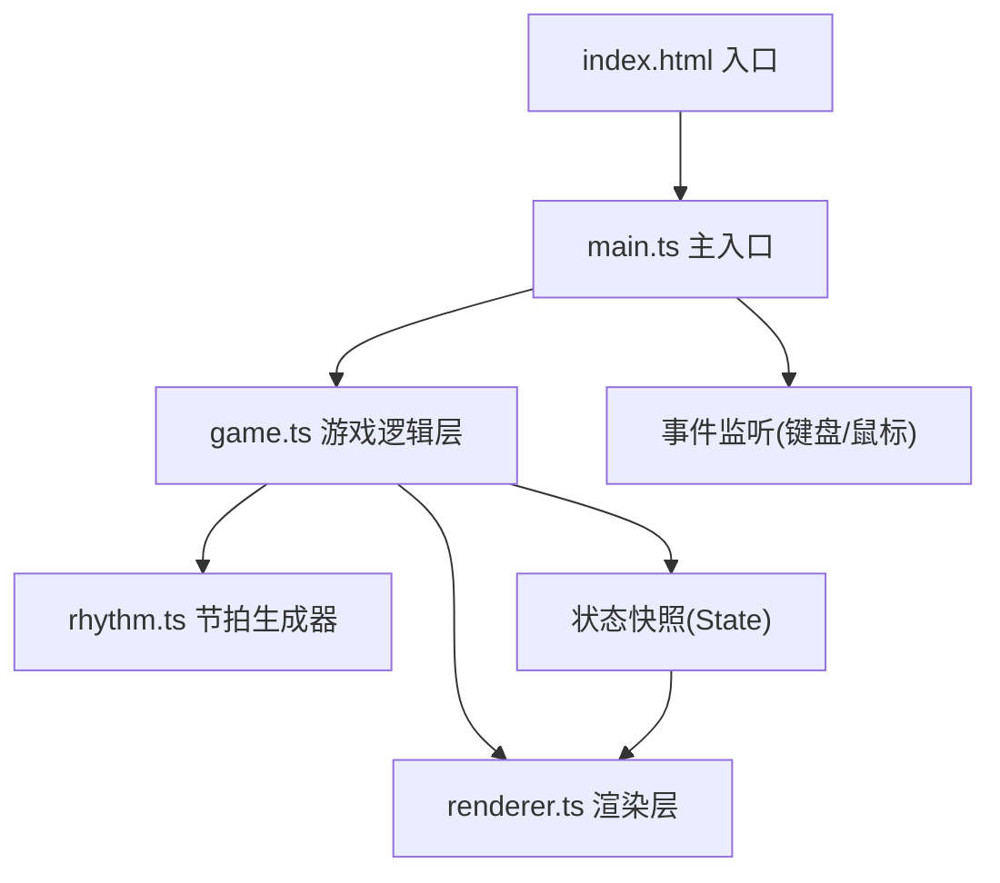

## 1. 架构设计



采用**逻辑-渲染分离**的分层架构：
- **入口层**：`main.ts` 初始化画布、注册事件、驱动 RAF 循环
- **逻辑层**：`game.ts` 管理星形目标、打击判定、连击计数、粒子系统、音频播放
- **节拍层**：`rhythm.ts` 独立节拍生成器，维护拍点时间线
- **渲染层**：`renderer.ts` 纯函数式渲染，接收状态快照，Canvas 2D 绘制所有可视元素

## 2. 技术说明
- **前端**：TypeScript + Vite + Canvas 2D API + Web Audio API
- **构建工具**：Vite（热更新，原生 ESM）
- **后端**：无（纯前端）
- **数据库**：无
- **依赖**：vite、typescript（零运行时依赖）

## 3. 文件组织结构

| 文件路径 | 职责说明 |
|----------|----------|
| `package.json` | 依赖声明（vite、typescript），脚本配置（dev） |
| `vite.config.js` | Vite 基础构建配置 |
| `tsconfig.json` | TypeScript 严格模式配置 |
| `index.html` | 入口页面，Canvas 容器，深色背景 |
| `src/main.ts` | 初始化 Canvas、事件监听、启动 requestAnimationFrame 循环 |
| `src/rhythm.ts` | 节拍生成器：8拍循环、0.45s拍间隔、`getNextBeatTime()` 接口 |
| `src/game.ts` | 核心逻辑：星形生成/更新、打击判定、连击、粒子、得分、暂停、震动、闪光状态 |
| `src/renderer.ts` | 渲染器：背景、准心、星形、粒子、UI文本、暂停覆盖层 |

## 4. 核心数据结构与类型定义

```typescript
// 方向枚举
type Direction = 'up' | 'down' | 'left' | 'right';

// 判定等级
type HitGrade = 'perfect' | 'good' | 'miss';

// 星形目标
interface Star {
  id: number;
  direction: Direction;
  color: string;           // 对应方向色
  spawnTime: number;       // 生成时刻(ms)
  hitTime: number;         // 应命中时刻(ms) = 生成 + 飞行时长
  progress: number;        // 0→1 飞行进度
  x: number;               // 当前坐标
  y: number;
  alive: boolean;          // 是否存活(未命中/未消失)
  isMiss: boolean;         // 是否未命中变灰
}

// 粒子
interface Particle {
  id: number;
  x: number;
  y: number;
  vx: number;
  vy: number;
  color: string;
  life: number;            // 剩余寿命 0→1
  size: number;            // 半径
  isGold?: boolean;        // 完美命中金色
}

// 流光拖尾
interface Trail {
  id: number;
  x: number;
  y: number;
  life: number;            // 0.5秒
  color: string;           // 蓝色 #4488ff
}

// 分裂碎片
interface Shard {
  id: number;
  x: number;
  y: number;
  vx: number;
  vy: number;
  life: number;
  color: string;           // 紫色 #cc66ff
}

// 游戏状态快照(逻辑→渲染)
interface GameState {
  stars: Star[];
  particles: Particle[];
  trails: Trail[];
  shards: Shard[];
  score: number;
  combo: number;
  comboAnim: number;       // 0→1 弹跳动画进度
  flashAlpha: number;      // 全屏闪光透明度 0→1
  shakeX: number;          // 屏幕震动 X 偏移
  shakeY: number;          // 屏幕震动 Y 偏移
  paused: boolean;
  pulsePhase: number;      // 准心脉冲相位 0→1
}
```

## 5. 关键算法说明

### 5.1 节拍生成算法
```
拍间隔 = 450ms（固定）
循环长度 = 8拍
启动时 T0 = performance.now()
第 n 个拍点时间 = T0 + n × 450ms
getNextBeatTime(currentTime):
    返回 ≥ currentTime 的下一个拍点时间
```
拍点方向按伪随机序列循环分配到 4 个方向（保证方向分布均衡）。

### 5.2 星形飞行轨迹
- 设画布中心为 `(cx, cy)`
- 上方向起点：`(cx, -30)`，终点：`(cx, cy)`
- 下方向起点：`(cx, canvasHeight + 30)`
- 左方向起点：`(-30, cy)`
- 右方向起点：`(canvasWidth + 30, cy)`
- 飞行时长 = 拍间隔（450ms），到达准心时恰为拍点
- 每帧线性插值：`progress = (now - spawnTime) / flightDuration`

### 5.3 打击判定算法
```
按下方向键 D，时刻 T：
    查找该方向下存活的、距离拍点最近的星形 S
    delta = |T - S.hitTime|
    if delta ≤ 30ms:  完美命中(Perfect)
    elif delta ≤ 80ms: 良好命中(Good)
    else: 忽略（视为未按下，等穿过准心时 miss）
```

### 5.4 粒子发射
- 每次命中生成 15 个粒子
- 速度向量：`(cosθ × rand(60,120), sinθ × rand(60,120))`，θ ∈ [0, 2π]
- 颜色：完美命中全部金色，否则使用星形颜色
- 寿命：0.6s，线性渐隐（alpha = life）
- 连击 > 5：粒子尺寸 × 2

### 5.5 连击奖励触发
- combo 从 9 → 10：开启后续命中都附加蓝色流光（生命0.5s）
- combo 从 19 → 20：后续命中附加 3 个紫色子碎片（随机方向飞散）
- combo 从 29 → 30：触发全屏金色闪光（alpha 从 0→0.3→0，共 0.2s）
- 屏幕震动：每次 combo > 5 的命中，生成 4~6 像素的高频衰减震动（~0.15s）

## 6. 性能保障措施
- **粒子池**：`particles` 数组长度上限 200，超出时丢弃最旧粒子
- **对象复用**：优先复用已死亡的粒子/星形对象，避免频繁 GC
- **离屏剔除**：不渲染坐标超出可视范围的元素
- **RAF 驱动**：所有逻辑更新绑定 `requestAnimationFrame`，时间步长基于 `performance.now()` 差值（避免帧率依赖）
- **Canvas 状态最小化**：批量绘制同色元素，减少 `save/restore` 调用
