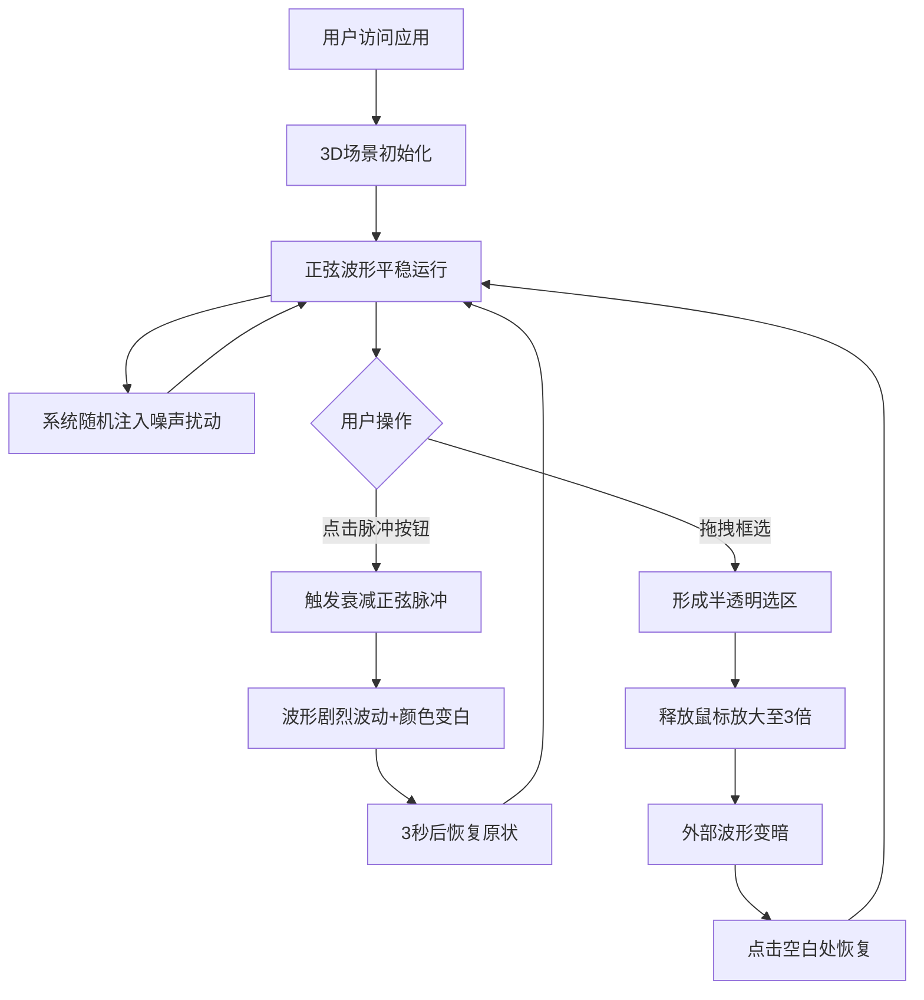

## 1. 产品概述

「星语脉冲」是一个沉浸式3D深空信号可视化应用，在空间站观测舱场景中，通过全息界面实时追踪和解析从深空捕获的神秘信号波形。目标用户为科研人员和天文爱好者，帮助他们直观地探索宇宙信号规律。

- 核心价值：将抽象的信号数据转化为可交互的3D视觉体验，提供多维度（波形、频谱、能量）的信号分析工具
- 市场定位：高端科研可视化演示工具、天文科普互动展品

## 2. 核心特性

### 2.1 用户角色

| 角色 | 使用方式 | 核心权限 |
|------|----------|----------|
| 观测员 | 本地浏览器访问 | 实时观察信号、触发脉冲、框选分析波形段 |

### 2.2 功能模块

1. **3D波形粒子系统**：1000个发光粒子构成的动态波形，支持实时变形和脉动
2. **脉冲信号模拟器**：主动触发衰减正弦脉冲，随机生成小幅度噪声扰动
3. **框选放大分析器**：鼠标拖拽框选波形段，平滑缩放放大至画布中央
4. **频谱瀑布图**：2D时频分析图，显示0-20Hz频率随时间变化的能量分布
5. **能量热力条**：实时显示过去0.5秒内波形能量变化趋势

### 2.3 页面详情

| 页面名称 | 模块名称 | 功能描述 |
|----------|----------|----------|
| 主观测界面 | 3D波形粒子系统 | 1000粒子紫青渐变发光粒子，正弦基波+噪声抖动，0.2Hz绕Y轴旋转 |
| 主观测界面 | 脉冲信号模拟器 | 点击"脉冲"按钮触发3秒衰减脉冲，2-5秒随机噪声扰动 |
| 主观测界面 | 框选放大分析器 | X轴±6/Y轴±4范围框选，3倍放大+0.4s Ease-out动画，外部波形变暗 |
| 主观测界面 | 频谱瀑布图 | 右侧2D瀑布图，频率0-20Hz，时间窗口8秒，蓝→红颜色映射 |
| 主观测界面 | 能量热力条 | 下方细长热力条，深蓝→亮黄颜色映射，圆形端点闪烁效果 |

## 3. 核心流程

用户打开应用 → 3D场景初始化，波形以正弦曲线平稳运行 → 
用户观察频谱瀑布图和能量热力条 → 
(可选) 用户点击"脉冲"按钮触发剧烈脉冲信号 → 
(可选) 用户拖拽框选感兴趣的波形段进行放大分析 → 
(可选) 用户点击空白处恢复全貌 → 
系统每2-5秒自动注入小噪声扰动

## 4. 用户界面设计

### 4.1 设计风格
- **主色调**：深空紫蓝底色 #0a0a1a，粒子渐变紫色→青色
- **强调色**：脉冲渐变青 #00e5ff → #00b8d4，频谱高亮红
- **按钮风格**：圆角渐变按钮，悬停亮度+15%，点击0.1s压扁动画
- **字体**：等宽科技感字体（JetBrains Mono / Consolas），营造科幻观测界面
- **布局**：居中3D主画布，右侧频谱瀑布图，下方能量热力条，左上角控制按钮
- **视觉特效**：粒子柔和发光（叠加圆形贴图）、框选脉冲光晕、频谱圆角发光投影、热力条端点闪烁

### 4.2 页面设计概览

| 页面名称 | 模块名称 | UI元素 |
|----------|----------|--------|
| 主观测界面 | 3D波形区 | 居中16:9画布，1000发光粒子沿X轴分布，紫青渐变颜色，基波0.3Hz正弦 |
| 主观测界面 | 脉冲按钮 | 左上角定位，渐变青色背景，圆角，悬停/点击动画 |
| 主观测界面 | 频谱瀑布图 | 右侧X=9.5~12区域，圆角0.3单位，蓝→红渐变，微弱发光投影 |
| 主观测界面 | 能量热力条 | 下方Y=-4.5~-3.5区域，与波形同宽，圆形端点，深蓝→亮黄映射 |
| 主观测界面 | 框选区域 | 白色半透明边框（2px），填充透明度0.1，边界向外扩散光晕 |

### 4.3 响应式设计
- **桌面端（≥768px）**：标准尺寸布局，元素间距正常
- **移动端（<768px）**：所有界面元素缩小至80%，调整元素间距以适应小屏幕

### 4.4 3D场景指导
- **环境氛围**：纯黑星空背景（#0a0a1a），营造深空观测舱沉浸感
- **光照设置**：场景光以粒子自发光为主，无外部光源依赖，保证发光效果纯净
- **相机设置**：PerspectiveCamera，初始距离15单位，可鼠标拖拽旋转视角、滚轮缩放
- **构图重点**：波形粒子系统居中为视觉焦点，频谱图和热力条作为辅助信息环绕
- **交互动画**：框选缩放0.4s Ease-out、脉冲光晕0.3s扩散、热力条0.3s发光扩散
- **性能优化**：BufferGeometry批量渲染1000粒子，每帧粒子更新<1ms，目标帧率≥55 FPS
- **资源来源**：粒子贴图使用Canvas动态生成径向渐变圆形，无需外部资源

