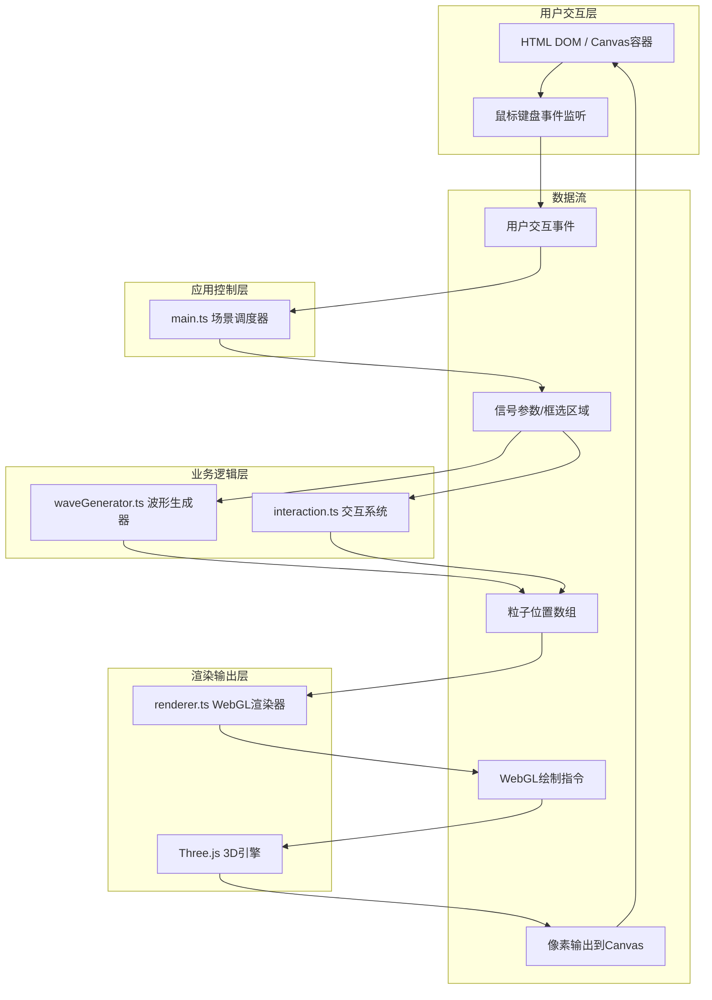

## 1. 架构设计



## 2. 技术说明

- **前端框架**：原生 TypeScript 5.x + Three.js 0.160.x（用户明确指定非React技术栈）
- **构建工具**：Vite 5.x，HMR热更新，生产构建tree-shaking优化
- **3D引擎**：Three.js，使用BufferGeometry + PointsMaterial批量粒子渲染
- **渲染策略**：Canvas 2D绘制UI覆盖层（框选矩形、频谱图、热力条），WebGL负责3D粒子系统
- **动画系统**：requestAnimationFrame驱动统一循环，基于时间差(deltaTime)的帧率无关动画
- **状态管理**：各模块内部私有状态 + 主控制器通过回调函数协调，避免引入额外状态库

## 3. 文件结构定义

| 文件路径 | 职责说明 | 输入/输出 |
|----------|----------|-----------|
| `package.json` | 项目依赖声明与脚本配置 | three, vite, typescript, @types/three |
| `vite.config.js` | Vite构建配置，端口/别名/HMR设置 | 开发服务器配置 |
| `tsconfig.json` | TypeScript严格模式编译配置 | strict: true, target ES2020 |
| `index.html` | 应用入口HTML，Canvas容器与样式 | 加载main.ts，暗色背景 |
| `src/main.ts` | 场景初始化/相机/渲染器/动画循环，组合子系统 | 用户交互→波形生成器→渲染器 |
| `src/waveGenerator.ts` | 波形粒子生成与管理，信号参数计算粒子位置 | 信号数据→粒子位置→渲染器 |
| `src/interaction.ts` | 鼠标拖拽旋转/滚轮缩放/框选交互逻辑 | DOM事件→相机/框选区域→重绘 |
| `src/renderer.ts` | 粒子系统渲染/频谱图/热力图绘制 | 粒子位置→BufferGeometry→WebGL绘制 |

**调用关系：**
```
main.ts (导入)
  ├── waveGenerator.ts (实例化 WaveGenerator)
  ├── interaction.ts (实例化 InteractionSystem)
  └── renderer.ts (实例化 AppRenderer)

数据流方向：
  interaction.ts --(相机变换、框选区域、脉冲触发)--> main.ts
  main.ts --(信号参数、时间、框选信息)--> waveGenerator.ts
  waveGenerator.ts --(粒子位置/颜色数组、频谱数据、能量值)--> renderer.ts
  main.ts --(相机矩阵)--> renderer.ts.render()
```

## 4. 核心数据结构

```typescript
// 单个粒子数据
interface ParticleData {
  x: number;          // X轴基础位置 (-8 ~ 8)
  baseY: number;      // 基波Y值
  jitterX: number;    // X随机抖动偏移
  jitterZ: number;    // Z随机抖动偏移
  selected: boolean;  // 是否在框选区域内
}

// 波形生成器输出
interface WaveOutput {
  positions: Float32Array;    // 1000*3 粒子XYZ
  colors: Float32Array;       // 1000*3 粒子RGB
  sizes: Float32Array;        // 1000   粒子大小
  opacity: Float32Array;      // 1000   粒子透明度
  spectrumData: number[];     // 64频点 当前频谱强度
  energyLevel: number;        // 0~1  当前能量等级
}

// 框选区域（世界坐标系）
interface SelectionBox {
  active: boolean;
  xMin: number;   // -6 ~ 6
  xMax: number;
  yMin: number;   // -4 ~ 4
  yMax: number;
  zoomProgress: number;  // 0~1 缩放动画进度
}

// 脉冲状态
interface PulseState {
  active: boolean;
  startTime: number;
  duration: number;       // 3000ms
  amplitude: number;      // 起始3单位
  frequency: number;      // 2Hz
}
```

## 5. 性能优化策略

| 优化点 | 实现方案 | 预期效果 |
|--------|----------|----------|
| 粒子批量渲染 | Three.js Points + BufferGeometry，单次DrawCall | 渲染开销降低90% |
| 粒子贴图 | 单张Canvas生成径向渐变圆形纹理，所有粒子共享 | 减少纹理切换 |
| 位置计算 | Float32Array直接操作buffer，避免中间数组分配 | 每帧<1ms |
| 频谱数据 | 滑动窗口循环写入，新数据覆盖最旧数据 | O(1)时间复杂度 |
| 动画缓动 | 基于deltaTime的lerp插值，避免setTimeout | 帧率无关平滑动画 |
| UI绘制 | 离屏Canvas预渲染静态元素（频谱背景网格） | 减少每帧绘制量 |
| 响应式缩放 | CSS transform: scale() 处理移动端缩放，不重排3D场景 | 零额外计算开销 |

