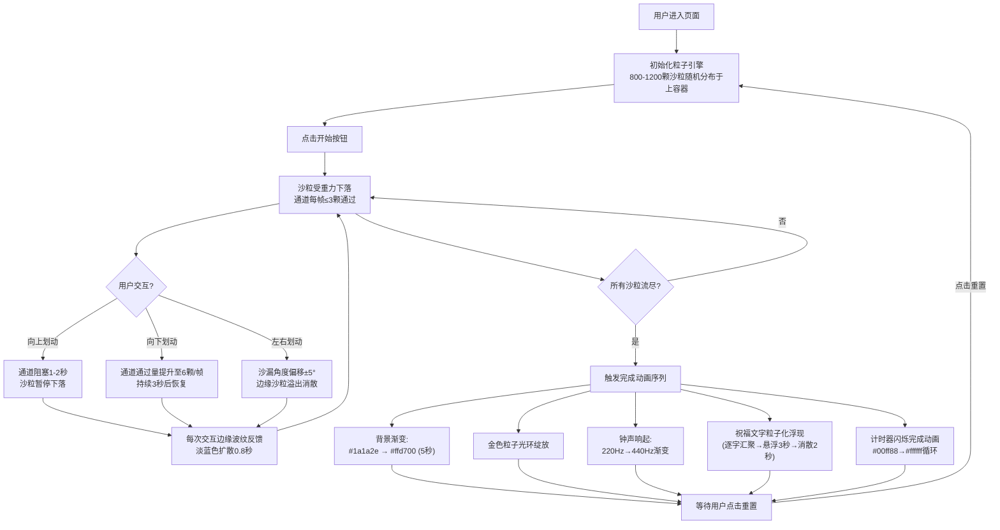

## 1. 产品概述

「时光沙漏」是一款基于Web的沉浸式动态粒子交互应用，通过Canvas 2D渲染实时物理沙粒系统，结合触控手势和声音反馈，将传统计时器转化为富有情感温度的数字艺术作品。用户通过手势控制沙粒流速，在沙粒流尽时收获个性化祝福与钟声回响，解决了传统静态计时器缺乏视觉沉浸感和情感反馈的问题。

## 2. 核心功能

### 2.1 功能模块

1. **沙漏粒子系统**：上下倒三角容器+中央通道，800-1200颗沙粒实时物理模拟（重力、碰撞、堆积）
2. **触控手势交互**：向上阻塞、向下加速、左右晃动沙漏，边缘波纹反馈
3. **祝福文字粒子化**：30字符以内自定义文字，沙粒流尽后以金色粒子形态逐字浮现
4. **开始/暂停/重置控制**：半透明圆形按钮三态切换
5. **计时与统计显示**：MM:SS格式计时 + 上下容器沙粒数比例
6. **Web Audio钟声**：沙粒流尽时220Hz-440Hz渐变悠长钟声 + 金色光环绽放

### 2.2 页面详情

| 页面名称 | 模块名称 | 功能描述 |
|---------|---------|---------|
| 主页面 | 沙漏渲染区 | Canvas居中渲染，占页面高度70%，宽高比3:4，深色背景带发光边框 |
| 主页面 | 计时统计层 | 左上角MM:SS计时器，右上角上下容器沙粒数量比例 |
| 主页面 | 波纹反馈层 | 交互时画布边缘淡蓝色波纹扩散动画（0.8秒衰减） |
| 主页面 | 祝福文字输入框 | 底部30字符限制输入框，预设祝福文字 |
| 主页面 | 控制按钮 | 半透明白色圆形按钮（50px），三态：开始/暂停/重置 |
| 主页面 | 完成动画层 | 沙粒流尽后背景渐变、金色光环、粒子祝福文字、钟声 |

## 3. 核心流程

## 4. 用户界面设计

### 4.1 设计风格

- **主色调**：深邃宇宙蓝 `#0a0a1a`（背景）、神秘紫蓝渐变（沙漏边框 `#4a4a8a → #8a4a8a`）
- **点缀色**：暖沙金 `#D4A373 ~ #C28B4E`（沙粒）、淡蓝 `#6aa9ff`（波纹）、暖金 `#ffd700`（完成状态）
- **按钮风格**：半透明圆形（50px直径，`#ffffff` 透明度0.3），内部图标简洁几何
- **字体**：Geometric Sans-serif家族（Poppins / Montserrat），现代几何感
- **布局**：居中对称构图，大量负空间营造呼吸感，沙漏为视觉焦点
- **光影细节**：沙粒周围2px柔光（透明度0.2），落沙区100px半透明光晕（透明度0.1）

### 4.2 页面设计概览

| 区域 | 模块 | UI元素 |
|------|------|--------|
| 全屏 | 背景层 | 深色 `#0a0a1a` 径向渐变（中心略亮），完成态渐变至暖金 |
| 中央70% | 沙漏画布 | 宽高比3:4，倒三角容器+40px通道，渐变发光边框，Canvas渲染 |
| 左上角 | 计时器 | MM:SS格式，白色细体，完成态色相循环闪烁 |
| 右上角 | 沙粒统计 | "上:352 下:648"，白色小字，实时更新 |
| 画布边缘 | 波纹层 | 交互触发，淡蓝色圆环，透明度0.6→0，0.8秒消散 |
| 底部 | 输入区 | 半透明输入框（30字符限制），提示文字"输入祝福..." |
| 底部中央 | 控制按钮 | 50px半透明白色圆，三态图标（播放/暂停/重置） |

### 4.3 响应式

- **设计策略**：桌面端优先，移动端自适应
- **桌面端**：沙漏居中占页面高度70%，宽高比3:4
- **移动端**：沙漏占宽度90%，高度按3:4比例自适应，触控手势优化
- **触摸优化**：增大交互热区（沙漏区域外扩20px），滑动方向识别容错

### 4.4 视觉动效层级

1. **持续动效**：沙粒重力下落、碰撞弹开、圆锥堆积
2. **交互动效**：波纹扩散、沙漏倾斜、沙粒溢出消散
3. **状态动效**：计时器闪烁、背景渐变、光环绽放、粒子文字浮现
4. **微交互**：按钮hover半透+0.1过渡、输入框focus光晕
