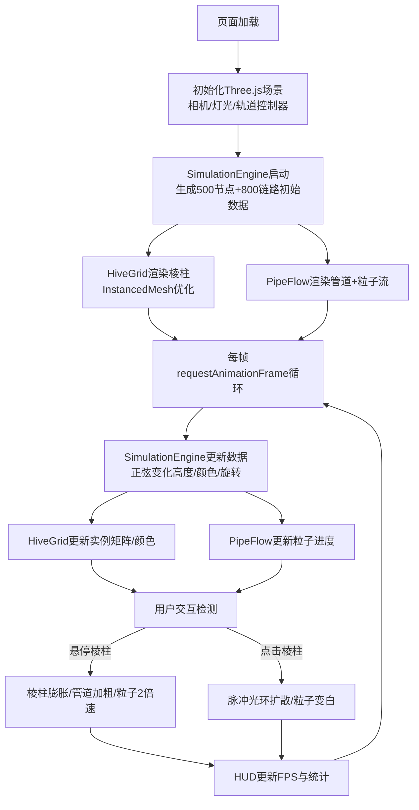

## 1. 产品概述
「流光蜂巢」是一款面向数据艺术家的3D交互社交网络可视化应用，将抽象多维社交数据映射为由数千个六边形棱柱构成的动态蜂巢矩阵，通过发光柔性管道与粒子流动画展现信息传递关系。
- 核心目的：以沉浸式3D视觉形式呈现社交网络数据的动态变化，为数据艺术创作提供直观而富有表现力的可视化工具
- 目标用户：数据艺术家、数据可视化设计师、社交网络分析研究者

## 2. 核心功能

### 2.1 功能模块
1. **蜂巢矩阵渲染**：500个六边形棱柱构成的三维蜂巢结构，使用InstancedMesh优化性能
2. **动态属性映射**：棱柱高度、颜色、旋转随用户数据实时变化
3. **柔性管道系统**：800条弯曲发光管道连接棱柱节点
4. **粒子流动画**：24000个彩色粒子沿管道流动，代表信息传递
5. **悬停交互反馈**：鼠标悬停触发棱柱膨胀、管道加粗、粒子加速
6. **点击脉冲效果**：点击棱柱产生扩散光环，高亮经过的粒子
7. **实时数据统计显示**：FPS计数器与节点/链路数量显示

### 2.2 页面详情
| 页面名称 | 模块名称 | 功能描述 |
|-----------|-------------|---------------------|
| 主场景 | 蜂巢矩阵模块 | 渲染500个六边形棱柱，InstancedMesh单次DrawCall，高度/颜色/旋转动态变化 |
| 主场景 | 管道粒子模块 | 800条CatmullRom曲线管道，每条30个渐变大小粒子流动 |
| 主场景 | 交互反馈模块 | 悬停棱柱膨胀、管道加粗、粒子2倍速；点击脉冲扩散光环 |
| 主场景 | HUD信息模块 | 右下角FPS(白色13px)，左上角节点/链路数量统计 |
| 主场景 | 模拟引擎模块 | 60fps更新500节点+800链路数据，平滑正弦过渡动画 |

## 3. 核心流程
用户打开页面 → 加载初始化蜂巢矩阵与管道系统 → SimulationEngine每帧更新节点/链路数据 → HiveGrid与PipeFlow组件接收数据更新渲染 → 鼠标悬停触发交互反馈 → 点击触发脉冲效果 → HUD实时显示FPS与统计数据

## 4. 用户界面设计

### 4.1 设计风格
- **主色调**：深空蓝黑背景 #0A0F1C，营造深邃太空感
- **强调色**：青色 #00FFFF → 洋红色 #FF00FF 渐变，代表链路强度0-1
- **棱柱材质**：半透明发光玻璃，emissive强度0.3，金属度0.1，粗糙度0.4
- **管道材质**：半透明发光，opacity 0.5
- **字体**：无衬线系统字体，13px白色小字用于HUD
- **光标**：悬停棱柱时变为pointer

### 4.2 页面设计概述
| 页面名称 | 模块名称 | UI元素 |
|-----------|-------------|-------------|
| 主场景 | 3D舞台 | 全屏深空背景，蜂巢居中，相机Z=-10/Y=5面向原点 |
| 主场景 | 六边形棱柱 | 0.5-3.0高度正弦变化，色相0-360循环，0.1-2.0rad/s旋转波动 |
| 主场景 | 柔性管道 | 3-5控制点CatmullRom曲线，宽度0.05-0.15悬停膨胀 |
| 主场景 | 流光粒子 | 0.05-0.15渐变大小，正弦透明度波动，链路强度颜色渐变 |
| 主场景 | 脉冲光环 | 点击触发，半径0→3，透明度1→0，持续0.6秒 |
| 主场景 | HUD | 右下角FPS(13px白)，左上角节点/链路计数 |

### 4.3 响应式
- 全屏自适应，Canvas占满整个视口
- 支持窗口resize事件自动调整相机投影矩阵
- 桌面端优先，触控设备支持基础轨道控制

### 4.4 3D场景指导
- **环境氛围**：深空蓝黑背景，无HDRI，自发光材质营造氛围
- **灯光设置**：AmbientLight强度0.3 + DirectionalLight强度0.6从上方照射，补充边缘光
- **相机设置**：PerspectiveCamera，fov 60，初始位置(0, 5, -10)，lookAt原点，OrbitControls启用阻尼
- **构图焦点**：蜂巢矩阵位于场景正中央，粒子流光引导视觉
- **交互动画**：悬停棱柱高度4.0持续0.3s→回落0.5s过渡，管道宽度膨胀，粒子2倍速
- **后期处理**：自带emissive发光效果，可加Bloom后期增强辉光（如性能允许）
- **性能预算**：55FPS+，内存<200MB，粒子≤24000，棱柱≤500（超500自动合并邻近棱柱）
