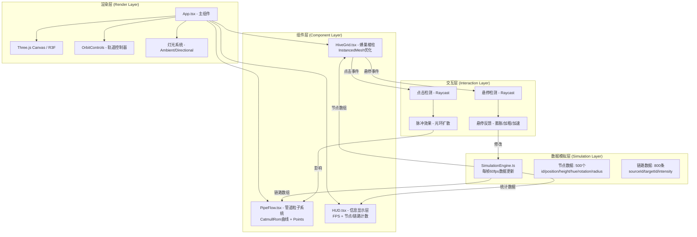
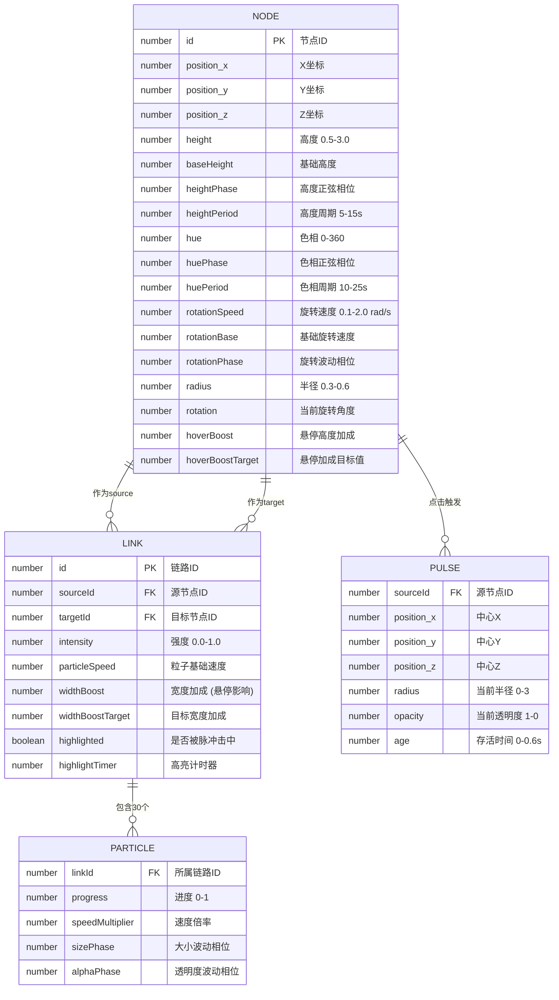

## 1. 架构设计



## 2. 技术描述

- **前端框架**: React 18 + TypeScript 5.x，严格模式开启
- **构建工具**: Vite 5.x + @vitejs/plugin-react，支持HMR热更新
- **3D渲染**: Three.js r160 + @react-three/fiber 8.x + @react-three/drei 9.x
- **类型定义**: @types/three 对应版本
- **后端**: 无后端，纯前端数据模拟
- **状态管理**: 不引入额外状态库，使用R3F内置useFrame + useRef高性能更新
- **性能优化**: InstancedMesh（棱柱单次DrawCall）、Points（粒子批量渲染）、对象池、增量更新

## 3. 路由定义

| 路由 | 用途 |
|-------|---------|
| / | 主场景页面，包含完整3D蜂巢可视化与HUD |

## 4. 数据模型

### 4.1 数据模型定义



### 4.2 TypeScript类型定义

```typescript
// src/simulation/types.ts
export interface NodeData {
  id: number;
  position: [number, number, number];
  height: number;
  baseHeight: number;
  heightPhase: number;
  heightPeriod: number;
  hue: number;
  huePhase: number;
  huePeriod: number;
  rotationSpeed: number;
  rotationBase: number;
  rotationPhase: number;
  radius: number;
  rotation: number;
  hoverBoost: number;
  hoverBoostTarget: number;
}

export interface LinkData {
  id: number;
  sourceId: number;
  targetId: number;
  intensity: number;
  particleSpeed: number;
  widthBoost: number;
  widthBoostTarget: number;
  highlighted: boolean;
  highlightTimer: number;
  curvePoints: [number, number, number][];
}

export interface ParticleData {
  linkId: number;
  progress: number;
  speedMultiplier: number;
  sizePhase: number;
  alphaPhase: number;
}

export interface PulseData {
  id: number;
  sourceId: number;
  position: [number, number, number];
  radius: number;
  opacity: number;
  age: number;
}

export interface SimulationState {
  nodes: NodeData[];
  links: LinkData[];
  particles: ParticleData[];
  pulses: PulseData[];
  hoveredNodeId: number | null;
  selectedNodeId: number | null;
  frameCount: number;
}
```

## 5. 文件结构与职责

```
project-root/
├── package.json                 # 项目依赖与启动脚本
├── vite.config.js               # Vite构建配置 + React HMR
├── tsconfig.json                # TypeScript严格模式配置
├── index.html                   # 入口页面(全屏暗色背景)
└── src/
    ├── main.tsx                 # React应用入口
    ├── App.tsx                  # 主组件: Canvas+灯光+相机+控制器+挂载HiveGrid/PipeFlow/HUD
    ├── types/
    │   └── simulation.ts        # 全局类型定义(NodeData/LinkData等)
    ├── simulation/
    │   └── SimulationEngine.ts  # 数据模拟引擎: 每帧更新500节点+800链路
    ├── components/
    │   ├── HiveGrid.tsx         # 蜂巢棱柱: InstancedMesh渲染500六边形棱柱
    │   ├── PipeFlow.tsx         # 管道粒子: TubeGeometry管道+Points粒子流
    │   └── HUD.tsx              # 信息显示: FPS计数器+节点/链路统计
    └── utils/
        └── hexGrid.ts           # 六边形网格坐标计算工具函数
```

### 5.1 调用关系与数据流向

```
main.tsx → App.tsx
                ↓ (创建SimulationEngine实例, 启动循环)
        SimulationEngine.ts (每帧更新状态)
                ↓ (通过props传递nodes/links/particles/pulses)
        ┌────────┴────────┐
        ↓                 ↓
   HiveGrid.tsx      PipeFlow.tsx
   (接收nodes)       (接收links/particles/pulses)
        ↓                 ↓
   InstancedMesh      TubeGeometry + Points
   更新matrix/color    更新粒子positions/colors
        ↓                 ↓
        └────────┬────────┘
                 ↓
              HUD.tsx
           (FPS + 统计信息)
```

## 6. 关键技术实现方案

### 6.1 六边形棱柱渲染 (HiveGrid.tsx)
- 使用`CylinderGeometry`创建六边形棱柱(radialSegments=6)
- `InstancedMesh`管理500个实例，单次DrawCall
- 每帧在`useFrame`中更新每个实例的`matrix`(position+scale+rotation)和`color`
- 使用`Cylindrical`坐标系统构建蜂巢网格布局
- 悬停检测：drei的`Instances` + `useHover`或手动Raycast

### 6.2 管道粒子系统 (PipeFlow.tsx)
- 每条链路使用`CatmullRomCurve3`生成弯曲路径(3-5控制点随机)
- 使用`TubeGeometry`创建管道Mesh，半透明发光材质
- 粒子使用`THREE.Points` + `BufferGeometry`
  - position属性：每粒子3个float = 24000 × 3 = 72000 float
  - color属性：每粒子3个float = 72000 float
  - size属性（使用custom shader或size attenuation）
- 每帧更新粒子position：`curve.getPointAt(progress)`
- 颜色插值：青色#00FFFF → 洋红色#FF00FF，基于intensity

### 6.3 数据模拟引擎 (SimulationEngine.ts)
- 独立class，内部维护`state: SimulationState`
- `start()`启动`requestAnimationFrame`循环，目标60fps(每帧~16ms)
- 节点更新算法：
  - 高度：`baseHeight + sin(t/period*2π + phase) * amplitude`
  - 色相：`(huePhase + t/period*360) % 360`
  - 旋转：`rotation += (rotationBase + sin(t/8*2π + phase) * 0.5) * dt`
  - 悬停加成：lerp向目标值(hoverBoostTarget)
- 节点自动合并：距离<0.3的相邻棱柱合并为更高棱柱

### 6.4 交互反馈
- **悬停** (hover):
  - 目标棱柱: hoverBoostTarget = 4.0 - baseHeight，持续0.3s，0.5s回落
  - 关联链路: widthBoostTarget = 0.15，粒子speedMultiplier = 2
- **点击** (click):
  - 创建PulseData，age从0到0.6s
  - radius: `3 * (age/0.6)`，opacity: `1 - age/0.6`
  - 每帧检测链路粒子到脉冲中心距离 < radius时 → highlighted=true, 颜色变白

### 6.5 性能优化清单
1. ✅ InstancedMesh 500棱柱 → 1 DrawCall
2. ✅ Points 24000粒子 → 1 DrawCall
3. ✅ BufferAttribute typed数组直接操作，避免GC
4. ✅ 对象池复用粒子/脉冲对象
5. ✅ 每帧仅更新变化的BufferAttribute（markUpdate）
6. ✅ 矩阵预计算，避免重复数学运算
7. ✅ 距离检测使用平方距离比较，省sqrt
8. ✅ 节点合并：>500节点时合并邻近(距离<0.3)节点

## 7. 性能验收标准
- FPS: 稳定 ≥ 55fps (Chrome DevTools Performance面板验证)
- 内存: ≤ 200MB (Chrome Task Manager)
- DrawCalls: ≤ 10 (含HUD)
- 粒子数: ≤ 24000
- 节点数: ≤ 500 (自动合并生效)
