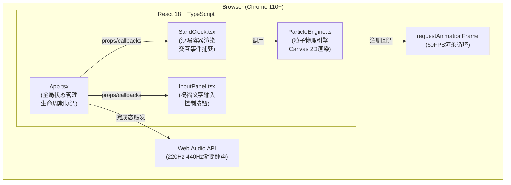

## 1. 架构设计



## 2. 技术描述

- **前端框架**：React@18 + TypeScript@5（严格模式，target ES2020）
- **构建工具**：Vite@5 + @vitejs/plugin-react@4，开发端口3000
- **渲染引擎**：Canvas 2D Context（原生高性能粒子渲染）
- **音频**：Web Audio API（OscillatorNode + GainNode + 包络控制）
- **状态管理**：React useState/useRef（无需额外状态库，组件内状态为主）
- **样式方案**：内联CSS-in-JS（style属性）+ CSS Modules style（index.css全局变量）
- **字体方案**：Google Fonts（Poppins, Montserrat）Geometric Sans-serif
- **性能目标**：Chrome 110+ 桌面端 ≥ 55FPS，粒子总数 ≤ 1500颗

## 3. 核心文件结构

| 文件路径 | 职责 | 关键接口/方法 |
|---------|------|--------------|
| `src/App.tsx` | 全局状态：祝福文字、播放状态、完成态、计时、背景渐变、光环、钟声协调 | useState/useEffect管理各子模块生命周期，完成态动画编排 |
| `src/components/SandClock.tsx` | 沙漏几何布局、通道/容器路径、Canvas ref、鼠标/触摸事件处理、手势识别 | props: `wishText`, `onComplete`, `engineRef`; 手势: 上/下/左/右划动映射到引擎动作 |
| `src/components/ParticleEngine.ts` | 沙粒创建/更新/碰撞/堆积/渲染，暴露控制接口与统计查询 | `start()` `stop()` `reset()` `getStats()` `setBlocked(ms)` `setSpeedBoost(ms)` `setTilt(angle,ms)` `render(ctx)` |
| `src/components/InputPanel.tsx` | 受控输入框（maxLength=30），圆形三态按钮 | props: `wishText`, `onWishChange`, `playState`, `onPlayPause`, `onReset` |
| `index.html` | viewport meta、Google Fonts引入、根节点、页面标题"时光沙漏" | - |
| `package.json` | react, react-dom, typescript, vite, @vitejs/plugin-react | `npm run dev` (端口3000) |
| `vite.config.js` | Vite React插件，server.port=3000，base="./" | - |
| `tsconfig.json` | strict:true, target:"ES2020", jsx:"react-jsx", module:"ESNext" | - |

## 4. ParticleEngine 核心算法定义

### 4.1 数据结构

```typescript
interface Particle {
  x: number; y: number;           // 位置
  vx: number; vy: number;         // 速度
  r: number;                      // 半径 3-5px
  color: string;                  // #D4A373 ~ #C28B4E
  container: 'top' | 'bottom' | 'channel' | 'spilling'; // 当前所在区域
  spillTimer?: number;            // 溢出消散计时
}

interface EngineStats {
  topCount: number;
  bottomCount: number;
  elapsedSeconds: number;
  isComplete: boolean;
}

interface Ripple {
  x: number; y: number;
  radius: number;
  alpha: number;
  startTime: number;
}
```

### 4.2 物理参数常量

```
GRAVITY = 9.8 px/s²
ELASTICITY = 0.3（弹性系数）
REST_ANGLE = 30°（安息角，堆积斜率）
MAX_STACK_HEIGHT_RATIO = 0.6（下容器堆积最大高度比例）
CHANNEL_MAX_PASS = 3（每帧正常通过量）
CHANNEL_BOOST_PASS = 6（加速时通过量）
BLOCK_DURATION_MIN = 1000ms
BLOCK_DURATION_MAX = 2000ms
BOOST_DURATION = 3000ms
TILT_MAX_ANGLE = ±5°
SPILL_FADE_TIME = 500ms
RIPPLE_DURATION = 800ms
```

### 4.3 碰撞检测策略

- **空间哈希分箱**：将画布按 2×maxRadius 网格分箱，每颗粒子只与同箱及8邻箱粒子做距离检测，复杂度从O(n²)降至O(n)
- **简化圆形碰撞**：两颗粒子距离 < r1+r2 时，沿法线方向分离并按弹性系数反弹速度分量
- **安息角堆积近似**：下容器底部网格高度场，每颗粒子落地后检查左右邻格高度差，若 > tan(30°)*dx 则向低处滚落1-2格

## 5. 完成态动画时序编排（SandClock → App 回调驱动）

| 时间点 | 触发动作 |
|--------|---------|
| T+0s | ParticleEngine回调 `onComplete` → App设置 `isComplete=true` |
| T+0s | 背景CSS transition `#1a1a2e → #ffd700` 持续5s |
| T+0s | 计时器开始 `#00ff88 → #ffffff` HSL色相循环（周期1s，持续4s） |
| T+0s | Web Audio: OscillatorNode频率从220Hz线性rampToValueAtTime到440Hz，时长3s，GainNode ADSR包络(attack 0.2s, decay 1s, sustain 1s, release 2s) |
| T+0.2s | 光环粒子从沙漏中心向四周扩散（金色半透明圆环，半径渐增，0→300px，2s完成） |
| T+0.5s | 祝福文字逐字粒子化：从下容器中心升起，每字20-30颗粒子在离底150px处汇聚成字形 |
| T+2s | 全部文字汇聚完成，悬浮静止3s |
| T+5s | 文字粒子开始向四周消散（2s淡出+位移） |
| T+7s | 所有完成态动画结束，等待用户点击重置 |

## 6. 手势识别逻辑

```
交互起点(mousedown/touchstart) → 记录 {startX, startY, startTime}
交互终点(mouseup/touchend)   → 计算 {dx, dy, dt, distance, velocity}

  |dy| > |dx|  → 垂直划动
    dy < -30px → 向上划动 → setBlocked(random(BLOCK_DURATION_MIN, BLOCK_DURATION_MAX))
    dy > 30px  → 向下划动 → setSpeedBoost(BOOST_DURATION)
  
  |dx| > |dy|  → 水平划动
    dx < -30px → 向左划动 → setTilt(-TILT_MAX_ANGLE, TILT_DURATION)
    dx > 30px  → 向右划动 → setTilt(+TILT_MAX_ANGLE, TILT_DURATION)

无论何种划动 → 在交互起点添加Ripple波纹动画
```
