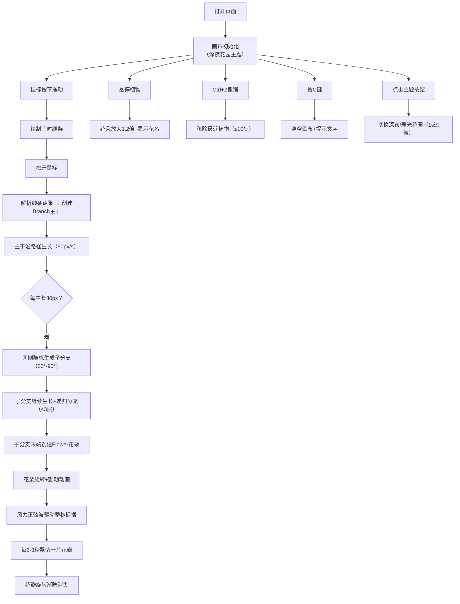

## 1. 产品概述

「笔尖花园」是一款将用户手绘线条实时转化为动态生长植物的交互式Web应用，让创意工作室用户通过简单的笔触体验数字园艺的乐趣。用户在画布上绘制任意线条，系统将其解析为植物主干或枝条，形成一片持续生长的数字花园。

## 2. 核心功能

### 2.1 功能模块

1. **主画布页面**：手绘解析、植物生长、分支生成、花朵绽放、风力摆动、花瓣飘落、悬停交互、撤销清空、主题切换

### 2.2 页面详情

| 页面名称 | 模块名称 | 功能描述 |
|---------|---------|---------|
| 主画布页面 | 手绘解析模块 | 鼠标按下拖动绘制线条，松开后转化为植物主干，按线条路径生长（50像素/秒） |
| 主画布页面 | 生长动画模块 | 主干宽度从2px渐变到8px，棕色渐变（#4a2810→#6b4423） |
| 主画布页面 | 分支生成模块 | 主干每生长30px，60-90度夹角两侧随机生成子分支（60%宽度，最多3层），分支末端绿色渐变（#2d5a27→#5a8f3c） |
| 主画布页面 | 花朵绽放模块 | 每条子分支末端1朵花，5片花瓣，随机大小（8-20px）和颜色（粉/紫/黄/橙），旋转（0.5-1.5rad/s）+颤动动画 |
| 主画布页面 | 风力与飘落模块 | 模拟风力正弦波（幅度0.3rad，周期3s），整株摇摆；花瓣每2-3秒飘落一片，旋转渐隐（2s消失） |
| 主画布页面 | 悬停交互模块 | 鼠标悬停植物：花朵停止旋转+放大1.2倍+显示随机花名（白色半透明跟随鼠标） |
| 主画布页面 | 撤销清空模块 | Ctrl+Z撤销最近绘制（最多10步），C键清空画布+淡入淡出提示"画布已清空"（1.5s） |
| 主画布页面 | 主题切换模块 | 右上角圆形按钮切换「深夜花园」（深蓝黑渐变+花朵发光）与「晨光花园」（浅绿淡黄渐变+柔光阴影），1秒淡入淡出过渡 |

## 3. 核心流程

用户打开页面 → 画布加载（深夜花园主题） → 鼠标按下拖动绘制线条 → 松开鼠标 → 线条转化为植物主干 → 主干沿路径生长 → 每30px自动生成子分支 → 子分支末端开花 → 风力摆动+花瓣飘落 → 用户可悬停查看花名/撤销/清空/切换主题

## 4. 用户界面设计

### 4.1 设计风格

- **主色调**：深夜主题（#0d0d2b→#000011深蓝黑渐变），晨光主题（#e8f5e9→#fff9c4浅绿淡黄渐变）
- **强调色**：浅绿标题色#7dcea0，花瓣四色板#ff69b4/#9b59b6/#f1c40f/#e67e22
- **按钮**：圆形（直径40px→45px悬停放大），过渡0.2s
- **字体**：标题Caveat手写风格，正文系统无衬线字体
- **布局**：画布居中（圆角12px，边距20px/10px响应式），左上角标题，右上角主题按钮，底部操作提示栏
- **动画风格**：柔和自然，梦幻感，所有过渡0.2-1s平滑曲线

### 4.2 页面设计概述

| 页面名称 | 模块名称 | UI元素 |
|---------|---------|---------|
| 主画布页面 | 标题区域 | 左上角半透明"笔尖花园"，Caveat字体，#7dcea0，悬停放大1.05倍（0.3s过渡） |
| 主画布页面 | 画布区域 | 居中，圆角12px，边距20px，渐变背景，Canvas渲染 |
| 主画布页面 | 主题切换按钮 | 右上角圆形，直径40px→45px悬停，tooltip"切换主题" |
| 主画布页面 | 底部提示栏 | 中央半透明，14px #888888，文字："绘制线条开始你的花园 | Ctrl+Z撤销 | C清空" |
| 主画布页面 | 花名提示 | 悬停时跟随鼠标，白色半透明，随机花名 |
| 主画布页面 | 清空提示 | 淡入淡出文字"画布已清空"，持续1.5s |

### 4.3 响应式

- Desktop-first设计
- 最小宽度768px：画布占满全屏，边距减小到10px
- 画布尺寸随窗口动态调整（resize事件）
- 触摸设备兼容（touchstart/touchmove/touchend事件）
