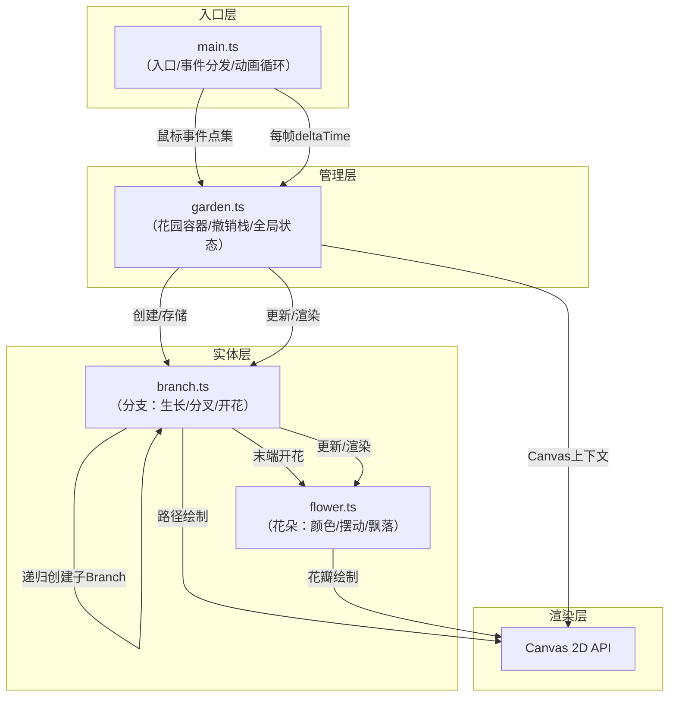

## 1. 架构设计

纯前端Canvas应用，无后端服务。采用分层模块化架构，按职责分离数据模型与渲染逻辑。



## 2. 技术描述

- **前端框架**：无UI框架，原生TypeScript + Canvas 2D API
- **构建工具**：Vite 5.x（开发服务器端口3000）
- **语言**：TypeScript 5.x（严格模式strict:true，target:ES2020）
- **第三方库**：uuid（生成唯一实体ID）
- **字体**：Google Fonts - Caveat（手写风格标题）

## 3. 文件结构与调用关系

| 文件路径 | 职责 | 主要输出 | 被谁调用 | 调用谁 |
|---------|------|---------|---------|-------|
| `index.html` | 页面容器、CSS样式、Canvas元素、Google Fonts引入 | DOM结构 | 浏览器 | - |
| `src/main.ts` | 画布初始化、尺寸自适应、鼠标/触屏/键盘事件监听、requestAnimationFrame循环 | 原始点集、deltaTime | Vite入口 | `garden.ts` |
| `src/garden.ts` | 管理Branch数组、撤销栈（≤10）、风力模拟、主题状态、hitTest悬停检测 | 全局更新/渲染指令 | `main.ts` | `branch.ts` |
| `src/branch.ts` | 单分支生长进度计算、路径采样、子分支递归生成（≤3层）、Flower创建、风力偏移叠加、棕色/绿色渐变绘制 | 已生长路径、花朵列表 | `garden.ts`（父级branch） | `flower.ts`、自身（递归） |
| `src/flower.ts` | 5片花瓣绘制、旋转+颤动动画、花瓣飘落队列、透明度衰减 | 花朵渲染、飘落花瓣渲染 | `branch.ts` | - |

### 数据流向说明

1. **绘制流程**：
   - `main.ts` 捕获 `mousedown→mousemove→mouseup`，收集 `{x,y}[]` 点集
   - `main.ts` 调用 `garden.addBranch(points)` 传入点集
   - `garden.ts` 创建新 `Branch(points, level=0)`，推入 `branches[]` + `undoStack[]`
   - `undoStack` 超过10项时 `shift()` 丢弃最早记录

2. **每帧更新流程**：
   - `main.ts` 的RAF循环计算 `deltaTime = (now - lastTime) / 1000`
   - 调用 `garden.update(deltaTime, mouseX, mouseY)`
   - `garden.ts` 先更新风力值 `wind = Math.sin(time * 2π/3) * 0.3`
   - 遍历 `branches[]` 调用 `branch.update(dt, wind, hoverHit)`
   - 最后调用 `garden.render(ctx)` → 遍历 `branches[]` 调用 `branch.render(ctx, theme)`

3. **悬停检测**：
   - `garden.hitTest(mx, my)` 反向遍历 `branches[]`（从新到旧）
   - 每个Branch检查末端Flower中心点与鼠标距离 ≤ 花瓣最大半径
   - 命中则返回该Flower引用 + 花名，主循环据此传递 `hoveredFlower`

## 4. 核心数据结构

### 4.1 Point 接口

```typescript
interface Point { x: number; y: number }
```

### 4.2 Branch 类字段

| 字段 | 类型 | 说明 |
|-----|------|------|
| `id` | `string` | uuid唯一标识（撤销用） |
| `pathPoints` | `Point[]` | 原始手绘路径点集 |
| `totalLength` | `number` | 路径总长度（p5累加计算） |
| `growthProgress` | `number` | 已生长长度（像素），每秒+50 |
| `level` | `number` | 层级（0=主干，≤3） |
| `thickness` | `number` | 当前绘制宽度（2→8线性插值） |
| `children` | `Branch[]` | 子分支数组 |
| `flower` | `Flower \| null` | 末端花朵（level≥1才创建） |
| `lastSpawnDistance` | `number` | 上次分叉时已生长长度，每+30px触发一次 |

### 4.3 Flower 类字段

| 字段 | 类型 | 说明 |
|-----|------|------|
| `petals` | `Petal[]` | 5片花瓣：{color, size, rotationOffset, phase} |
| `baseRotation` | `number` | 花朵整体旋转角 |
| `rotationSpeed` | `number` | 旋转速度（±0.5~±1.5 rad/s） |
| `position` | `Point` | 花朵位置（branch末端） |
| `fallingPetals` | `FallingPetal[]` | 飘落中花瓣队列 |
| `fallTimer` | `number` | 下次飘落倒计时（2~3s随机） |
| `name` | `string` | 花名，从预设列表随机 |

### 4.4 Theme 类型

```typescript
type Theme = 'night' | 'morning'
interface ThemeConfig {
  bgGradient: [string, string];   // 背景渐变起止色
  flowerGlow: string;             // 发光颜色（night用rgba半透明）
  flowerShadow: string;           // 阴影颜色（morning用）
  strokeBase: [string, string];   // 棕色渐变
  strokeTip: [string, string];    // 绿色渐变
}
```

## 5. 关键算法

### 5.1 路径采样与生长进度

- 初始化时遍历 `pathPoints`，累加相邻两点距离，得到 `totalLength`
- 每帧 `growthProgress += 50 * dt`，`clamp(growthProgress, 0, totalLength)`
- 绘制时从起点出发沿路径采样，累计长度达到 `growthProgress` 停止
- 宽度插值：`thickness = lerp(2, 8, growthProgress / totalLength)`

### 5.2 分叉生成

- 当 `growthProgress - lastSpawnDistance >= 30` 且 `level < 3` 时触发
- 取当前位置路径切线方向（前后两点差分），左右各 `±(60°~90°随机)`
- 子分支路径长度为剩余长度的 `30%~50%随机`，贝塞尔曲线弯曲
- 子分支 `thickness = this.thickness * 0.6`，`level + 1`
- 更新 `lastSpawnDistance = growthProgress`

### 5.3 风力摆动

- 全局 `windOffset = Math.sin(elapsed * (2π/3)) * 0.3`
- 每个Branch绘制时，其根部为支点，沿路径每段的旋转叠加 `windOffset * 衰减系数`
- 衰减系数 = `(1 - level * 0.2) * (距根部距离 / totalLength)`，越高层/越远端摆动越大

### 5.4 花瓣飘落

- 每朵花 `fallTimer -= dt`，归零时：
  1. 随机选一片花瓣，创建 `FallingPetal`
  2. `FallingPetal` 字段：`x,y, vx, vy, rot, rotSpeed, alpha, life(2s)`
  3. `fallTimer = 2 + Math.random() * 1` 重置倒计时
- 每帧更新：`vy += 30 * dt`（重力），`rot += rotSpeed * dt`，`alpha -= dt / 2`
- `life <= 0` 时从数组中移除

### 5.5 主题过渡动画

- `themeTransition = { progress: 0→1, from: Theme, to: Theme }`
- 切换时 `progress` 1秒内从0到1（easeInOutCubic）
- 背景渐变与花朵效果颜色在 `render()` 中按 `progress` 线性插值

## 6. 性能优化策略

- **路径长度预计算**：Branch初始化时一次性计算累计距离数组，避免每帧重复遍历
- **对象池**：飘落花瓣对象复用以减少GC（50个槽位循环）
- **hitTest优化**：只检测Branch末端花朵边界圆，不做整条路径精确碰撞
- **渲染分层**：先画所有分支（棕色→绿色），再画所有花朵，减少状态切换
- **requestAnimationFrame时间间隔**：`deltaTime` clamp在`1/30`防止标签页切回后跳帧

## 7. 性能指标验收

| 指标 | 目标 | 测试方式 |
|-----|------|---------|
| 50朵花同时飘落帧率 | ≥40 FPS | Chrome DevTools Performance录制 |
| 松开鼠标到生长动画启动 | ≤100ms | console.time标记`addBranch`首尾 |
| 内存占用（20株植物后） | ≤200MB | DevTools Memory Heap Snapshot |
